# [Work Order][Mobile Flow] Check Out

## Flow Diagram

```mermaid
%% If you read this, your Markdown visualizer does not handle MermaidJS syntax.
%% - If you are in VsCode, install extension `Markdown Preview Mermaid Support` at https://marketplace.visualstudio.com/items?itemName=bierner.markdown-mermaid
%% - If you are using sfdx-hardis, try to define env variable `MERMAID_MODES=cli,docker` ,then run again the command to regenerate markdown with SVG images.
%% - If you are within mkdocs-material, define mermaid plugin in `mkdocs.yml` as described in https://squidfunk.github.io/mkdocs-material/extensions/mermaid/
%% - At last resort, you can copy-paste this MermaidJS code in https://mermaid.live/ to see the Flow Diagram

flowchart TB
START(["START"]):::startClass
click START "#general-information" "422881515"

LMRA_Done{"<b>🔀 <em></em><br/>LMRA Done ?</b>"}:::decisionsChanged


click LMRA_Done "#lmra_done" "2020599569"



Get_LMRA_Work_Step_Information[("<b>🔍 <em></em><br/>Get LMRA Work Step Information</b>")]:::recordLookupsAdded
click Get_LMRA_Work_Step_Information "#get_lmra_work_step_information" "1781930665"


Get_WO_Order_Information[("<b>🔍 <em></em><br/>Get WO Order Information</b>")]:::recordLookupsChanged


click Get_WO_Order_Information "#get_wo_order_information" "1778649093"


Get_Work_Step_Information[("<b>🔍 <em></em><br/>Get Work Step Information</b>")]:::recordLookupsChanged


click Get_Work_Step_Information "#get_work_step_information" "3727188450"


Update_Status_of_Service_Appointment[("<b>🛠️ <em></em><br/>Update Status of Service Appointment</b>")]:::recordUpdatesChanged


click Update_Status_of_Service_Appointment "#update_status_of_service_appointment" "1939527503"


Update_Status_of_Work_Order[("<b>🛠️ <em></em><br/>Update Status of Work Order</b>")]:::recordUpdatesChanged


click Update_Status_of_Work_Order "#update_status_of_work_order" "3878701233"



LMRA_Not_Done_Message(["<i>💻 <em></em><br/>LMRA Not Done Message</i>"]):::screensRemoved
click LMRA_Not_Done_Message "#lmra_not_done_message" "3118293043"

Update_Work_Step_to_New[("<b>🛠️ <em></em><br/>Update Work Step to New</b>")]:::recordUpdatesAdded
click Update_Work_Step_to_New "#update_work_step_to_new" "2791516181"



Complete_LMRA_Message(["<b>💻 <em></em><br/>Complete LMRA Message</b>"]):::screensAdded
click Complete_LMRA_Message "#complete_lmra_message" "3360828917"

LMRA_Done ==> |"🟩<b>No</b>"| Complete_LMRA_Message

LMRA_Done --> |"Yes"| Update_Status_of_Work_Order

LMRA_Done -.-> |"🟥<i>No</i>"| LMRA_Not_Done_Message
Get_WO_Order_Information -.-> LMRA_Done

Get_LMRA_Work_Step_Information ==> LMRA_Done
Get_WO_Order_Information ==> Get_LMRA_Work_Step_Information

Get_Work_Step_Information --> Get_WO_Order_Information
Update_Status_of_Service_Appointment --> END_Update_Status_of_Service_Appointment
Update_Status_of_Work_Order --> Update_Status_of_Service_Appointment

LMRA_Not_Done_Message -.-> END_LMRA_Not_Done_Message

Update_Work_Step_to_New ==> END_Update_Work_Step_to_New
Complete_LMRA_Message ==> Update_Work_Step_to_New

START -->  Get_Work_Step_Information
END_Update_Status_of_Service_Appointment(( END )):::endClass

END_LMRA_Not_Done_Message(( END )):::endClassRemoved

END_Update_Work_Step_to_New(( END )):::endClassAdded



classDef actionCalls fill:#D4E4FC,color:black,text-decoration:none,max-height:100px
classDef assignments fill:#FBEED7,color:black,text-decoration:none,max-height:100px
classDef collectionProcessors fill:#F0E3FA,color:black,text-decoration:none,max-height:100px
classDef customErrors fill:#FFE9E9,color:black,text-decoration:none,max-height:100px
classDef decisions fill:#FDEAF6,color:black,text-decoration:none,max-height:100px
classDef loops fill:#FDEAF6,color:black,text-decoration:none,max-height:100px
classDef recordCreates fill:#FFF8C9,color:black,text-decoration:none,max-height:100px
classDef recordDeletes fill:#FFF8C9,color:black,text-decoration:none,max-height:100px
classDef recordLookups fill:#EDEAFF,color:black,text-decoration:none,max-height:100px
classDef recordUpdates fill:#FFF8C9,color:black,text-decoration:none,max-height:100px
classDef screens fill:#DFF6FF,color:black,text-decoration:none,max-height:100px
classDef subflows fill:#D4E4FC,color:black,text-decoration:none,max-height:100px
classDef startClass fill:#D9F2E6,color:black,text-decoration:none,max-height:100px
classDef endClass fill:#F9BABA,color:black,text-decoration:none,max-height:100px



classDef actionCallsAdded fill:green,color:white,stroke-width:4px,text-decoration:none,max-height:100px
classDef assignmentsAdded fill:green,color:white,stroke-width:4px,text-decoration:none,max-height:100px
classDef collectionProcessorsAdded fill:green,color:white,stroke-width:4px,text-decoration:none,max-height:100px
classDef customErrorsAdded fill:green,color:white,stroke-width:4px,text-decoration:none,max-height:100px
classDef decisionsAdded fill:green,color:white,stroke-width:4px,text-decoration:none,max-height:100px
classDef loopsAdded fill:green,color:white,stroke-width:4px,text-decoration:none,max-height:100px
classDef recordCreatesAdded fill:green,color:white,stroke-width:4px,text-decoration:none,max-height:100px
classDef recordDeletesAdded fill:green,color:white,stroke-width:4px,text-decoration:none,max-height:100px
classDef recordLookupsAdded fill:green,color:white,stroke-width:4px,text-decoration:none,max-height:100px
classDef recordUpdatesAdded fill:green,color:white,stroke-width:4px,text-decoration:none,max-height:100px
classDef screensAdded fill:green,color:white,stroke-width:4px,text-decoration:none,max-height:100px
classDef subflowsAdded fill:green,color:white,stroke-width:4px,text-decoration:none,max-height:100px
classDef startClassAdded fill:green,color:white,stroke-width:4px,text-decoration:none,max-height:100px

classDef actionCallsRemoved fill:red,color:white,stroke-width:4px,text-decoration:none,max-height:100px
classDef assignmentsRemoved fill:red,color:white,stroke-width:4px,text-decoration:none,max-height:100px
classDef collectionProcessorsRemoved fill:red,color:white,stroke-width:4px,text-decoration:none,max-height:100px
classDef customErrorsRemoved fill:red,color:white,stroke-width:4px,text-decoration:none,max-height:100px
classDef decisionsRemoved fill:red,color:white,stroke-width:4px,text-decoration:none,max-height:100px
classDef loopsRemoved fill:red,color:white,stroke-width:4px,text-decoration:none,max-height:100px
classDef recordCreatesRemoved fill:red,color:white,stroke-width:4px,text-decoration:none,max-height:100px
classDef recordDeletesRemoved fill:red,color:white,stroke-width:4px,text-decoration:none,max-height:100px
classDef recordLookupsRemoved fill:red,color:white,stroke-width:4px,text-decoration:none,max-height:100px
classDef recordUpdatesRemoved fill:red,color:white,stroke-width:4px,text-decoration:none,max-height:100px
classDef screensRemoved fill:red,color:white,stroke-width:4px,text-decoration:none,max-height:100px
classDef subflowsRemoved fill:red,color:white,stroke-width:4px,text-decoration:none,max-height:100px
classDef startClassRemoved fill:red,color:white,stroke-width:4px,text-decoration:none,max-height:100px

classDef actionCallsChanged fill:orange,color:white,stroke-width:4px,text-decoration:none,max-height:100px
classDef assignmentsChanged fill:orange,color:white,stroke-width:4px,text-decoration:none,max-height:100px
classDef collectionProcessorsChanged fill:orange,color:white,stroke-width:4px,text-decoration:none,max-height:100px
classDef customErrorsChanged fill:orange,color:white,stroke-width:4px,text-decoration:none,max-height:100px
classDef decisionsChanged fill:orange,color:white,stroke-width:4px,text-decoration:none,max-height:100px
classDef loopsChanged fill:orange,color:white,stroke-width:4px,text-decoration:none,max-height:100px
classDef recordCreatesChanged fill:orange,color:white,stroke-width:4px,text-decoration:none,max-height:100px
classDef recordDeletesChanged fill:orange,color:white,stroke-width:4px,text-decoration:none,max-height:100px
classDef recordLookupsChanged fill:orange,color:white,stroke-width:4px,text-decoration:none,max-height:100px
classDef recordUpdatesChanged fill:orange,color:white,stroke-width:4px,text-decoration:none,max-height:100px
classDef screensChanged fill:orange,color:white,stroke-width:4px,text-decoration:none,max-height:100px
classDef subflowsChanged fill:orange,color:white,stroke-width:4px,text-decoration:none,max-height:100px
classDef startClassChanged fill:orange,color:white,stroke-width:4px,text-decoration:none,max-height:100px
  
linkStyle 0,4,5,10,11 stroke:#00ff00,stroke-width:4px,color:green;
linkStyle 2,3,9 stroke:#ff0000,stroke-width:4px,color:red;
```

<!-- Flow description -->

## Variables

|Name|Data Type|Is Collection|Is Input|Is Output|Object Type|Description|
|:-- |:--:|:--:|:--:|:--:|:--:|:--  |
|🟩<b>LMRAWorkStepRecord</b>|<b>SObject</b>|<b>⬜</b>|<b>✅</b>|<b>⬜</b>|<b>WorkStep</b>|<b><!-- --></b>|

## Flow Nodes Details

### LMRA_Done

|<!-- -->|<!-- -->|
|:---|:---|
|🟥<i>Default Connector</i>|<i>[LMRA_Not_Done_Message](#lmra_not_done_message)</i>|
|🟥<i>Default Connector Label</i>|<i>No</i>|
|🟩<b>Default Connector</b>|<b>[Update_Status_of_Work_Order](#update_status_of_work_order)</b>|
|🟩<b>Default Connector Label</b>|<b>Yes</b>|

#### 🟥Rule Yes (Yes)

#### 🟩Rule No (No)

|<!-- -->|<!-- -->|
|:---|:---|
|🟥<i>Connector</i>|<i>[Update_Status_of_Work_Order](#update_status_of_work_order)</i>|
|🟩<b>Connector</b>|<b>[Complete_LMRA_Message](#complete_lmra_message)</b>|

|Condition Id|Left Value Reference|Operator|Right Value|
|:-- |:-- |:--:|:--: |
|🟥<i>1</i>|<i>WorkOrderRecord.LMRA_Done__c</i>|<i> Equal To</i>|<i>✅</i>|
|🟩<b>1</b>|<b>LMRAWorkStepRecord.Status</b>|<b> Not Equal To</b>|<b>Completed</b>|

### 🟩Get_LMRA_Work_Step_Information

|<!-- -->|<!-- -->|
|:---|:---|
|🟩<b>Type</b>|<b>Record Lookup</b>|
|🟩<b>Object</b>|<b>WorkStep</b>|
|🟩<b>Label</b>|<b>Get LMRA Work Step Information</b>|
|🟩<b>Assign Null Values If No Records Found</b>|<b>⬜</b>|
|🟩<b>Output Reference</b>|<b>LMRAWorkStepRecord</b>|
|🟩<b>Queried Fields</b>|<b>- Id - Status </b>|
|🟩<b>Connector</b>|<b>[LMRA_Done](#lmra_done)</b>|

#### 🟩Filters (logic: **and**)

|Filter Id|Field|Operator|Value|
|:-- |:-- |:--:|:--: |
|🟩<b>1</b>|<b>Name</b>|<b> Equal To</b>|<b>LMRA</b>|
|🟩<b>2</b>|<b>WorkOrderId</b>|<b> Equal To</b>|<b>WorkOrderRecord.Id</b>|

### Get_WO_Order_Information

|<!-- -->|<!-- -->|
|:---|:---|
|🟥<i>Connector</i>|<i>[LMRA_Done](#lmra_done)</i>|
|🟩<b>Connector</b>|<b>[Get_LMRA_Work_Step_Information](#get_lmra_work_step_information)</b>|

### Get_Work_Step_Information

|<!-- -->|<!-- -->|
|:---|:---|
|🟥<i>Queried Fields</i>|<i>Id</i>|
|🟩<b>Queried Fields</b>|<b>- Id - WorkOrderId </b>|

### Update_Status_of_Service_Appointment

#### Filters (logic: **and**)

|Filter Id|Field|Operator|Value|
|:-- |:-- |:--:|:--: |
|🟥<i>1</i>|<i>ParentRecordId</i>|<i> Equal To</i>|<i>Id</i>|
|🟩<b>1</b>|<b>ParentRecordId</b>|<b> Equal To</b>|<b>WorkOrderRecord.Id</b>|

### Update_Status_of_Work_Order

#### Filters (logic: **and**)

|Filter Id|Field|Operator|Value|
|:-- |:-- |:--:|:--: |
|🟥<i>1</i>|<i>Id</i>|<i> Equal To</i>|<i>Id</i>|
|🟩<b>1</b>|<b>Id</b>|<b> Equal To</b>|<b>WorkOrderRecord.Id</b>|

### 🟥LMRA_Not_Done_Message

### 🟩Update_Work_Step_to_New

|<!-- -->|<!-- -->|
|:---|:---|
|🟩<b>Type</b>|<b>Record Update</b>|
|🟩<b>Object</b>|<b>WorkStep</b>|
|🟩<b>Label</b>|<b>Update Work Step to New</b>|

#### 🟩Filters (logic: **and**)

|Filter Id|Field|Operator|Value|
|:-- |:-- |:--:|:--: |
|🟩<b>1</b>|<b>WorkOrderId</b>|<b> Equal To</b>|<b>WorkOrderRecord.Id</b>|
|🟩<b>2</b>|<b>Name</b>|<b> Equal To</b>|<b>Check Out</b>|

#### 🟩Input Assignments

|Field|Value|
|:-- |:--: |
|🟩<b>Status</b>|<b>New</b>|

### 🟩Complete_LMRA_Message

|<!-- -->|<!-- -->|
|:---|:---|
|🟥<i>Label</i>|<i>LMRA Not Done Message</i>|
|🟩<b>Label</b>|<b>Complete LMRA Message</b>|
|🟥<i>Next Or Finish Button Label</i>|<i>Close</i>|
|🟩<b>Connector</b>|<b>[Update_Work_Step_to_New](#update_work_step_to_new)</b>|

#### 🟥LMRANotDoneMessage

#### 🟩MessageToCompleteLMRA

|<!-- -->|<!-- -->|
|:---|:---|
|🟥<i>Field Text</i>|<i>
The LMRA has not been done. Please do this before closing this work order.
</i>|
|🟩<b>Field Text</b>|<b>
Please complete the LMRA step before closing your work order.
</b>|

___

_Documentation generated from branch monitoring_krinkelsgreencare__upeodev_sandbox by [sfdx-hardis](https://sfdx-hardis.cloudity.com), featuring [salesforce-flow-visualiser](https://github.com/toddhalfpenny/salesforce-flow-visualiser)_