<b>🟩# [Work Order][Mobile Flow] Log Waste Depot Visit</b>

## 🟩Flow Diagram

```mermaid
%% If you read this, your Markdown visualizer does not handle MermaidJS syntax.
%% - If you are in VsCode, install extension `Markdown Preview Mermaid Support` at https://marketplace.visualstudio.com/items?itemName=bierner.markdown-mermaid
%% - If you are using sfdx-hardis, try to define env variable `MERMAID_MODES=cli,docker` ,then run again the command to regenerate markdown with SVG images.
%% - If you are within mkdocs-material, define mermaid plugin in `mkdocs.yml` as described in https://squidfunk.github.io/mkdocs-material/extensions/mermaid/
%% - At last resort, you can copy-paste this MermaidJS code in https://mermaid.live/ to see the Flow Diagram

flowchart TB
START(["<b>START</b>"]):::startClassAdded
click START "#general-information" "233366232"

Set_WorkStep_Status[\"<b>🟰 <em></em><br/>Set WorkStep Status</b>"/]:::assignmentsAdded
click Set_WorkStep_Status "#set_workstep_status" "157142891"

Get_Work_Order_Information[("<b>🔍 <em></em><br/>Get Work Order Information</b>")]:::recordLookupsAdded
click Get_Work_Order_Information "#get_work_order_information" "1656706463"

Get_Work_Step_Information[("<b>🔍 <em></em><br/>Get Work Step Information</b>")]:::recordLookupsAdded
click Get_Work_Step_Information "#get_work_step_information" "2718793161"

Marked_Waste_Depot_Visit_as_Done[("<b>🛠️ <em></em><br/>Marked Waste Depot Visit as Done</b>")]:::recordUpdatesAdded
click Marked_Waste_Depot_Visit_as_Done "#marked_waste_depot_visit_as_done" "1580016462"

Update_Work_Step[("<b>🛠️ <em></em><br/>Update Work Step</b>")]:::recordUpdatesAdded
click Update_Work_Step "#update_work_step" "566050632"

Attach_receipt(["<b>💻 <em></em><br/>Attach receipt</b>"]):::screensAdded
click Attach_receipt "#attach_receipt" "3224878217"

Set_WorkStep_Status ==> Update_Work_Step
Get_Work_Order_Information ==> Attach_receipt
Get_Work_Step_Information ==> Get_Work_Order_Information
Marked_Waste_Depot_Visit_as_Done ==> Set_WorkStep_Status
Update_Work_Step ==> END_Update_Work_Step
Attach_receipt ==> Marked_Waste_Depot_Visit_as_Done
START ==>  Get_Work_Step_Information
END_Update_Work_Step(( END )):::endClassAdded


classDef actionCalls fill:#D4E4FC,color:black,text-decoration:none,max-height:100px
classDef assignments fill:#FBEED7,color:black,text-decoration:none,max-height:100px
classDef collectionProcessors fill:#F0E3FA,color:black,text-decoration:none,max-height:100px
classDef customErrors fill:#FFE9E9,color:black,text-decoration:none,max-height:100px
classDef decisions fill:#FDEAF6,color:black,text-decoration:none,max-height:100px
classDef loops fill:#FDEAF6,color:black,text-decoration:none,max-height:100px
classDef recordCreates fill:#FFF8C9,color:black,text-decoration:none,max-height:100px
classDef recordDeletes fill:#FFF8C9,color:black,text-decoration:none,max-height:100px
classDef recordLookups fill:#EDEAFF,color:black,text-decoration:none,max-height:100px
classDef recordUpdates fill:#FFF8C9,color:black,text-decoration:none,max-height:100px
classDef screens fill:#DFF6FF,color:black,text-decoration:none,max-height:100px
classDef subflows fill:#D4E4FC,color:black,text-decoration:none,max-height:100px
classDef startClass fill:#D9F2E6,color:black,text-decoration:none,max-height:100px
classDef endClass fill:#F9BABA,color:black,text-decoration:none,max-height:100px



classDef actionCallsAdded fill:green,color:white,stroke-width:4px,text-decoration:none,max-height:100px
classDef assignmentsAdded fill:green,color:white,stroke-width:4px,text-decoration:none,max-height:100px
classDef collectionProcessorsAdded fill:green,color:white,stroke-width:4px,text-decoration:none,max-height:100px
classDef customErrorsAdded fill:green,color:white,stroke-width:4px,text-decoration:none,max-height:100px
classDef decisionsAdded fill:green,color:white,stroke-width:4px,text-decoration:none,max-height:100px
classDef loopsAdded fill:green,color:white,stroke-width:4px,text-decoration:none,max-height:100px
classDef recordCreatesAdded fill:green,color:white,stroke-width:4px,text-decoration:none,max-height:100px
classDef recordDeletesAdded fill:green,color:white,stroke-width:4px,text-decoration:none,max-height:100px
classDef recordLookupsAdded fill:green,color:white,stroke-width:4px,text-decoration:none,max-height:100px
classDef recordUpdatesAdded fill:green,color:white,stroke-width:4px,text-decoration:none,max-height:100px
classDef screensAdded fill:green,color:white,stroke-width:4px,text-decoration:none,max-height:100px
classDef subflowsAdded fill:green,color:white,stroke-width:4px,text-decoration:none,max-height:100px
classDef startClassAdded fill:green,color:white,stroke-width:4px,text-decoration:none,max-height:100px

classDef actionCallsRemoved fill:red,color:white,stroke-width:4px,text-decoration:none,max-height:100px
classDef assignmentsRemoved fill:red,color:white,stroke-width:4px,text-decoration:none,max-height:100px
classDef collectionProcessorsRemoved fill:red,color:white,stroke-width:4px,text-decoration:none,max-height:100px
classDef customErrorsRemoved fill:red,color:white,stroke-width:4px,text-decoration:none,max-height:100px
classDef decisionsRemoved fill:red,color:white,stroke-width:4px,text-decoration:none,max-height:100px
classDef loopsRemoved fill:red,color:white,stroke-width:4px,text-decoration:none,max-height:100px
classDef recordCreatesRemoved fill:red,color:white,stroke-width:4px,text-decoration:none,max-height:100px
classDef recordDeletesRemoved fill:red,color:white,stroke-width:4px,text-decoration:none,max-height:100px
classDef recordLookupsRemoved fill:red,color:white,stroke-width:4px,text-decoration:none,max-height:100px
classDef recordUpdatesRemoved fill:red,color:white,stroke-width:4px,text-decoration:none,max-height:100px
classDef screensRemoved fill:red,color:white,stroke-width:4px,text-decoration:none,max-height:100px
classDef subflowsRemoved fill:red,color:white,stroke-width:4px,text-decoration:none,max-height:100px
classDef startClassRemoved fill:red,color:white,stroke-width:4px,text-decoration:none,max-height:100px

classDef actionCallsChanged fill:orange,color:white,stroke-width:4px,text-decoration:none,max-height:100px
classDef assignmentsChanged fill:orange,color:white,stroke-width:4px,text-decoration:none,max-height:100px
classDef collectionProcessorsChanged fill:orange,color:white,stroke-width:4px,text-decoration:none,max-height:100px
classDef customErrorsChanged fill:orange,color:white,stroke-width:4px,text-decoration:none,max-height:100px
classDef decisionsChanged fill:orange,color:white,stroke-width:4px,text-decoration:none,max-height:100px
classDef loopsChanged fill:orange,color:white,stroke-width:4px,text-decoration:none,max-height:100px
classDef recordCreatesChanged fill:orange,color:white,stroke-width:4px,text-decoration:none,max-height:100px
classDef recordDeletesChanged fill:orange,color:white,stroke-width:4px,text-decoration:none,max-height:100px
classDef recordLookupsChanged fill:orange,color:white,stroke-width:4px,text-decoration:none,max-height:100px
classDef recordUpdatesChanged fill:orange,color:white,stroke-width:4px,text-decoration:none,max-height:100px
classDef screensChanged fill:orange,color:white,stroke-width:4px,text-decoration:none,max-height:100px
classDef subflowsChanged fill:orange,color:white,stroke-width:4px,text-decoration:none,max-height:100px
classDef startClassChanged fill:orange,color:white,stroke-width:4px,text-decoration:none,max-height:100px
  
linkStyle 0,1,2,3,4,5,6 stroke:#00ff00,stroke-width:4px,color:green;
```

<b>🟩<!-- Flow description --></b>

## 🟩General Information

|🟩<b><!-- --></b>|<b><!-- --></b>|
|:---|:---|
|🟩<b>Process Type</b>|<b> Field Service Mobile</b>|
|🟩<b>Label</b>|<b>[Work Order][Mobile Flow] Log Waste Depot Visit</b>|
|🟩<b>Status</b>|<b>Active</b>|
|🟩<b>Description</b>|<b>This flow allows the operator to log a waste depot visit</b>|
|🟩<b>Environments</b>|<b>Default</b>|
|🟩<b>Interview Label</b>|<b>[Work Order][Mobile Flow] Log Waste Depot Visit {!$Flow.CurrentDateTime}</b>|
|🟩<b> Builder Type (PM)</b>|<b>LightningFlowBuilder</b>|
|🟩<b> Canvas Mode (PM)</b>|<b>AUTO_LAYOUT_CANVAS</b>|
|🟩<b> Origin Builder Type (PM)</b>|<b>LightningFlowBuilder</b>|
|🟩<b>Connector</b>|<b>[Get_Work_Step_Information](#get_work_step_information)</b>|
|🟩<b>Next Node</b>|<b>[Get_Work_Step_Information](#get_work_step_information)</b>|

## 🟩Variables

|🟩<b>Name</b>|<b>Data Type</b>|<b>Is Collection</b>|<b>Is Input</b>|<b>Is Output</b>|<b>Object Type</b>|<b>Description</b>|
|:-- |:--:|:--:|:--:|:--:|:--:|:--  |
|🟩<b>Id</b>|<b>String</b>|<b>⬜</b>|<b>✅</b>|<b>⬜</b>|<b><!-- --></b>|<b><!-- --></b>|
|🟩<b>WorkOrderRecord</b>|<b>SObject</b>|<b>⬜</b>|<b>✅</b>|<b>⬜</b>|<b>WorkOrder</b>|<b><!-- --></b>|
|🟩<b>WorkStepRecord</b>|<b>SObject</b>|<b>⬜</b>|<b>✅</b>|<b>⬜</b>|<b>WorkStep</b>|<b><!-- --></b>|

## 🟩Flow Nodes Details

### 🟩Set_WorkStep_Status

|🟩<b><!-- --></b>|<b><!-- --></b>|
|:---|:---|
|🟩<b>Type</b>|<b>Assignment</b>|
|🟩<b>Label</b>|<b>Set WorkStep Status</b>|
|🟩<b>Connector</b>|<b>[Update_Work_Step](#update_work_step)</b>|

#### 🟩Assignments

|🟩<b>Assign To Reference</b>|<b>Operator</b>|<b>Value</b>|
|:-- |:--:|:--: |
|🟩<b>WorkStepRecord.Status</b>|<b> Assign</b>|<b>Completed</b>|

### 🟩Get_Work_Order_Information

|🟩<b><!-- --></b>|<b><!-- --></b>|
|:---|:---|
|🟩<b>Type</b>|<b>Record Lookup</b>|
|🟩<b>Object</b>|<b>WorkOrder</b>|
|🟩<b>Label</b>|<b>Get Work Order Information</b>|
|🟩<b>Assign Null Values If No Records Found</b>|<b>⬜</b>|
|🟩<b>Output Reference</b>|<b>WorkOrderRecord</b>|
|🟩<b>Queried Fields</b>|<b>Id</b>|
|🟩<b>Connector</b>|<b>[Attach_receipt](#attach_receipt)</b>|

#### 🟩Filters (logic: **and**)

|🟩<b>Filter Id</b>|<b>Field</b>|<b>Operator</b>|<b>Value</b>|
|:-- |:-- |:--:|:--: |
|🟩<b>1</b>|<b>Id</b>|<b> Equal To</b>|<b>WorkStepRecord.WorkOrderId</b>|

### 🟩Get_Work_Step_Information

|🟩<b><!-- --></b>|<b><!-- --></b>|
|:---|:---|
|🟩<b>Type</b>|<b>Record Lookup</b>|
|🟩<b>Object</b>|<b>WorkStep</b>|
|🟩<b>Label</b>|<b>Get Work Step Information</b>|
|🟩<b>Assign Null Values If No Records Found</b>|<b>⬜</b>|
|🟩<b>Output Reference</b>|<b>WorkStepRecord</b>|
|🟩<b>Queried Fields</b>|<b>- Id - WorkOrderId </b>|
|🟩<b>Connector</b>|<b>[Get_Work_Order_Information](#get_work_order_information)</b>|

#### 🟩Filters (logic: **and**)

|🟩<b>Filter Id</b>|<b>Field</b>|<b>Operator</b>|<b>Value</b>|
|:-- |:-- |:--:|:--: |
|🟩<b>1</b>|<b>Id</b>|<b> Equal To</b>|<b>Id</b>|

### 🟩Marked_Waste_Depot_Visit_as_Done

|🟩<b><!-- --></b>|<b><!-- --></b>|
|:---|:---|
|🟩<b>Type</b>|<b>Record Update</b>|
|🟩<b>Object</b>|<b>WorkOrder</b>|
|🟩<b>Label</b>|<b>Marked Waste Depot Visit as Done</b>|
|🟩<b>Connector</b>|<b>[Set_WorkStep_Status](#set_workstep_status)</b>|

#### 🟩Filters (logic: **and**)

|🟩<b>Filter Id</b>|<b>Field</b>|<b>Operator</b>|<b>Value</b>|
|:-- |:-- |:--:|:--: |
|🟩<b>1</b>|<b>Id</b>|<b> Equal To</b>|<b>WorkOrderRecord.Id</b>|

#### 🟩Input Assignments

|🟩<b>Field</b>|<b>Value</b>|
|:-- |:--: |
|🟩<b>Waste_Visit_Done__c</b>|<b>✅</b>|

### 🟩Update_Work_Step

|🟩<b><!-- --></b>|<b><!-- --></b>|
|:---|:---|
|🟩<b>Type</b>|<b>Record Update</b>|
|🟩<b>Label</b>|<b>Update Work Step</b>|
|🟩<b>Input Reference</b>|<b>WorkStepRecord</b>|

### 🟩Attach_receipt

|🟩<b><!-- --></b>|<b><!-- --></b>|
|:---|:---|
|🟩<b>Type</b>|<b>Screen</b>|
|🟩<b>Label</b>|<b>Attach receipt</b>|
|🟩<b>Allow Back</b>|<b>⬜</b>|
|🟩<b>Allow Finish</b>|<b>✅</b>|
|🟩<b>Allow Pause</b>|<b>⬜</b>|
|🟩<b>Show Footer</b>|<b>✅</b>|
|🟩<b>Show Header</b>|<b>⬜</b>|
|🟩<b>Connector</b>|<b>[Marked_Waste_Depot_Visit_as_Done](#marked_waste_depot_visit_as_done)</b>|

#### 🟩FileUpload

|🟩<b><!-- --></b>|<b><!-- --></b>|
|:---|:---|
|🟩<b>Extension Name</b>|<b>forceContent:fileUpload</b>|
|🟩<b>Field Type</b>|<b> Component Instance</b>|
|🟩<b>Inputs On Next Nav To Assoc Scrn</b>|<b> Use Stored Values</b>|
|🟩<b>Is Required</b>|<b>✅</b>|
|🟩<b>Label (input)</b>|<b>If nessary, attach a receipt.</b>|
|🟩<b>Multiple (input)</b>|<b>✅</b>|
|🟩<b>Record Id (input)</b>|<b>WorkOrderRecord.Id</b>|

___

<b>🟩_Documentation generated from branch monitoring_krinkelsgreencare__upeodev_sandbox by [sfdx-hardis](https://sfdx-hardis.cloudity.com), featuring [salesforce-flow-visualiser](https://github.com/toddhalfpenny/salesforce-flow-visualiser)_</b>