# [Work Order][Mobile Flow][Screen-Flow] Depot Visit

## Flow Diagram

```mermaid
%% If you read this, your Markdown visualizer does not handle MermaidJS syntax.
%% - If you are in VsCode, install extension `Markdown Preview Mermaid Support` at https://marketplace.visualstudio.com/items?itemName=bierner.markdown-mermaid
%% - If you are using sfdx-hardis, try to define env variable `MERMAID_MODES=cli,docker` ,then run again the command to regenerate markdown with SVG images.
%% - If you are within mkdocs-material, define mermaid plugin in `mkdocs.yml` as described in https://squidfunk.github.io/mkdocs-material/extensions/mermaid/
%% - At last resort, you can copy-paste this MermaidJS code in https://mermaid.live/ to see the Flow Diagram

flowchart TB
START(["START"]):::startClass
click START "#general-information" "3608237699"

Post_Remarks_to_Chatter("⚡ <em></em><br/>Post Remarks to Chatter"):::actionCalls
click Post_Remarks_to_Chatter "#post_remarks_to_chatter" "831181927"


Set_Work_Step_Status[\"<b>🟰 <em></em><br/>Set Work Step Status</b>"/]:::assignmentsAdded
click Set_Work_Step_Status "#set_work_step_status" "2966177962"


Remarks_Logged{"🔀 <em></em><br/>Remarks Logged ?"}:::decisions
click Remarks_Logged "#remarks_logged" "3612894717"

Get_Account_Information[("🔍 <em></em><br/>Get Account Information")]:::recordLookups
click Get_Account_Information "#get_account_information" "3350078102"

Get_Work_Order_Information[("🔍 <em></em><br/>Get Work Order Information")]:::recordLookups
click Get_Work_Order_Information "#get_work_order_information" "1816854772"

Get_Work_Step_Information[("<b>🔍 <em></em><br/>Get Work Step Information</b>")]:::recordLookupsChanged


click Get_Work_Step_Information "#get_work_step_information" "3714220184"



Update_Work_Step[("<b>🛠️ <em></em><br/>Update Work Step</b>")]:::recordUpdatesAdded
click Update_Work_Step "#update_work_step" "4205817010"


Depot_Visit_Information(["<b>💻 <em></em><br/>Depot Visit Information</b>"]):::screensChanged


click Depot_Visit_Information "#depot_visit_information" "1368258094"


Post_Remarks_to_Chatter --> END_Post_Remarks_to_Chatter

Set_Work_Step_Status ==> Get_Work_Order_Information

Remarks_Logged --> |"Yes"| Post_Remarks_to_Chatter
Remarks_Logged --> |"No"| END_Remarks_Logged
Get_Account_Information --> Depot_Visit_Information
Get_Work_Order_Information --> Get_Account_Information

Get_Work_Step_Information -.-> Get_Work_Order_Information
Depot_Visit_Information -.-> Remarks_Logged

Get_Work_Step_Information ==> Set_Work_Step_Status
Update_Work_Step ==> Remarks_Logged
Depot_Visit_Information ==> Update_Work_Step

START -->  Get_Work_Step_Information
END_Post_Remarks_to_Chatter(( END )):::endClass
END_Remarks_Logged(( END )):::endClass


classDef actionCalls fill:#D4E4FC,color:black,max-height:100px
classDef assignments fill:#FBEED7,color:black,max-height:100px
classDef collectionProcessors fill:#F0E3FA,color:black,max-height:100px
classDef customErrors fill:#FFE9E9,color:black,max-height:100px
classDef decisions fill:#FDEAF6,color:black,max-height:100px
classDef loops fill:#FDEAF6,color:black,max-height:100px
classDef recordCreates fill:#FFF8C9,color:black,max-height:100px
classDef recordDeletes fill:#FFF8C9,color:black,max-height:100px
classDef recordLookups fill:#EDEAFF,color:black,max-height:100px
classDef recordUpdates fill:#FFF8C9,color:black,max-height:100px
classDef screens fill:#DFF6FF,color:black,max-height:100px
classDef subflows fill:#D4E4FC,color:black,max-height:100px
classDef startClass fill:#D9F2E6,color:black,max-height:100px
classDef endClass fill:#F9BABA,color:black,max-height:100px



classDef actionCallsAdded fill:green,color:white,stroke-width:4px,max-height:100px
classDef assignmentsAdded fill:green,color:white,stroke-width:4px,max-height:100px
classDef collectionProcessorsAdded fill:green,color:white,stroke-width:4px,max-height:100px
classDef customErrorsAdded fill:green,color:white,stroke-width:4px,max-height:100px
classDef decisionsAdded fill:green,color:white,stroke-width:4px,max-height:100px
classDef loopsAdded fill:green,color:white,stroke-width:4px,max-height:100px
classDef recordCreatesAdded fill:green,color:white,stroke-width:4px,max-height:100px
classDef recordDeletesAdded fill:green,color:white,stroke-width:4px,max-height:100px
classDef recordLookupsAdded fill:green,color:white,stroke-width:4px,max-height:100px
classDef recordUpdatesAdded fill:green,color:white,stroke-width:4px,max-height:100px
classDef screensAdded fill:green,color:white,stroke-width:4px,max-height:100px
classDef subflowsAdded fill:green,color:white,stroke-width:4px,max-height:100px
classDef startClassAdded fill:green,color:white,stroke-width:4px,max-height:100px

classDef actionCallsRemoved fill:red,color:white,stroke-width:4px,max-height:100px
classDef assignmentsRemoved fill:red,color:white,stroke-width:4px,max-height:100px
classDef collectionProcessorsRemoved fill:red,color:white,stroke-width:4px,max-height:100px
classDef customErrorsRemoved fill:red,color:white,stroke-width:4px,max-height:100px
classDef decisionsRemoved fill:red,color:white,stroke-width:4px,max-height:100px
classDef loopsRemoved fill:red,color:white,stroke-width:4px,max-height:100px
classDef recordCreatesRemoved fill:red,color:white,stroke-width:4px,max-height:100px
classDef recordDeletesRemoved fill:red,color:white,stroke-width:4px,max-height:100px
classDef recordLookupsRemoved fill:red,color:white,stroke-width:4px,max-height:100px
classDef recordUpdatesRemoved fill:red,color:white,stroke-width:4px,max-height:100px
classDef screensRemoved fill:red,color:white,stroke-width:4px,max-height:100px
classDef subflowsRemoved fill:red,color:white,stroke-width:4px,max-height:100px
classDef startClassRemoved fill:red,color:white,stroke-width:4px,max-height:100px

classDef actionCallsChanged fill:orange,color:white,stroke-width:4px,max-height:100px
classDef assignmentsChanged fill:orange,color:white,stroke-width:4px,max-height:100px
classDef collectionProcessorsChanged fill:orange,color:white,stroke-width:4px,max-height:100px
classDef customErrorsChanged fill:orange,color:white,stroke-width:4px,max-height:100px
classDef decisionsChanged fill:orange,color:white,stroke-width:4px,max-height:100px
classDef loopsChanged fill:orange,color:white,stroke-width:4px,max-height:100px
classDef recordCreatesChanged fill:orange,color:white,stroke-width:4px,max-height:100px
classDef recordDeletesChanged fill:orange,color:white,stroke-width:4px,max-height:100px
classDef recordLookupsChanged fill:orange,color:white,stroke-width:4px,max-height:100px
classDef recordUpdatesChanged fill:orange,color:white,stroke-width:4px,max-height:100px
classDef screensChanged fill:orange,color:white,stroke-width:4px,max-height:100px
classDef subflowsChanged fill:orange,color:white,stroke-width:4px,max-height:100px
classDef startClassChanged fill:orange,color:white,stroke-width:4px,max-height:100px
  
linkStyle 1,8,9,10 stroke:#00ff00,stroke-width:4px,color:green;
linkStyle 6,7 stroke:#ff0000,stroke-width:4px,color:red;
```

## Flow Nodes Details

### 🟩Set_Work_Step_Status

|<!-- -->|<!-- -->|
|:---|:---|
|🟩<b>Type</b>|<b>Assignment</b>|
|🟩<b>Label</b>|<b>Set Work Step Status</b>|
|🟩<b>Connector</b>|<b>[Get_Work_Order_Information](#get_work_order_information)</b>|

#### 🟩Assignments

|Assign To Reference|Operator|Value|
|:-- |:--:|:--: |
|🟩<b>WorkStepRecord.Status</b>|<b> Assign</b>|<b>Completed</b>|

### Get_Work_Step_Information

|<!-- -->|<!-- -->|
|:---|:---|
|🟥<i>Connector</i>|<i>[Get_Work_Order_Information](#get_work_order_information)</i>|
|🟩<b>Connector</b>|<b>[Set_Work_Step_Status](#set_work_step_status)</b>|

### 🟩Update_Work_Step

|<!-- -->|<!-- -->|
|:---|:---|
|🟩<b>Type</b>|<b>Record Update</b>|
|🟩<b>Label</b>|<b>Update Work Step</b>|
|🟩<b>Input Reference</b>|<b>WorkStepRecord</b>|
|🟩<b>Connector</b>|<b>[Remarks_Logged](#remarks_logged)</b>|

### Depot_Visit_Information

|<!-- -->|<!-- -->|
|:---|:---|
|🟥<i>Connector</i>|<i>[Remarks_Logged](#remarks_logged)</i>|
|🟩<b>Connector</b>|<b>[Update_Work_Step](#update_work_step)</b>|

___

_Documentation generated from branch monitoring_krinkelsgreencare__upeodev_sandbox by [sfdx-hardis](https://sfdx-hardis.cloudity.com), featuring [salesforce-flow-visualiser](https://github.com/toddhalfpenny/salesforce-flow-visualiser)_