# [Work Order][Mobile Flow][Screen-Flow] Enter Shop Visit Information

## Flow Diagram

```mermaid
%% If you read this, your Markdown visualizer does not handle MermaidJS syntax.
%% - If you are in VsCode, install extension `Markdown Preview Mermaid Support` at https://marketplace.visualstudio.com/items?itemName=bierner.markdown-mermaid
%% - If you are using sfdx-hardis, try to define env variable `MERMAID_MODES=cli,docker` ,then run again the command to regenerate markdown with SVG images.
%% - If you are within mkdocs-material, define mermaid plugin in `mkdocs.yml` as described in https://squidfunk.github.io/mkdocs-material/extensions/mermaid/
%% - At last resort, you can copy-paste this MermaidJS code in https://mermaid.live/ to see the Flow Diagram

flowchart TB
START(["START"]):::startClass
click START "#general-information" "4232521589"

Get_Work_Order_Information[("🔍 <em></em><br/>Get Work Order Information")]:::recordLookups
click Get_Work_Order_Information "#get_work_order_information" "2677918915"

Update_Work_Order_Information[("<b>🛠️ <em></em><br/>Update Work Order Information</b>")]:::recordUpdatesChanged


click Update_Work_Order_Information "#update_work_order_information" "771537603"



Collected_Items_Information(["<b>💻 <em></em><br/>Collected Items Information</b>"]):::screensAdded
click Collected_Items_Information "#collected_items_information" "1558079806"


Shop_Visit_Information(["<b>💻 <em></em><br/>Shop Visit Information</b>"]):::screensChanged


click Shop_Visit_Information "#shop_visit_information" "3415546656"


Get_Work_Order_Information --> Shop_Visit_Information
Update_Work_Order_Information --> END_Update_Work_Order_Information

Shop_Visit_Information -.-> Update_Work_Order_Information

Collected_Items_Information ==> Update_Work_Order_Information
Shop_Visit_Information ==> Collected_Items_Information

START -->  Get_Work_Order_Information
END_Update_Work_Order_Information(( END )):::endClass


classDef actionCalls fill:#D4E4FC,color:black,max-height:100px
classDef assignments fill:#FBEED7,color:black,max-height:100px
classDef collectionProcessors fill:#F0E3FA,color:black,max-height:100px
classDef customErrors fill:#FFE9E9,color:black,max-height:100px
classDef decisions fill:#FDEAF6,color:black,max-height:100px
classDef loops fill:#FDEAF6,color:black,max-height:100px
classDef recordCreates fill:#FFF8C9,color:black,max-height:100px
classDef recordDeletes fill:#FFF8C9,color:black,max-height:100px
classDef recordLookups fill:#EDEAFF,color:black,max-height:100px
classDef recordUpdates fill:#FFF8C9,color:black,max-height:100px
classDef screens fill:#DFF6FF,color:black,max-height:100px
classDef subflows fill:#D4E4FC,color:black,max-height:100px
classDef startClass fill:#D9F2E6,color:black,max-height:100px
classDef endClass fill:#F9BABA,color:black,max-height:100px



classDef actionCallsAdded fill:green,color:white,stroke-width:4px,max-height:100px
classDef assignmentsAdded fill:green,color:white,stroke-width:4px,max-height:100px
classDef collectionProcessorsAdded fill:green,color:white,stroke-width:4px,max-height:100px
classDef customErrorsAdded fill:green,color:white,stroke-width:4px,max-height:100px
classDef decisionsAdded fill:green,color:white,stroke-width:4px,max-height:100px
classDef loopsAdded fill:green,color:white,stroke-width:4px,max-height:100px
classDef recordCreatesAdded fill:green,color:white,stroke-width:4px,max-height:100px
classDef recordDeletesAdded fill:green,color:white,stroke-width:4px,max-height:100px
classDef recordLookupsAdded fill:green,color:white,stroke-width:4px,max-height:100px
classDef recordUpdatesAdded fill:green,color:white,stroke-width:4px,max-height:100px
classDef screensAdded fill:green,color:white,stroke-width:4px,max-height:100px
classDef subflowsAdded fill:green,color:white,stroke-width:4px,max-height:100px
classDef startClassAdded fill:green,color:white,stroke-width:4px,max-height:100px

classDef actionCallsRemoved fill:red,color:white,stroke-width:4px,max-height:100px
classDef assignmentsRemoved fill:red,color:white,stroke-width:4px,max-height:100px
classDef collectionProcessorsRemoved fill:red,color:white,stroke-width:4px,max-height:100px
classDef customErrorsRemoved fill:red,color:white,stroke-width:4px,max-height:100px
classDef decisionsRemoved fill:red,color:white,stroke-width:4px,max-height:100px
classDef loopsRemoved fill:red,color:white,stroke-width:4px,max-height:100px
classDef recordCreatesRemoved fill:red,color:white,stroke-width:4px,max-height:100px
classDef recordDeletesRemoved fill:red,color:white,stroke-width:4px,max-height:100px
classDef recordLookupsRemoved fill:red,color:white,stroke-width:4px,max-height:100px
classDef recordUpdatesRemoved fill:red,color:white,stroke-width:4px,max-height:100px
classDef screensRemoved fill:red,color:white,stroke-width:4px,max-height:100px
classDef subflowsRemoved fill:red,color:white,stroke-width:4px,max-height:100px
classDef startClassRemoved fill:red,color:white,stroke-width:4px,max-height:100px

classDef actionCallsChanged fill:orange,color:white,stroke-width:4px,max-height:100px
classDef assignmentsChanged fill:orange,color:white,stroke-width:4px,max-height:100px
classDef collectionProcessorsChanged fill:orange,color:white,stroke-width:4px,max-height:100px
classDef customErrorsChanged fill:orange,color:white,stroke-width:4px,max-height:100px
classDef decisionsChanged fill:orange,color:white,stroke-width:4px,max-height:100px
classDef loopsChanged fill:orange,color:white,stroke-width:4px,max-height:100px
classDef recordCreatesChanged fill:orange,color:white,stroke-width:4px,max-height:100px
classDef recordDeletesChanged fill:orange,color:white,stroke-width:4px,max-height:100px
classDef recordLookupsChanged fill:orange,color:white,stroke-width:4px,max-height:100px
classDef recordUpdatesChanged fill:orange,color:white,stroke-width:4px,max-height:100px
classDef screensChanged fill:orange,color:white,stroke-width:4px,max-height:100px
classDef subflowsChanged fill:orange,color:white,stroke-width:4px,max-height:100px
classDef startClassChanged fill:orange,color:white,stroke-width:4px,max-height:100px
  
linkStyle 3,4 stroke:#00ff00,stroke-width:4px,color:green;
linkStyle 2 stroke:#ff0000,stroke-width:4px,color:red;
```

## Variables

|Name|Data Type|Is Collection|Is Input|Is Output|Object Type|
|:-- |:--:|:--:|:--:|:--:|:--: |
|🟩<b>errorMessage</b>|<b>String</b>|<b>⬜</b>|<b>✅</b>|<b>⬜</b>|<b><!-- --></b>|

## Flow Nodes Details

### Update_Work_Order_Information

#### Input Assignments

|Field|Value|
|:-- |:--: |
|🟩<b>Shop_Visit_Date__c</b>|<b>Shop_Date</b>|
|🟩<b>Shop_Visit_End_Time__c</b>|<b>Shop_Visit_End_Time</b>|
|🟩<b>Shop_Visit_Start_Time__c</b>|<b>Shop_Visit_Start_Time</b>|

### 🟩Collected_Items_Information

|<!-- -->|<!-- -->|
|:---|:---|
|🟩<b>Type</b>|<b>Screen</b>|
|🟩<b>Label</b>|<b>Collected Items Information</b>|
|🟩<b>Allow Back</b>|<b>⬜</b>|
|🟩<b>Allow Finish</b>|<b>✅</b>|
|🟩<b>Allow Pause</b>|<b>⬜</b>|
|🟩<b>Show Footer</b>|<b>✅</b>|
|🟩<b>Show Header</b>|<b>⬜</b>|
|🟩<b>Connector</b>|<b>[Update_Work_Order_Information](#update_work_order_information)</b>|

#### 🟩Collected_Items

|<!-- -->|<!-- -->|
|:---|:---|
|🟩<b>Field Text</b>|<b>Collected Items</b>|
|🟩<b>Field Type</b>|<b> Large Text Area</b>|
|🟩<b>Inputs On Next Nav To Assoc Scrn</b>|<b> Use Stored Values</b>|
|🟩<b>Is Required</b>|<b>⬜</b>|

#### 🟩FileUpload

|<!-- -->|<!-- -->|
|:---|:---|
|🟩<b>Extension Name</b>|<b>forceContent:fileUpload</b>|
|🟩<b>Field Type</b>|<b> Component Instance</b>|
|🟩<b>Inputs On Next Nav To Assoc Scrn</b>|<b> Use Stored Values</b>|
|🟩<b>Is Required</b>|<b>✅</b>|
|🟩<b>Label (input)</b>|<b>Upload File</b>|
|🟩<b>Record Id (input)</b>|<b>workOrderRecord.Id</b>|

### Shop_Visit_Information

|<!-- -->|<!-- -->|
|:---|:---|
|🟥<i>Connector</i>|<i>[Update_Work_Order_Information](#update_work_order_information)</i>|
|🟩<b>Connector</b>|<b>[Collected_Items_Information](#collected_items_information)</b>|

#### 🟩Shop_Date

|<!-- -->|<!-- -->|
|:---|:---|
|🟩<b>Data Type</b>|<b>Date</b>|
|🟩<b>Field Text</b>|<b>Shop Date</b>|
|🟩<b>Field Type</b>|<b> Input Field</b>|
|🟩<b>Inputs On Next Nav To Assoc Scrn</b>|<b> Use Stored Values</b>|
|🟩<b>Is Required</b>|<b>⬜</b>|

#### 🟥Collected_Items

#### 🟩Shop_Visit_Start_Time

|<!-- -->|<!-- -->|
|:---|:---|
|🟥<i>Field Text</i>|<i>Collected Items</i>|
|🟥<i>Field Type</i>|<i> Large Text Area</i>|
|🟩<b>Data Type</b>|<b>DateTime</b>|
|🟩<b>Field Text</b>|<b>Shop Visit Start Time</b>|
|🟩<b>Field Type</b>|<b> Input Field</b>|

#### 🟥FileUpload

#### 🟩Shop_Visit_End_Time

|<!-- -->|<!-- -->|
|:---|:---|
|🟥<i>Extension Name</i>|<i>forceContent:fileUpload</i>|
|🟥<i>Field Type</i>|<i> Component Instance</i>|
|🟩<b>Data Type</b>|<b>DateTime</b>|
|🟩<b>Field Text</b>|<b>Shop Visit End Time</b>|
|🟩<b>Field Type</b>|<b> Input Field</b>|
|🟥<i>Is Required</i>|<i>✅</i>|
|🟥<i>Label (input)</i>|<i>Upload File</i>|
|🟥<i>Record Id (input)</i>|<i>workOrderRecord.Id</i>|
|🟩<b>Is Required</b>|<b>⬜</b>|

___

_Documentation generated from branch monitoring_krinkelsgreencare__upeodev_sandbox by [sfdx-hardis](https://sfdx-hardis.cloudity.com), featuring [salesforce-flow-visualiser](https://github.com/toddhalfpenny/salesforce-flow-visualiser)_