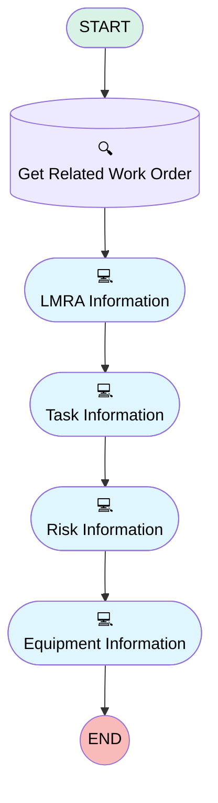

# [Work Order][Mobile Flow][Screen-Flow] Log LMRA Information

## Flow Diagram

## General Information

|<!-- -->|<!-- -->|
|:---|:---|
|Process Type| Field Service Mobile|
|Label|[Work Order][Mobile Flow][Screen-Flow] Log LMRA Information|
|Status|⚠️ Draft|
|Environments|Default|
|Interview Label|[Work Order][Mobile Flow][Screen-Flow] Log LMRA Information {!$Flow.CurrentDateTime}|
| Builder Type (PM)|LightningFlowBuilder|
| Canvas Mode (PM)|AUTO_LAYOUT_CANVAS|
| Origin Builder Type (PM)|LightningFlowBuilder|
|Connector|[Get_Related_Work_Order](#get_related_work_order)|
|Next Node|[Get_Related_Work_Order](#get_related_work_order)|

## Variables

|Name|Data Type|Is Collection|Is Input|Is Output|Object Type|
|:-- |:--:|:--:|:--:|:--:|:--: |
|Id|String|⬜|✅|⬜|<!-- -->|
|workOrderRecord|SObject|⬜|✅|⬜|WorkOrder|

## Flow Nodes Details

### Get_Related_Work_Order

|<!-- -->|<!-- -->|
|:---|:---|
|Type|Record Lookup|
|Object|WorkOrder|
|Label|Get Related Work Order|
|Assign Null Values If No Records Found|⬜|
|Output Reference|workOrderRecord|
|Queried Fields|- Id - WorkOrderNumber |
|Connector|[LMRA_Information](#lmra_information)|

#### Filters (logic: **and**)

|Filter Id|Field|Operator|Value|
|:-- |:-- |:--:|:--: |
|1|Id| Equal To|Id|

### Equipment_Information

|<!-- -->|<!-- -->|
|:---|:---|
|Type|Screen|
|Label|Equipment Information|
|Allow Back|✅|
|Allow Finish|✅|
|Allow Pause|⬜|
|Show Footer|✅|
|Show Header|⬜|

#### EPC_EPI_CBM_PBM

|<!-- -->|<!-- -->|
|:---|:---|
|Field Text|EPC - EPI/CBM - PBM|
|Field Type| Large Text Area|
|Inputs On Next Nav To Assoc Scrn| Use Stored Values|
|Is Required|⬜|

### LMRA_Information

|<!-- -->|<!-- -->|
|:---|:---|
|Type|Screen|
|Label|LMRA Information|
|Allow Back|⬜|
|Allow Finish|✅|
|Allow Pause|⬜|
|Show Footer|✅|
|Show Header|⬜|
|Connector|[Task_Information](#task_information)|

#### Work_Order_Number

|<!-- -->|<!-- -->|
|:---|:---|
|Data Type|String|
|Default Value|workOrderRecord.WorkOrderNumber|
|Field Text|Work Order Number|
|Field Type| Input Field|
|Inputs On Next Nav To Assoc Scrn| Use Stored Values|
|Is Disabled|true|
|Is Required|⬜|

#### Date

|<!-- -->|<!-- -->|
|:---|:---|
|Data Type|Date|
|Field Text|Date|
|Field Type| Input Field|
|Inputs On Next Nav To Assoc Scrn| Use Stored Values|
|Is Required|⬜|

#### LMRA_Type

|<!-- -->|<!-- -->|
|:---|:---|
|Data Type|String|
|Choice References|- Limited - Full |
|Field Text|LMRA Type|
|Field Type| Dropdown Box|
|Inputs On Next Nav To Assoc Scrn| Use Stored Values|
|Is Required|⬜|

### Risk_Information

|<!-- -->|<!-- -->|
|:---|:---|
|Type|Screen|
|Label|Risk Information|
|Allow Back|✅|
|Allow Finish|✅|
|Allow Pause|⬜|
|Show Footer|✅|
|Show Header|⬜|
|Connector|[Equipment_Information](#equipment_information)|

#### Surrounding_Risks

|<!-- -->|<!-- -->|
|:---|:---|
|Field Text|Surrounding Risks|
|Field Type| Large Text Area|
|Inputs On Next Nav To Assoc Scrn| Use Stored Values|
|Is Required|⬜|

#### SurroundRisksPhoto

|<!-- -->|<!-- -->|
|:---|:---|
|Extension Name|forceContent:fileUpload|
|Field Type| Component Instance|
|Inputs On Next Nav To Assoc Scrn| Use Stored Values|
|Is Required|✅|
|Record Id (input)|workOrderRecord.Id|
|Label (input)|Surrounding Risks Photo|

#### Corrective_Measures

|<!-- -->|<!-- -->|
|:---|:---|
|Field Text|Corrective Measures|
|Field Type| Large Text Area|
|Inputs On Next Nav To Assoc Scrn| Use Stored Values|
|Is Required|⬜|

#### CorrectiveMeasuresPhoto

|<!-- -->|<!-- -->|
|:---|:---|
|Extension Name|forceContent:fileUpload|
|Field Type| Component Instance|
|Inputs On Next Nav To Assoc Scrn| Use Stored Values|
|Is Required|✅|
|Label (input)|Corrective Measures Photo|
|Record Id (input)|workOrderRecord.Id|

### Task_Information

|<!-- -->|<!-- -->|
|:---|:---|
|Type|Screen|
|Label|Task Information|
|Allow Back|✅|
|Allow Finish|✅|
|Allow Pause|⬜|
|Show Footer|✅|
|Show Header|⬜|
|Connector|[Risk_Information](#risk_information)|

#### Tasks_of_the_Day

|<!-- -->|<!-- -->|
|:---|:---|
|Field Text|Tasks of the Day|
|Field Type| Large Text Area|
|Inputs On Next Nav To Assoc Scrn| Use Stored Values|
|Is Required|⬜|

___

_Documentation generated from branch monitoring_krinkelsgreencare__upeodev_sandbox by [sfdx-hardis](https://sfdx-hardis.cloudity.com), featuring [salesforce-flow-visualiser](https://github.com/toddhalfpenny/salesforce-flow-visualiser)_