# [Work Order][Mobile Flow][Screen-Flow] Log LMRA Information

## Flow Diagram

```mermaid
%% If you read this, your Markdown visualizer does not handle MermaidJS syntax.
%% - If you are in VsCode, install extension `Markdown Preview Mermaid Support` at https://marketplace.visualstudio.com/items?itemName=bierner.markdown-mermaid
%% - If you are using sfdx-hardis, try to define env variable `MERMAID_MODES=cli,docker` ,then run again the command to regenerate markdown with SVG images.
%% - If you are within mkdocs-material, define mermaid plugin in `mkdocs.yml` as described in https://squidfunk.github.io/mkdocs-material/extensions/mermaid/
%% - At last resort, you can copy-paste this MermaidJS code in https://mermaid.live/ to see the Flow Diagram

flowchart TB
START(["<b>START</b>"]):::startClassChanged


click START "#general-information" "459049158"



Full_or_Limited_LMRA{"<b>🔀 <em></em><br/>Full or Limited LMRA ?</b>"}:::decisionsAdded
click Full_or_Limited_LMRA "#full_or_limited_lmra" "1047146990"

LMRA_Already_Done{"<b>🔀 <em></em><br/>LMRA Already Done ?</b>"}:::decisionsAdded
click LMRA_Already_Done "#lmra_already_done" "2884183025"

Create_Full_LMRA[("<b>➕ <em></em><br/>Create Full LMRA</b>")]:::recordCreatesAdded
click Create_Full_LMRA "#create_full_lmra" "4175645033"

Create_Limited_LMRA[("<b>➕ <em></em><br/>Create Limited LMRA</b>")]:::recordCreatesAdded
click Create_Limited_LMRA "#create_limited_lmra" "69133525"


Get_Related_Work_Order[("<b>🔍 <em></em><br/>Get Related Work Order</b>")]:::recordLookupsChanged


click Get_Related_Work_Order "#get_related_work_order" "710350311"



Equipment_Information(["<i>💻 <em></em><br/>Equipment Information</i>"]):::screensRemoved
click Equipment_Information "#equipment_information" "2163154206"

Get_Work_Step_Information[("<b>🔍 <em></em><br/>Get Work Step Information</b>")]:::recordLookupsAdded
click Get_Work_Step_Information "#get_work_step_information" "1637338462"



LMRA_Information(["<i>💻 <em></em><br/>LMRA Information</i>"]):::screensRemoved
click LMRA_Information "#lmra_information" "245551225"

Confirmed_LMRA_Done_at_WO_level[("<b>🛠️ <em></em><br/>Confirmed LMRA Done at WO level</b>")]:::recordUpdatesAdded
click Confirmed_LMRA_Done_at_WO_level "#confirmed_lmra_done_at_wo_level" "3771151378"



Risk_Information(["<i>💻 <em></em><br/>Risk Information</i>"]):::screensRemoved
click Risk_Information "#risk_information" "4290839850"

Full_LMRA_Information(["<b>💻 <em></em><br/>Full LMRA Information</b>"]):::screensAdded
click Full_LMRA_Information "#full_lmra_information" "2192336012"



Task_Information(["<i>💻 <em></em><br/>Task Information</i>"]):::screensRemoved
click Task_Information "#task_information" "578828805"

Full_LMRA_Information_Part_Two(["<b>💻 <em></em><br/>Full LMRA Information - Part Two</b>"]):::screensAdded
click Full_LMRA_Information_Part_Two "#full_lmra_information_part_two" "4241642172"



Get_Related_Work_Order -.-> LMRA_Information
Equipment_Information -.-> END_Equipment_Information
LMRA_Information -.-> Task_Information
Risk_Information -.-> Equipment_Information
Task_Information -.-> Risk_Information
START -.->  Get_Related_Work_Order
END_Equipment_Information(( END )):::endClassRemoved

Limited_LMRA_Information(["<b>💻 <em></em><br/>Limited LMRA Information</b>"]):::screensAdded
click Limited_LMRA_Information "#limited_lmra_information" "1254657940"



LMRA_Done_Message(["<b>💻 <em></em><br/>LMRA Done Message</b>"]):::screensAdded
click LMRA_Done_Message "#lmra_done_message" "4218021228"



Full_or_Limited_LMRA ==> |"🟩<b>Full</b>"| Full_LMRA_Information
Full_or_Limited_LMRA ==> |"🟩<b>Limited</b>"| Limited_LMRA_Information
LMRA_Already_Done ==> |"🟩<b>No</b>"| Full_or_Limited_LMRA
LMRA_Already_Done ==> |"🟩<b>Yes</b>"| LMRA_Done_Message
Create_Full_LMRA ==> Confirmed_LMRA_Done_at_WO_level
Create_Limited_LMRA ==> Confirmed_LMRA_Done_at_WO_level
Get_Related_Work_Order ==> LMRA_Already_Done
Get_Work_Step_Information ==> Get_Related_Work_Order
Confirmed_LMRA_Done_at_WO_level ==> END_Confirmed_LMRA_Done_at_WO_level
Full_LMRA_Information ==> Full_LMRA_Information_Part_Two
Full_LMRA_Information_Part_Two ==> Create_Full_LMRA
Limited_LMRA_Information ==> Create_Limited_LMRA
LMRA_Done_Message ==> END_LMRA_Done_Message
START ==>  Get_Work_Step_Information
END_Confirmed_LMRA_Done_at_WO_level(( END )):::endClassAdded
END_LMRA_Done_Message(( END )):::endClassAdded



classDef actionCalls fill:#D4E4FC,color:black,max-height:100px
classDef assignments fill:#FBEED7,color:black,max-height:100px
classDef collectionProcessors fill:#F0E3FA,color:black,max-height:100px
classDef customErrors fill:#FFE9E9,color:black,max-height:100px
classDef decisions fill:#FDEAF6,color:black,max-height:100px
classDef loops fill:#FDEAF6,color:black,max-height:100px
classDef recordCreates fill:#FFF8C9,color:black,max-height:100px
classDef recordDeletes fill:#FFF8C9,color:black,max-height:100px
classDef recordLookups fill:#EDEAFF,color:black,max-height:100px
classDef recordUpdates fill:#FFF8C9,color:black,max-height:100px
classDef screens fill:#DFF6FF,color:black,max-height:100px
classDef subflows fill:#D4E4FC,color:black,max-height:100px
classDef startClass fill:#D9F2E6,color:black,max-height:100px
classDef endClass fill:#F9BABA,color:black,max-height:100px



classDef actionCallsAdded fill:green,color:white,stroke-width:4px,max-height:100px
classDef assignmentsAdded fill:green,color:white,stroke-width:4px,max-height:100px
classDef collectionProcessorsAdded fill:green,color:white,stroke-width:4px,max-height:100px
classDef customErrorsAdded fill:green,color:white,stroke-width:4px,max-height:100px
classDef decisionsAdded fill:green,color:white,stroke-width:4px,max-height:100px
classDef loopsAdded fill:green,color:white,stroke-width:4px,max-height:100px
classDef recordCreatesAdded fill:green,color:white,stroke-width:4px,max-height:100px
classDef recordDeletesAdded fill:green,color:white,stroke-width:4px,max-height:100px
classDef recordLookupsAdded fill:green,color:white,stroke-width:4px,max-height:100px
classDef recordUpdatesAdded fill:green,color:white,stroke-width:4px,max-height:100px
classDef screensAdded fill:green,color:white,stroke-width:4px,max-height:100px
classDef subflowsAdded fill:green,color:white,stroke-width:4px,max-height:100px
classDef startClassAdded fill:green,color:white,stroke-width:4px,max-height:100px

classDef actionCallsRemoved fill:red,color:white,stroke-width:4px,max-height:100px
classDef assignmentsRemoved fill:red,color:white,stroke-width:4px,max-height:100px
classDef collectionProcessorsRemoved fill:red,color:white,stroke-width:4px,max-height:100px
classDef customErrorsRemoved fill:red,color:white,stroke-width:4px,max-height:100px
classDef decisionsRemoved fill:red,color:white,stroke-width:4px,max-height:100px
classDef loopsRemoved fill:red,color:white,stroke-width:4px,max-height:100px
classDef recordCreatesRemoved fill:red,color:white,stroke-width:4px,max-height:100px
classDef recordDeletesRemoved fill:red,color:white,stroke-width:4px,max-height:100px
classDef recordLookupsRemoved fill:red,color:white,stroke-width:4px,max-height:100px
classDef recordUpdatesRemoved fill:red,color:white,stroke-width:4px,max-height:100px
classDef screensRemoved fill:red,color:white,stroke-width:4px,max-height:100px
classDef subflowsRemoved fill:red,color:white,stroke-width:4px,max-height:100px
classDef startClassRemoved fill:red,color:white,stroke-width:4px,max-height:100px

classDef actionCallsChanged fill:orange,color:white,stroke-width:4px,max-height:100px
classDef assignmentsChanged fill:orange,color:white,stroke-width:4px,max-height:100px
classDef collectionProcessorsChanged fill:orange,color:white,stroke-width:4px,max-height:100px
classDef customErrorsChanged fill:orange,color:white,stroke-width:4px,max-height:100px
classDef decisionsChanged fill:orange,color:white,stroke-width:4px,max-height:100px
classDef loopsChanged fill:orange,color:white,stroke-width:4px,max-height:100px
classDef recordCreatesChanged fill:orange,color:white,stroke-width:4px,max-height:100px
classDef recordDeletesChanged fill:orange,color:white,stroke-width:4px,max-height:100px
classDef recordLookupsChanged fill:orange,color:white,stroke-width:4px,max-height:100px
classDef recordUpdatesChanged fill:orange,color:white,stroke-width:4px,max-height:100px
classDef screensChanged fill:orange,color:white,stroke-width:4px,max-height:100px
classDef subflowsChanged fill:orange,color:white,stroke-width:4px,max-height:100px
classDef startClassChanged fill:orange,color:white,stroke-width:4px,max-height:100px
  
linkStyle 6,7,8,9,10,11,12,13,14,15,16,17,18,19 stroke:#00ff00,stroke-width:4px,color:green;
linkStyle 0,1,2,3,4,5 stroke:#ff0000,stroke-width:4px,color:red;
```

## General Information

|<!-- -->|<!-- -->|
|:---|:---|
|🟥<i>Status</i>|<i>⚠️ Draft</i>|
|🟩<b>Status</b>|<b>Active</b>|
|🟥<i>Connector</i>|<i>[Get_Related_Work_Order](#get_related_work_order)</i>|
|🟥<i>Next Node</i>|<i>[Get_Related_Work_Order](#get_related_work_order)</i>|
|🟩<b>Connector</b>|<b>[Get_Work_Step_Information](#get_work_step_information)</b>|
|🟩<b>Next Node</b>|<b>[Get_Work_Step_Information](#get_work_step_information)</b>|

## Variables

|Name|Data Type|Is Collection|Is Input|Is Output|Object Type|
|:-- |:--:|:--:|:--:|:--:|:--: |
|🟩<b>WorkStepRecord</b>|<b>SObject</b>|<b>⬜</b>|<b>✅</b>|<b>⬜</b>|<b>WorkStep</b>|

## Flow Nodes Details

### 🟩Full_or_Limited_LMRA

|<!-- -->|<!-- -->|
|:---|:---|
|🟩<b>Type</b>|<b>Decision</b>|
|🟩<b>Label</b>|<b>Full or Limited LMRA ?</b>|
|🟩<b>Default Connector</b>|<b>[Limited_LMRA_Information](#limited_lmra_information)</b>|
|🟩<b>Default Connector Label</b>|<b>Limited</b>|

#### 🟩Rule Full_Full_or_Limited_LMRA (Full)

|<!-- -->|<!-- -->|
|:---|:---|
|🟩<b>Connector</b>|<b>[Full_LMRA_Information](#full_lmra_information)</b>|
|🟩<b>Condition Logic</b>|<b>and</b>|

|Condition Id|Left Value Reference|Operator|Right Value|
|:-- |:-- |:--:|:--: |
|🟩<b>1</b>|<b>workOrderRecord.LMRA__c</b>|<b> Equal To</b>|<b>Full</b>|

### 🟩LMRA_Already_Done

|<!-- -->|<!-- -->|
|:---|:---|
|🟩<b>Type</b>|<b>Decision</b>|
|🟩<b>Label</b>|<b>LMRA Already Done ?</b>|
|🟩<b>Default Connector</b>|<b>[LMRA_Done_Message](#lmra_done_message)</b>|
|🟩<b>Default Connector Label</b>|<b>Yes</b>|

#### 🟩Rule No (No)

|<!-- -->|<!-- -->|
|:---|:---|
|🟩<b>Connector</b>|<b>[Full_or_Limited_LMRA](#full_or_limited_lmra)</b>|
|🟩<b>Condition Logic</b>|<b>and</b>|

|Condition Id|Left Value Reference|Operator|Right Value|
|:-- |:-- |:--:|:--: |
|🟩<b>1</b>|<b>workOrderRecord.LMRA_Done__c</b>|<b> Equal To</b>|<b>⬜</b>|

### 🟩Create_Full_LMRA

|<!-- -->|<!-- -->|
|:---|:---|
|🟩<b>Type</b>|<b>Record Create</b>|
|🟩<b>Object</b>|<b>LMRA__c</b>|
|🟩<b>Label</b>|<b>Create Full LMRA</b>|
|🟩<b>Connector</b>|<b>[Confirmed_LMRA_Done_at_WO_level](#confirmed_lmra_done_at_wo_level)</b>|

#### 🟩Input Assignments

|Field|Value|
|:-- |:--: |
|🟩<b>Corrective_Measures__c</b>|<b>Corrective_Measures</b>|
|🟩<b>Date__c</b>|<b>Date_Full</b>|
|🟩<b>EPC_EPI_CBM_PBM__c</b>|<b>EPC_EPI_CBM_PBM</b>|
|🟩<b>LMRA_Type__c</b>|<b>Full</b>|
|🟩<b>Project_Lead__c</b>|<b>Project_Lead_Full</b>|
|🟩<b>Surrounding_Risks__c</b>|<b>Surrounding_Risks</b>|
|🟩<b>Tasks_of_the_Day__c</b>|<b>Tasks_of_the_Day</b>|
|🟩<b>Work_Order__c</b>|<b>workOrderRecord.Id</b>|

### 🟩Create_Limited_LMRA

|<!-- -->|<!-- -->|
|:---|:---|
|🟩<b>Type</b>|<b>Record Create</b>|
|🟩<b>Object</b>|<b>LMRA__c</b>|
|🟩<b>Label</b>|<b>Create Limited LMRA</b>|
|🟩<b>Connector</b>|<b>[Confirmed_LMRA_Done_at_WO_level](#confirmed_lmra_done_at_wo_level)</b>|

#### 🟩Input Assignments

|Field|Value|
|:-- |:--: |
|🟩<b>Date__c</b>|<b>Date_Lmited</b>|
|🟩<b>LMRA_Type__c</b>|<b>Limited</b>|
|🟩<b>Project_Lead__c</b>|<b>Project_Lead</b>|
|🟩<b>Work_Order__c</b>|<b>workOrderRecord.Id</b>|

### Get_Related_Work_Order

|<!-- -->|<!-- -->|
|:---|:---|
|🟥<i>Queried Fields</i>|<i>- Id - WorkOrderNumber </i>|
|🟥<i>Connector</i>|<i>[LMRA_Information](#lmra_information)</i>|
|🟩<b>Queried Fields</b>|<b>- Id - WorkOrderNumber - LMRA__c - LMRA_Done__c </b>|
|🟩<b>Connector</b>|<b>[LMRA_Already_Done](#lmra_already_done)</b>|

#### Filters (logic: **and**)

|Filter Id|Field|Operator|Value|
|:-- |:-- |:--:|:--: |
|🟥<i>1</i>|<i>Id</i>|<i> Equal To</i>|<i>Id</i>|
|🟩<b>1</b>|<b>Id</b>|<b> Equal To</b>|<b>WorkStepRecord.WorkOrderId</b>|

### 🟥Equipment_Information

### 🟩Get_Work_Step_Information

|<!-- -->|<!-- -->|
|:---|:---|
|🟥<i>Type</i>|<i>Screen</i>|
|🟥<i>Label</i>|<i>Equipment Information</i>|
|🟥<i>Allow Back</i>|<i>✅</i>|
|🟥<i>Allow Finish</i>|<i>✅</i>|
|🟥<i>Allow Pause</i>|<i>⬜</i>|
|🟥<i>Show Footer</i>|<i>✅</i>|
|🟥<i>Show Header</i>|<i>⬜</i>|
|🟩<b>Type</b>|<b>Record Lookup</b>|
|🟩<b>Object</b>|<b>WorkStep</b>|
|🟩<b>Label</b>|<b>Get Work Step Information</b>|
|🟩<b>Assign Null Values If No Records Found</b>|<b>⬜</b>|
|🟩<b>Output Reference</b>|<b>WorkStepRecord</b>|
|🟩<b>Queried Fields</b>|<b>- Id - WorkOrderId </b>|
|🟩<b>Connector</b>|<b>[Get_Related_Work_Order](#get_related_work_order)</b>|

#### 🟥EPC_EPI_CBM_PBM

#### 🟩Filters (logic: **and**)

|Filter Id|Field|Operator|Value|
|:-- |:-- |:--:|:--: |
|🟩<b>1</b>|<b>Id</b>|<b> Equal To</b>|<b>Id</b>|

### 🟩Confirmed_LMRA_Done_at_WO_level

|<!-- -->|<!-- -->|
|:---|:---|
|🟥<i>Field Text</i>|<i>EPC - EPI/CBM - PBM</i>|
|🟥<i>Field Type</i>|<i> Large Text Area</i>|
|🟥<i>Inputs On Next Nav To Assoc Scrn</i>|<i> Use Stored Values</i>|
|🟥<i>Is Required</i>|<i>⬜</i>|
|🟩<b>Type</b>|<b>Record Update</b>|
|🟩<b>Object</b>|<b>WorkOrder</b>|
|🟩<b>Label</b>|<b>Confirmed LMRA Done at WO level</b>|

#### 🟩Filters (logic: **and**)

|Filter Id|Field|Operator|Value|
|:-- |:-- |:--:|:--: |
|🟩<b>1</b>|<b>Id</b>|<b> Equal To</b>|<b>workOrderRecord.Id</b>|

### 🟥LMRA_Information

#### 🟩Input Assignments

|Field|Value|
|:-- |:--: |
|🟩<b>LMRA_Done__c</b>|<b>✅</b>|

### 🟩Full_LMRA_Information

|<!-- -->|<!-- -->|
|:---|:---|
|🟥<i>Label</i>|<i>LMRA Information</i>|
|🟩<b>Label</b>|<b>Full LMRA Information</b>|
|🟥<i>Connector</i>|<i>[Task_Information](#task_information)</i>|
|🟩<b>Connector</b>|<b>[Full_LMRA_Information_Part_Two](#full_lmra_information_part_two)</b>|

#### 🟥Work_Order_Number

#### 🟩FullLMRATitle

|<!-- -->|<!-- -->|
|:---|:---|
|🟩<b>Field Text</b>|<b>
<strong>Full LMRA</strong>
</b>|
|🟩<b>Field Type</b>|<b> Display Text</b>|

#### 🟩Work_Order_Full

|<!-- -->|<!-- -->|
|:---|:---|
|🟥<i>Field Text</i>|<i>Work Order Number</i>|
|🟩<b>Field Text</b>|<b>Work Order</b>|
|🟩<b>Is Read Only</b>|<b>true</b>|

#### 🟥Date

#### 🟩Date_Full

#### 🟥LMRA_Type

#### 🟩Project_Lead_Full

|<!-- -->|<!-- -->|
|:---|:---|
|🟥<i>Choice References</i>|<i>- Limited - Full </i>|
|🟥<i>Field Text</i>|<i>LMRA Type</i>|
|🟥<i>Field Type</i>|<i> Dropdown Box</i>|
|🟩<b>Field Text</b>|<b>Project Lead</b>|
|🟩<b>Field Type</b>|<b> Input Field</b>|

### 🟥Risk_Information

### 🟩Full_LMRA_Information_Part_Two

|<!-- -->|<!-- -->|
|:---|:---|
|🟥<i>Label</i>|<i>Risk Information</i>|
|🟥<i>Allow Back</i>|<i>✅</i>|
|🟩<b>Label</b>|<b>Full LMRA Information - Part Two</b>|
|🟩<b>Allow Back</b>|<b>⬜</b>|
|🟥<i>Connector</i>|<i>[Equipment_Information](#equipment_information)</i>|
|🟩<b>Connector</b>|<b>[Create_Full_LMRA](#create_full_lmra)</b>|

#### 🟥Surrounding_Risks

#### 🟩FullLMRATitleTwo

|<!-- -->|<!-- -->|
|:---|:---|
|🟥<i>Field Text</i>|<i>Surrounding Risks</i>|
|🟩<b>Field Text</b>|<b>
<strong>Full LMRA</strong>
</b>|
|🟩<b>Field Type</b>|<b> Display Text</b>|

#### 🟩Tasks_of_the_Day

|<!-- -->|<!-- -->|
|:---|:---|
|🟩<b>Field Text</b>|<b>Tasks of the Day</b>|

#### 🟥SurroundRisksPhoto

#### 🟩Surrounding_Risks

|<!-- -->|<!-- -->|
|:---|:---|
|🟥<i>Extension Name</i>|<i>forceContent:fileUpload</i>|
|🟥<i>Field Type</i>|<i> Component Instance</i>|
|🟩<b>Field Text</b>|<b>Surrounding Risks</b>|
|🟩<b>Field Type</b>|<b> Large Text Area</b>|
|🟥<i>Is Required</i>|<i>✅</i>|
|🟥<i>Record Id (input)</i>|<i>workOrderRecord.Id</i>|
|🟥<i>Label (input)</i>|<i>Surrounding Risks Photo</i>|
|🟩<b>Is Required</b>|<b>⬜</b>|

#### 🟥CorrectiveMeasuresPhoto

#### 🟩EPC_EPI_CBM_PBM

|<!-- -->|<!-- -->|
|:---|:---|
|🟥<i>Extension Name</i>|<i>forceContent:fileUpload</i>|
|🟥<i>Field Type</i>|<i> Component Instance</i>|
|🟩<b>Field Text</b>|<b>EPC - EPI/CBM - PBM</b>|
|🟩<b>Field Type</b>|<b> Large Text Area</b>|
|🟥<i>Is Required</i>|<i>✅</i>|
|🟥<i>Label (input)</i>|<i>Corrective Measures Photo</i>|
|🟥<i>Record Id (input)</i>|<i>workOrderRecord.Id</i>|
|🟩<b>Is Required</b>|<b>⬜</b>|

### 🟥Task_Information

### 🟩Limited_LMRA_Information

|<!-- -->|<!-- -->|
|:---|:---|
|🟥<i>Label</i>|<i>Task Information</i>|
|🟥<i>Allow Back</i>|<i>✅</i>|
|🟩<b>Label</b>|<b>Limited LMRA Information</b>|
|🟩<b>Allow Back</b>|<b>⬜</b>|
|🟥<i>Connector</i>|<i>[Risk_Information](#risk_information)</i>|
|🟩<b>Connector</b>|<b>[Create_Limited_LMRA](#create_limited_lmra)</b>|

#### 🟥Tasks_of_the_Day

#### 🟩LimitedLMRATitle

|<!-- -->|<!-- -->|
|:---|:---|
|🟥<i>Field Text</i>|<i>Tasks of the Day</i>|
|🟥<i>Field Type</i>|<i> Large Text Area</i>|
|🟩<b>Field Text</b>|<b>
<strong>Limited LMRA</strong>
</b>|
|🟩<b>Field Type</b>|<b> Display Text</b>|

#### 🟩LmitedLMRAMessage

|<!-- -->|<!-- -->|
|:---|:---|
|🟩<b>Field Text</b>|<b>
<strong style="color: rgb(231, 24, 24); font-size: 14px;">Don't forget your LMRA, avoid accidents!</strong>
</b>|
|🟩<b>Field Type</b>|<b> Display Text</b>|

#### 🟩Work_Order

|<!-- -->|<!-- -->|
|:---|:---|
|🟩<b>Data Type</b>|<b>String</b>|
|🟩<b>Default Value</b>|<b>workOrderRecord.WorkOrderNumber</b>|
|🟩<b>Field Text</b>|<b>Work Order</b>|
|🟩<b>Field Type</b>|<b> Input Field</b>|
|🟩<b>Is Disabled</b>|<b>true</b>|
|🟩<b>Is Read Only</b>|<b>true</b>|

#### 🟩Date_Lmited

|<!-- -->|<!-- -->|
|:---|:---|
|🟩<b>Data Type</b>|<b>Date</b>|
|🟩<b>Field Text</b>|<b>Date</b>|
|🟩<b>Field Type</b>|<b> Input Field</b>|
|🟩<b>Inputs On Next Nav To Assoc Scrn</b>|<b> Use Stored Values</b>|
|🟩<b>Is Required</b>|<b>⬜</b>|

#### 🟩Project_Lead

|<!-- -->|<!-- -->|
|:---|:---|
|🟩<b>Data Type</b>|<b>String</b>|
|🟩<b>Field Text</b>|<b>Project Lead</b>|
|🟩<b>Field Type</b>|<b> Input Field</b>|
|🟩<b>Inputs On Next Nav To Assoc Scrn</b>|<b> Use Stored Values</b>|
|🟩<b>Is Required</b>|<b>⬜</b>|

### 🟩LMRA_Done_Message

|<!-- -->|<!-- -->|
|:---|:---|
|🟩<b>Type</b>|<b>Screen</b>|
|🟩<b>Label</b>|<b>LMRA Done Message</b>|
|🟩<b>Allow Back</b>|<b>⬜</b>|
|🟩<b>Allow Finish</b>|<b>✅</b>|
|🟩<b>Allow Pause</b>|<b>⬜</b>|
|🟩<b>Next Or Finish Button Label</b>|<b>Close</b>|
|🟩<b>Show Footer</b>|<b>✅</b>|
|🟩<b>Show Header</b>|<b>⬜</b>|

#### 🟩LMRADoneMessage

|<!-- -->|<!-- -->|
|:---|:---|
|🟩<b>Field Text</b>|<b>
LMRA already done for this work order at this location. You can continue with your tasks.&nbsp;
</b>|
|🟩<b>Field Type</b>|<b> Display Text</b>|

___

_Documentation generated from branch monitoring_krinkelsgreencare__upeodev_sandbox by [sfdx-hardis](https://sfdx-hardis.cloudity.com), featuring [salesforce-flow-visualiser](https://github.com/toddhalfpenny/salesforce-flow-visualiser)_