# [Work Order][Mobile Flow][Screen-Flow] Log LMRA Information

## Flow Diagram

```mermaid
%% If you read this, your Markdown visualizer does not handle MermaidJS syntax.
%% - If you are in VsCode, install extension `Markdown Preview Mermaid Support` at https://marketplace.visualstudio.com/items?itemName=bierner.markdown-mermaid
%% - If you are using sfdx-hardis, try to define env variable `MERMAID_MODES=cli,docker` ,then run again the command to regenerate markdown with SVG images.
%% - If you are within mkdocs-material, define mermaid plugin in `mkdocs.yml` as described in https://squidfunk.github.io/mkdocs-material/extensions/mermaid/
%% - At last resort, you can copy-paste this MermaidJS code in https://mermaid.live/ to see the Flow Diagram

flowchart TB
START(["START"]):::startClass
click START "#general-information" "459049158"

Full_or_Limited_LMRA{"🔀 <em></em><br/>Full or Limited LMRA ?"}:::decisions
click Full_or_Limited_LMRA "#full_or_limited_lmra" "1047146990"

Limited_LMRA_Confirmed{"🔀 <em></em><br/>Limited LMRA Confirmed ?"}:::decisions
click Limited_LMRA_Confirmed "#limited_lmra_confirmed" "2857364459"

LMRA_Already_Done{"🔀 <em></em><br/>LMRA Already Done ?"}:::decisions
click LMRA_Already_Done "#lmra_already_done" "2884183025"

Create_Full_LMRA[("➕ <em></em><br/>Create Full LMRA")]:::recordCreates
click Create_Full_LMRA "#create_full_lmra" "3999568703"

Create_Limited_LMRA[("➕ <em></em><br/>Create Limited LMRA")]:::recordCreates
click Create_Limited_LMRA "#create_limited_lmra" "2204160202"

Get_Related_Work_Order[("🔍 <em></em><br/>Get Related Work Order")]:::recordLookups
click Get_Related_Work_Order "#get_related_work_order" "710350311"

Get_Work_Step_Information[("🔍 <em></em><br/>Get Work Step Information")]:::recordLookups
click Get_Work_Step_Information "#get_work_step_information" "968707648"

Confirmed_LMRA_Done_at_WO_level[("🛠️ <em></em><br/>Confirmed LMRA Done at WO level")]:::recordUpdates
click Confirmed_LMRA_Done_at_WO_level "#confirmed_lmra_done_at_wo_level" "3771151378"

Update_Work_Step_Status_to_Complete[("🛠️ <em></em><br/>Update Work Step Status to Complete")]:::recordUpdates
click Update_Work_Step_Status_to_Complete "#update_work_step_status_to_complete" "1882464419"

Update_Work_Step_Status_to_Complete_After[("🛠️ <em></em><br/>Update Work Step Status to Complete After")]:::recordUpdates
click Update_Work_Step_Status_to_Complete_After "#update_work_step_status_to_complete_after" "247084983"

Full_LMRA_Information(["<b>💻 <em></em><br/>Full LMRA Information</b>"]):::screensChanged


click Full_LMRA_Information "#full_lmra_information" "737905365"


Limited_LMRA_Information(["💻 <em></em><br/>Limited LMRA Information"]):::screens
click Limited_LMRA_Information "#limited_lmra_information" "3519037032"

LMRA_Done_Message(["💻 <em></em><br/>LMRA Done Message"]):::screens
click LMRA_Done_Message "#lmra_done_message" "581062939"

Full_or_Limited_LMRA --> |"Full"| Full_LMRA_Information
Full_or_Limited_LMRA --> |"Limited"| Limited_LMRA_Information
Limited_LMRA_Confirmed --> |"Yes"| Create_Limited_LMRA
Limited_LMRA_Confirmed --> |"No"| Limited_LMRA_Information
LMRA_Already_Done --> |"No"| Full_or_Limited_LMRA
LMRA_Already_Done --> |"Yes"| LMRA_Done_Message
Create_Full_LMRA --> Update_Work_Step_Status_to_Complete_After
Create_Limited_LMRA --> Update_Work_Step_Status_to_Complete_After
Get_Related_Work_Order --> LMRA_Already_Done
Get_Work_Step_Information --> Get_Related_Work_Order
Confirmed_LMRA_Done_at_WO_level --> END_Confirmed_LMRA_Done_at_WO_level
Update_Work_Step_Status_to_Complete --> END_Update_Work_Step_Status_to_Complete
Update_Work_Step_Status_to_Complete_After --> Confirmed_LMRA_Done_at_WO_level
Full_LMRA_Information --> Create_Full_LMRA
Limited_LMRA_Information --> Limited_LMRA_Confirmed
LMRA_Done_Message --> Update_Work_Step_Status_to_Complete
START -->  Get_Work_Step_Information
END_Confirmed_LMRA_Done_at_WO_level(( END )):::endClass
END_Update_Work_Step_Status_to_Complete(( END )):::endClass


classDef actionCalls fill:#D4E4FC,color:black,text-decoration:none,max-height:100px
classDef assignments fill:#FBEED7,color:black,text-decoration:none,max-height:100px
classDef collectionProcessors fill:#F0E3FA,color:black,text-decoration:none,max-height:100px
classDef customErrors fill:#FFE9E9,color:black,text-decoration:none,max-height:100px
classDef decisions fill:#FDEAF6,color:black,text-decoration:none,max-height:100px
classDef loops fill:#FDEAF6,color:black,text-decoration:none,max-height:100px
classDef recordCreates fill:#FFF8C9,color:black,text-decoration:none,max-height:100px
classDef recordDeletes fill:#FFF8C9,color:black,text-decoration:none,max-height:100px
classDef recordLookups fill:#EDEAFF,color:black,text-decoration:none,max-height:100px
classDef recordUpdates fill:#FFF8C9,color:black,text-decoration:none,max-height:100px
classDef screens fill:#DFF6FF,color:black,text-decoration:none,max-height:100px
classDef subflows fill:#D4E4FC,color:black,text-decoration:none,max-height:100px
classDef startClass fill:#D9F2E6,color:black,text-decoration:none,max-height:100px
classDef endClass fill:#F9BABA,color:black,text-decoration:none,max-height:100px



classDef actionCallsAdded fill:green,color:white,stroke-width:4px,text-decoration:none,max-height:100px
classDef assignmentsAdded fill:green,color:white,stroke-width:4px,text-decoration:none,max-height:100px
classDef collectionProcessorsAdded fill:green,color:white,stroke-width:4px,text-decoration:none,max-height:100px
classDef customErrorsAdded fill:green,color:white,stroke-width:4px,text-decoration:none,max-height:100px
classDef decisionsAdded fill:green,color:white,stroke-width:4px,text-decoration:none,max-height:100px
classDef loopsAdded fill:green,color:white,stroke-width:4px,text-decoration:none,max-height:100px
classDef recordCreatesAdded fill:green,color:white,stroke-width:4px,text-decoration:none,max-height:100px
classDef recordDeletesAdded fill:green,color:white,stroke-width:4px,text-decoration:none,max-height:100px
classDef recordLookupsAdded fill:green,color:white,stroke-width:4px,text-decoration:none,max-height:100px
classDef recordUpdatesAdded fill:green,color:white,stroke-width:4px,text-decoration:none,max-height:100px
classDef screensAdded fill:green,color:white,stroke-width:4px,text-decoration:none,max-height:100px
classDef subflowsAdded fill:green,color:white,stroke-width:4px,text-decoration:none,max-height:100px
classDef startClassAdded fill:green,color:white,stroke-width:4px,text-decoration:none,max-height:100px

classDef actionCallsRemoved fill:red,color:white,stroke-width:4px,text-decoration:none,max-height:100px
classDef assignmentsRemoved fill:red,color:white,stroke-width:4px,text-decoration:none,max-height:100px
classDef collectionProcessorsRemoved fill:red,color:white,stroke-width:4px,text-decoration:none,max-height:100px
classDef customErrorsRemoved fill:red,color:white,stroke-width:4px,text-decoration:none,max-height:100px
classDef decisionsRemoved fill:red,color:white,stroke-width:4px,text-decoration:none,max-height:100px
classDef loopsRemoved fill:red,color:white,stroke-width:4px,text-decoration:none,max-height:100px
classDef recordCreatesRemoved fill:red,color:white,stroke-width:4px,text-decoration:none,max-height:100px
classDef recordDeletesRemoved fill:red,color:white,stroke-width:4px,text-decoration:none,max-height:100px
classDef recordLookupsRemoved fill:red,color:white,stroke-width:4px,text-decoration:none,max-height:100px
classDef recordUpdatesRemoved fill:red,color:white,stroke-width:4px,text-decoration:none,max-height:100px
classDef screensRemoved fill:red,color:white,stroke-width:4px,text-decoration:none,max-height:100px
classDef subflowsRemoved fill:red,color:white,stroke-width:4px,text-decoration:none,max-height:100px
classDef startClassRemoved fill:red,color:white,stroke-width:4px,text-decoration:none,max-height:100px

classDef actionCallsChanged fill:orange,color:white,stroke-width:4px,text-decoration:none,max-height:100px
classDef assignmentsChanged fill:orange,color:white,stroke-width:4px,text-decoration:none,max-height:100px
classDef collectionProcessorsChanged fill:orange,color:white,stroke-width:4px,text-decoration:none,max-height:100px
classDef customErrorsChanged fill:orange,color:white,stroke-width:4px,text-decoration:none,max-height:100px
classDef decisionsChanged fill:orange,color:white,stroke-width:4px,text-decoration:none,max-height:100px
classDef loopsChanged fill:orange,color:white,stroke-width:4px,text-decoration:none,max-height:100px
classDef recordCreatesChanged fill:orange,color:white,stroke-width:4px,text-decoration:none,max-height:100px
classDef recordDeletesChanged fill:orange,color:white,stroke-width:4px,text-decoration:none,max-height:100px
classDef recordLookupsChanged fill:orange,color:white,stroke-width:4px,text-decoration:none,max-height:100px
classDef recordUpdatesChanged fill:orange,color:white,stroke-width:4px,text-decoration:none,max-height:100px
classDef screensChanged fill:orange,color:white,stroke-width:4px,text-decoration:none,max-height:100px
classDef subflowsChanged fill:orange,color:white,stroke-width:4px,text-decoration:none,max-height:100px
classDef startClassChanged fill:orange,color:white,stroke-width:4px,text-decoration:none,max-height:100px
  
```

## Flow Nodes Details

### Full_LMRA_Information

#### Project_Lead_Full

|<!-- -->|<!-- -->|
|:---|:---|
|🟥<i>Is Required</i>|<i>⬜</i>|
|🟩<b>Is Required</b>|<b>✅</b>|

#### Tasks_of_the_Day_1

|<!-- -->|<!-- -->|
|:---|:---|
|🟥<i>Is Required</i>|<i>⬜</i>|
|🟩<b>Is Required</b>|<b>✅</b>|

#### Surrounding_Risks_1

|<!-- -->|<!-- -->|
|:---|:---|
|🟥<i>Is Required</i>|<i>⬜</i>|
|🟩<b>Is Required</b>|<b>✅</b>|

#### Corrective_Measures_1

|<!-- -->|<!-- -->|
|:---|:---|
|🟥<i>Is Required</i>|<i>⬜</i>|
|🟩<b>Is Required</b>|<b>✅</b>|

#### EPC_EPI_CBM_PBM_1

|<!-- -->|<!-- -->|
|:---|:---|
|🟥<i>Is Required</i>|<i>⬜</i>|
|🟩<b>Is Required</b>|<b>✅</b>|

___

_Documentation generated from branch monitoring_krinkelsgreencare__upeodev_sandbox by [sfdx-hardis](https://sfdx-hardis.cloudity.com), featuring [salesforce-flow-visualiser](https://github.com/toddhalfpenny/salesforce-flow-visualiser)_