# [Work Order][Mobile Flow][Screen-Flow] Log LMRA Information

## Flow Diagram

```mermaid
%% If you read this, your Markdown visualizer does not handle MermaidJS syntax.
%% - If you are in VsCode, install extension `Markdown Preview Mermaid Support` at https://marketplace.visualstudio.com/items?itemName=bierner.markdown-mermaid
%% - If you are using sfdx-hardis, try to define env variable `MERMAID_MODES=cli,docker` ,then run again the command to regenerate markdown with SVG images.
%% - If you are within mkdocs-material, define mermaid plugin in `mkdocs.yml` as described in https://squidfunk.github.io/mkdocs-material/extensions/mermaid/
%% - At last resort, you can copy-paste this MermaidJS code in https://mermaid.live/ to see the Flow Diagram

flowchart TB
START(["START"]):::startClass
click START "#general-information" "459049158"

Full_or_Limited_LMRA{"🔀 <em></em><br/>Full or Limited LMRA ?"}:::decisions
click Full_or_Limited_LMRA "#full_or_limited_lmra" "1047146990"


Limited_LMRA_Confirmed{"<b>🔀 <em></em><br/>Limited LMRA Confirmed ?</b>"}:::decisionsAdded
click Limited_LMRA_Confirmed "#limited_lmra_confirmed" "2857364459"


LMRA_Already_Done{"🔀 <em></em><br/>LMRA Already Done ?"}:::decisions
click LMRA_Already_Done "#lmra_already_done" "2884183025"

Create_Full_LMRA[("<b>➕ <em></em><br/>Create Full LMRA</b>")]:::recordCreatesChanged


click Create_Full_LMRA "#create_full_lmra" "3896107074"


Create_Limited_LMRA[("<b>➕ <em></em><br/>Create Limited LMRA</b>")]:::recordCreatesChanged


click Create_Limited_LMRA "#create_limited_lmra" "2999553559"


Get_Related_Work_Order[("🔍 <em></em><br/>Get Related Work Order")]:::recordLookups
click Get_Related_Work_Order "#get_related_work_order" "710350311"

Get_Work_Step_Information[("🔍 <em></em><br/>Get Work Step Information")]:::recordLookups
click Get_Work_Step_Information "#get_work_step_information" "968707648"

Confirmed_LMRA_Done_at_WO_level[("🛠️ <em></em><br/>Confirmed LMRA Done at WO level")]:::recordUpdates
click Confirmed_LMRA_Done_at_WO_level "#confirmed_lmra_done_at_wo_level" "3771151378"

Update_Work_Step_Status_to_Complete[("🛠️ <em></em><br/>Update Work Step Status to Complete")]:::recordUpdates
click Update_Work_Step_Status_to_Complete "#update_work_step_status_to_complete" "1882464419"

Full_LMRA_Information(["<b>💻 <em></em><br/>Full LMRA Information</b>"]):::screensChanged


click Full_LMRA_Information "#full_lmra_information" "1170505404"



Full_LMRA_Information_Part_Two(["<i>💻 <em></em><br/>Full LMRA Information - Part Two</i>"]):::screensRemoved
click Full_LMRA_Information_Part_Two "#full_lmra_information_part_two" "4241642172"


Limited_LMRA_Information(["<b>💻 <em></em><br/>Limited LMRA Information</b>"]):::screensChanged


click Limited_LMRA_Information "#limited_lmra_information" "3519037032"


LMRA_Done_Message(["💻 <em></em><br/>LMRA Done Message"]):::screens
click LMRA_Done_Message "#lmra_done_message" "581062939"

Full_or_Limited_LMRA --> |"Full"| Full_LMRA_Information
Full_or_Limited_LMRA --> |"Limited"| Limited_LMRA_Information

Limited_LMRA_Confirmed ==> |"🟩<b>Yes</b>"| Create_Limited_LMRA
Limited_LMRA_Confirmed ==> |"🟩<b>No</b>"| Limited_LMRA_Information

LMRA_Already_Done --> |"No"| Full_or_Limited_LMRA
LMRA_Already_Done --> |"Yes"| LMRA_Done_Message
Create_Full_LMRA --> Confirmed_LMRA_Done_at_WO_level
Create_Limited_LMRA --> Confirmed_LMRA_Done_at_WO_level
Get_Related_Work_Order --> LMRA_Already_Done
Get_Work_Step_Information --> Get_Related_Work_Order
Confirmed_LMRA_Done_at_WO_level --> END_Confirmed_LMRA_Done_at_WO_level
Update_Work_Step_Status_to_Complete --> END_Update_Work_Step_Status_to_Complete

Full_LMRA_Information -.-> Full_LMRA_Information_Part_Two
Full_LMRA_Information_Part_Two -.-> Create_Full_LMRA
Limited_LMRA_Information -.-> Create_Limited_LMRA

Full_LMRA_Information ==> Create_Full_LMRA
Limited_LMRA_Information ==> Limited_LMRA_Confirmed

LMRA_Done_Message --> Update_Work_Step_Status_to_Complete
START -->  Get_Work_Step_Information
END_Confirmed_LMRA_Done_at_WO_level(( END )):::endClass
END_Update_Work_Step_Status_to_Complete(( END )):::endClass


classDef actionCalls fill:#D4E4FC,color:black,text-decoration:none,max-height:100px
classDef assignments fill:#FBEED7,color:black,text-decoration:none,max-height:100px
classDef collectionProcessors fill:#F0E3FA,color:black,text-decoration:none,max-height:100px
classDef customErrors fill:#FFE9E9,color:black,text-decoration:none,max-height:100px
classDef decisions fill:#FDEAF6,color:black,text-decoration:none,max-height:100px
classDef loops fill:#FDEAF6,color:black,text-decoration:none,max-height:100px
classDef recordCreates fill:#FFF8C9,color:black,text-decoration:none,max-height:100px
classDef recordDeletes fill:#FFF8C9,color:black,text-decoration:none,max-height:100px
classDef recordLookups fill:#EDEAFF,color:black,text-decoration:none,max-height:100px
classDef recordUpdates fill:#FFF8C9,color:black,text-decoration:none,max-height:100px
classDef screens fill:#DFF6FF,color:black,text-decoration:none,max-height:100px
classDef subflows fill:#D4E4FC,color:black,text-decoration:none,max-height:100px
classDef startClass fill:#D9F2E6,color:black,text-decoration:none,max-height:100px
classDef endClass fill:#F9BABA,color:black,text-decoration:none,max-height:100px



classDef actionCallsAdded fill:green,color:white,stroke-width:4px,text-decoration:none,max-height:100px
classDef assignmentsAdded fill:green,color:white,stroke-width:4px,text-decoration:none,max-height:100px
classDef collectionProcessorsAdded fill:green,color:white,stroke-width:4px,text-decoration:none,max-height:100px
classDef customErrorsAdded fill:green,color:white,stroke-width:4px,text-decoration:none,max-height:100px
classDef decisionsAdded fill:green,color:white,stroke-width:4px,text-decoration:none,max-height:100px
classDef loopsAdded fill:green,color:white,stroke-width:4px,text-decoration:none,max-height:100px
classDef recordCreatesAdded fill:green,color:white,stroke-width:4px,text-decoration:none,max-height:100px
classDef recordDeletesAdded fill:green,color:white,stroke-width:4px,text-decoration:none,max-height:100px
classDef recordLookupsAdded fill:green,color:white,stroke-width:4px,text-decoration:none,max-height:100px
classDef recordUpdatesAdded fill:green,color:white,stroke-width:4px,text-decoration:none,max-height:100px
classDef screensAdded fill:green,color:white,stroke-width:4px,text-decoration:none,max-height:100px
classDef subflowsAdded fill:green,color:white,stroke-width:4px,text-decoration:none,max-height:100px
classDef startClassAdded fill:green,color:white,stroke-width:4px,text-decoration:none,max-height:100px

classDef actionCallsRemoved fill:red,color:white,stroke-width:4px,text-decoration:none,max-height:100px
classDef assignmentsRemoved fill:red,color:white,stroke-width:4px,text-decoration:none,max-height:100px
classDef collectionProcessorsRemoved fill:red,color:white,stroke-width:4px,text-decoration:none,max-height:100px
classDef customErrorsRemoved fill:red,color:white,stroke-width:4px,text-decoration:none,max-height:100px
classDef decisionsRemoved fill:red,color:white,stroke-width:4px,text-decoration:none,max-height:100px
classDef loopsRemoved fill:red,color:white,stroke-width:4px,text-decoration:none,max-height:100px
classDef recordCreatesRemoved fill:red,color:white,stroke-width:4px,text-decoration:none,max-height:100px
classDef recordDeletesRemoved fill:red,color:white,stroke-width:4px,text-decoration:none,max-height:100px
classDef recordLookupsRemoved fill:red,color:white,stroke-width:4px,text-decoration:none,max-height:100px
classDef recordUpdatesRemoved fill:red,color:white,stroke-width:4px,text-decoration:none,max-height:100px
classDef screensRemoved fill:red,color:white,stroke-width:4px,text-decoration:none,max-height:100px
classDef subflowsRemoved fill:red,color:white,stroke-width:4px,text-decoration:none,max-height:100px
classDef startClassRemoved fill:red,color:white,stroke-width:4px,text-decoration:none,max-height:100px

classDef actionCallsChanged fill:orange,color:white,stroke-width:4px,text-decoration:none,max-height:100px
classDef assignmentsChanged fill:orange,color:white,stroke-width:4px,text-decoration:none,max-height:100px
classDef collectionProcessorsChanged fill:orange,color:white,stroke-width:4px,text-decoration:none,max-height:100px
classDef customErrorsChanged fill:orange,color:white,stroke-width:4px,text-decoration:none,max-height:100px
classDef decisionsChanged fill:orange,color:white,stroke-width:4px,text-decoration:none,max-height:100px
classDef loopsChanged fill:orange,color:white,stroke-width:4px,text-decoration:none,max-height:100px
classDef recordCreatesChanged fill:orange,color:white,stroke-width:4px,text-decoration:none,max-height:100px
classDef recordDeletesChanged fill:orange,color:white,stroke-width:4px,text-decoration:none,max-height:100px
classDef recordLookupsChanged fill:orange,color:white,stroke-width:4px,text-decoration:none,max-height:100px
classDef recordUpdatesChanged fill:orange,color:white,stroke-width:4px,text-decoration:none,max-height:100px
classDef screensChanged fill:orange,color:white,stroke-width:4px,text-decoration:none,max-height:100px
classDef subflowsChanged fill:orange,color:white,stroke-width:4px,text-decoration:none,max-height:100px
classDef startClassChanged fill:orange,color:white,stroke-width:4px,text-decoration:none,max-height:100px
  
linkStyle 2,3,15,16 stroke:#00ff00,stroke-width:4px,color:green;
linkStyle 12,13,14 stroke:#ff0000,stroke-width:4px,color:red;
```

<!-- Flow description -->

## Flow Nodes Details

### 🟩Limited_LMRA_Confirmed

|<!-- -->|<!-- -->|
|:---|:---|
|🟩<b>Type</b>|<b>Decision</b>|
|🟩<b>Label</b>|<b>Limited LMRA Confirmed ?</b>|
|🟩<b>Default Connector</b>|<b>isGoTo: true targetReference: Limited_LMRA_Information </b>|
|🟩<b>Default Connector Label</b>|<b>No</b>|

#### 🟩Rule Yes (Yes)

|<!-- -->|<!-- -->|
|:---|:---|
|🟩<b>Connector</b>|<b>[Create_Limited_LMRA](#create_limited_lmra)</b>|
|🟩<b>Condition Logic</b>|<b>and</b>|

|Condition Id|Left Value Reference|Operator|Right Value|
|:-- |:-- |:--:|:--: |
|🟩<b>1</b>|<b>Limited_LMRA_Done</b>|<b> Equal To</b>|<b>✅</b>|

### Create_Full_LMRA

#### Input Assignments

|Field|Value|
|:-- |:--: |
|🟥<i>Corrective_Measures__c</i>|<i>Corrective_Measures</i>|
|🟥<i>Date__c</i>|<i>Date_Full</i>|
|🟥<i>EPC_EPI_CBM_PBM__c</i>|<i>EPC_EPI_CBM_PBM</i>|
|🟩<b>Corrective_Measures__c</b>|<b>Corrective_Measures_1</b>|
|🟩<b>EPC_EPI_CBM_PBM__c</b>|<b>EPC_EPI_CBM_PBM_1</b>|
|🟥<i>Surrounding_Risks__c</i>|<i>Surrounding_Risks</i>|
|🟥<i>Tasks_of_the_Day__c</i>|<i>Tasks_of_the_Day</i>|
|🟩<b>Surrounding_Risks__c</b>|<b>Surrounding_Risks_1</b>|
|🟩<b>Tasks_of_the_Day__c</b>|<b>Tasks_of_the_Day_1</b>|

### Create_Limited_LMRA

#### Input Assignments

|Field|Value|
|:-- |:--: |
|🟥<i>Date__c</i>|<i>Date_Lmited</i>|
|🟥<i>Project_Lead__c</i>|<i>Project_Lead</i>|
|🟩<b>Limited_LMRA_Done__c</b>|<b>Limited_LMRA_Done</b>|

### Full_LMRA_Information

|<!-- -->|<!-- -->|
|:---|:---|
|🟥<i>Connector</i>|<i>[Full_LMRA_Information_Part_Two](#full_lmra_information_part_two)</i>|
|🟩<b>Connector</b>|<b>[Create_Full_LMRA](#create_full_lmra)</b>|

#### 🟥FullLMRATitle

|<!-- -->|<!-- -->|
|:---|:---|
|🟥<i>Field Text</i>|<i>
<strong>Full LMRA</strong>
</i>|
|🟥<i>Field Type</i>|<i> Display Text</i>|

#### 🟥Date_Full

|<!-- -->|<!-- -->|
|:---|:---|
|🟥<i>Data Type</i>|<i>Date</i>|
|🟥<i>Field Text</i>|<i>Date</i>|
|🟥<i>Field Type</i>|<i> Input Field</i>|
|🟥<i>Inputs On Next Nav To Assoc Scrn</i>|<i> Use Stored Values</i>|
|🟥<i>Is Required</i>|<i>⬜</i>|

### 🟥Full_LMRA_Information_Part_Two

#### 🟩Tasks_of_the_Day_1

|<!-- -->|<!-- -->|
|:---|:---|
|🟥<i>Type</i>|<i>Screen</i>|
|🟥<i>Label</i>|<i>Full LMRA Information - Part Two</i>|
|🟥<i>Allow Back</i>|<i>⬜</i>|
|🟥<i>Allow Finish</i>|<i>✅</i>|
|🟥<i>Allow Pause</i>|<i>⬜</i>|
|🟥<i>Show Footer</i>|<i>✅</i>|
|🟥<i>Show Header</i>|<i>⬜</i>|
|🟥<i>Connector</i>|<i>[Create_Full_LMRA](#create_full_lmra)</i>|
|🟩<b>Field Text</b>|<b>Tasks of the Day</b>|
|🟩<b>Field Type</b>|<b> Large Text Area</b>|
|🟩<b>Inputs On Next Nav To Assoc Scrn</b>|<b> Use Stored Values</b>|
|🟩<b>Is Required</b>|<b>⬜</b>|

#### 🟥FullLMRATitleTwo

|<!-- -->|<!-- -->|
|:---|:---|
|🟥<i>Field Text</i>|<i>
<strong>Full LMRA</strong>
</i>|
|🟥<i>Field Type</i>|<i> Display Text</i>|

#### 🟩Surrounding_Risks_1

#### 🟥Tasks_of_the_Day

|<!-- -->|<!-- -->|
|:---|:---|
|🟥<i>Field Text</i>|<i>Tasks of the Day</i>|
|🟩<b>Field Text</b>|<b>Surrounding Risks</b>|

#### 🟥Surrounding_Risks

#### 🟩Corrective_Measures_1

|<!-- -->|<!-- -->|
|:---|:---|
|🟥<i>Field Text</i>|<i>Surrounding Risks</i>|
|🟩<b>Field Text</b>|<b>Corrective Measures</b>|

#### 🟥Corrective_Measures

#### 🟩EPC_EPI_CBM_PBM_1

|<!-- -->|<!-- -->|
|:---|:---|
|🟥<i>Field Text</i>|<i>Corrective Measures</i>|
|🟩<b>Field Text</b>|<b>EPC - EPI/CBM - PBM</b>|

#### 🟥EPC_EPI_CBM_PBM

#### 🟩FileUpload

|<!-- -->|<!-- -->|
|:---|:---|
|🟥<i>Field Text</i>|<i>EPC - EPI/CBM - PBM</i>|
|🟥<i>Field Type</i>|<i> Large Text Area</i>|
|🟩<b>Extension Name</b>|<b>forceContent:fileUpload</b>|
|🟩<b>Field Type</b>|<b> Component Instance</b>|
|🟥<i>Is Required</i>|<i>⬜</i>|
|🟩<b>Is Required</b>|<b>✅</b>|
|🟩<b>Label (input)</b>|<b>Attach Photos</b>|
|🟩<b>Multiple (input)</b>|<b>✅</b>|
|🟩<b>Record Id (input)</b>|<b>WorkStepRecord.Id</b>|

### Limited_LMRA_Information

|<!-- -->|<!-- -->|
|:---|:---|
|🟥<i>Connector</i>|<i>[Create_Limited_LMRA](#create_limited_lmra)</i>|
|🟩<b>Connector</b>|<b>[Limited_LMRA_Confirmed](#limited_lmra_confirmed)</b>|

#### 🟥LimitedLMRATitle

|<!-- -->|<!-- -->|
|:---|:---|
|🟥<i>Field Text</i>|<i>
<strong>Limited LMRA</strong>
</i>|
|🟥<i>Field Type</i>|<i> Display Text</i>|

#### LmitedLMRAMessage

|<!-- -->|<!-- -->|
|:---|:---|
|🟥<i>Field Text</i>|<i>
<strong style="color: rgb(231, 24, 24); font-size: 14px;">Don't forget your LMRA, avoid accidents!</strong>
</i>|
|🟩<b>Field Text</b>|<b>
<strong style="font-size: 14px; color: rgb(11, 11, 11);">Don't forget your LMRA, avoid accidents!</strong>
</b>|

#### 🟥Work_Order

#### 🟩Limited_LMRA_Done

|<!-- -->|<!-- -->|
|:---|:---|
|🟥<i>Data Type</i>|<i>String</i>|
|🟥<i>Default Value</i>|<i>workOrderRecord.WorkOrderNumber</i>|
|🟥<i>Field Text</i>|<i>Work Order</i>|
|🟩<b>Data Type</b>|<b>Boolean</b>|
|🟩<b>Field Text</b>|<b>Limited LMRA Done</b>|
|🟥<i>Is Disabled</i>|<i>true</i>|
|🟥<i>Is Read Only</i>|<i>true</i>|
|🟥<i>Is Required</i>|<i>⬜</i>|
|🟩<b>Is Required</b>|<b>✅</b>|

#### 🟥Date_Lmited

#### 🟩confirmedLMRA

|<!-- -->|<!-- -->|
|:---|:---|
|🟥<i>Data Type</i>|<i>Date</i>|
|🟥<i>Field Text</i>|<i>Date</i>|
|🟥<i>Field Type</i>|<i> Input Field</i>|
|🟥<i>Inputs On Next Nav To Assoc Scrn</i>|<i> Use Stored Values</i>|
|🟥<i>Is Required</i>|<i>⬜</i>|
|🟩<b>Field Text</b>|<b>
<em>To confirm that a limited LMRA has been done, please tick the box.</em>
</b>|
|🟩<b>Field Type</b>|<b> Display Text</b>|

#### 🟥Project_Lead

|<!-- -->|<!-- -->|
|:---|:---|
|🟥<i>Data Type</i>|<i>String</i>|
|🟥<i>Field Text</i>|<i>Project Lead</i>|
|🟥<i>Field Type</i>|<i> Input Field</i>|
|🟥<i>Inputs On Next Nav To Assoc Scrn</i>|<i> Use Stored Values</i>|
|🟥<i>Is Required</i>|<i>⬜</i>|

___

_Documentation generated from branch monitoring_krinkelsgreencare__upeodev_sandbox by [sfdx-hardis](https://sfdx-hardis.cloudity.com), featuring [salesforce-flow-visualiser](https://github.com/toddhalfpenny/salesforce-flow-visualiser)_