# [Work Order][Mobile Flow][Screen-Flow] Log Mileage

## Flow Diagram

```mermaid
%% If you read this, your Markdown visualizer does not handle MermaidJS syntax.
%% - If you are in VsCode, install extension `Markdown Preview Mermaid Support` at https://marketplace.visualstudio.com/items?itemName=bierner.markdown-mermaid
%% - If you are using sfdx-hardis, try to define env variable `MERMAID_MODES=cli,docker` ,then run again the command to regenerate markdown with SVG images.
%% - If you are within mkdocs-material, define mermaid plugin in `mkdocs.yml` as described in https://squidfunk.github.io/mkdocs-material/extensions/mermaid/
%% - At last resort, you can copy-paste this MermaidJS code in https://mermaid.live/ to see the Flow Diagram

flowchart TB
START(["START"]):::startClass
click START "#general-information" "1073547091"

Set_Mileage_Values[\"🟰 <em></em><br/>Set Mileage Values"/]:::assignments
click Set_Mileage_Values "#set_mileage_values" "1168915445"

Get_Mileage_Entry[("🔍 <em></em><br/>Get Mileage Entry")]:::recordLookups
click Get_Mileage_Entry "#get_mileage_entry" "3132636032"

Get_Work_Step[("🔍 <em></em><br/>Get Work Step")]:::recordLookups
click Get_Work_Step "#get_work_step" "2399507764"

Update_Kilometers[("🛠️ <em></em><br/>Update Kilometers")]:::recordUpdates
click Update_Kilometers "#update_kilometers" "31216743"

Update_Work_Step[("🛠️ <em></em><br/>Update Work Step")]:::recordUpdates
click Update_Work_Step "#update_work_step" "3555008714"

Log_KM(["💻 <em></em><br/>Log KM"]):::screens
click Log_KM "#log_km" "494045391"

Set_Mileage_Values --> Update_Kilometers
Get_Mileage_Entry --> Log_KM
Get_Work_Step --> Get_Mileage_Entry
Update_Kilometers --> Update_Work_Step
Update_Work_Step --> END_Update_Work_Step
Log_KM --> Set_Mileage_Values
START -->  Get_Work_Step
END_Update_Work_Step(( END )):::endClass


classDef actionCalls fill:#D4E4FC,color:black,max-height:100px
classDef assignments fill:#FBEED7,color:black,max-height:100px
classDef collectionProcessors fill:#F0E3FA,color:black,max-height:100px
classDef customErrors fill:#FFE9E9,color:black,max-height:100px
classDef decisions fill:#FDEAF6,color:black,max-height:100px
classDef loops fill:#FDEAF6,color:black,max-height:100px
classDef recordCreates fill:#FFF8C9,color:black,max-height:100px
classDef recordDeletes fill:#FFF8C9,color:black,max-height:100px
classDef recordLookups fill:#EDEAFF,color:black,max-height:100px
classDef recordUpdates fill:#FFF8C9,color:black,max-height:100px
classDef screens fill:#DFF6FF,color:black,max-height:100px
classDef subflows fill:#D4E4FC,color:black,max-height:100px
classDef startClass fill:#D9F2E6,color:black,max-height:100px
classDef endClass fill:#F9BABA,color:black,max-height:100px


```

## General Information

|<!-- -->|<!-- -->|
|:---|:---|
|Process Type| Field Service Mobile|
|Label|[Work Order][Mobile Flow][Screen-Flow] Log Mileage|
|Status|Active|
|Environments|Default|
|Interview Label|[Work Order][Mobile Flow][Screen-Flow] Log KM {!$Flow.CurrentDateTime}|
| Builder Type (PM)|LightningFlowBuilder|
| Canvas Mode (PM)|AUTO_LAYOUT_CANVAS|
| Origin Builder Type (PM)|LightningFlowBuilder|
|Connector|[Get_Work_Step](#get_work_step)|
|Next Node|[Get_Work_Step](#get_work_step)|

## Variables

|Name|Data Type|Is Collection|Is Input|Is Output|Object Type|
|:-- |:--:|:--:|:--:|:--:|:--: |
|Id|String|⬜|✅|⬜|<!-- -->|
|MileageEntryRecord|SObject|⬜|⬜|⬜|Mileage_Entry__c|
|WorkStepRecord|SObject|⬜|✅|⬜|WorkStep|

## Flow Nodes Details

### Set_Mileage_Values

|<!-- -->|<!-- -->|
|:---|:---|
|Type|Assignment|
|Label|Set Mileage Values|
|Connector|[Update_Kilometers](#update_kilometers)|

#### Assignments

|Assign To Reference|Operator|Value|
|:-- |:--:|:--: |
|MileageEntryRecord.Starting_Mileage__c| Assign|Starting_Kilomters|
|MileageEntryRecord.Ending_Mileage__c| Assign|Ending_Kilometers|

### Get_Mileage_Entry

|<!-- -->|<!-- -->|
|:---|:---|
|Type|Record Lookup|
|Object|Mileage_Entry__c|
|Label|Get Mileage Entry|
|Assign Null Values If No Records Found|⬜|
|Output Reference|MileageEntryRecord|
|Queried Fields|- Id - Starting_Mileage__c - Ending_Mileage__c |
|Sort Field|CreatedDate|
|Sort Order|Desc|
|Connector|[Log_KM](#log_km)|

#### Filters (logic: **and**)

|Filter Id|Field|Operator|Value|
|:-- |:-- |:--:|:--: |
|1|Work_Order__c| Equal To|WorkStepRecord.WorkOrderId|

### Get_Work_Step

|<!-- -->|<!-- -->|
|:---|:---|
|Type|Record Lookup|
|Object|WorkStep|
|Label|Get Work Step|
|Assign Null Values If No Records Found|⬜|
|Output Reference|WorkStepRecord|
|Queried Fields|- Id - WorkOrderId |
|Connector|[Get_Mileage_Entry](#get_mileage_entry)|

#### Filters (logic: **and**)

|Filter Id|Field|Operator|Value|
|:-- |:-- |:--:|:--: |
|1|Id| Equal To|Id|

### Update_Kilometers

|<!-- -->|<!-- -->|
|:---|:---|
|Type|Record Update|
|Label|Update Kilometers|
|Input Reference|MileageEntryRecord|
|Connector|[Update_Work_Step](#update_work_step)|

### Update_Work_Step

|<!-- -->|<!-- -->|
|:---|:---|
|Type|Record Update|
|Object|WorkStep|
|Label|Update Work Step|

#### Filters (logic: **and**)

|Filter Id|Field|Operator|Value|
|:-- |:-- |:--:|:--: |
|1|Id| Equal To|Id|

#### Input Assignments

|Field|Value|
|:-- |:--: |
|Status|Completed|

### Log_KM

|<!-- -->|<!-- -->|
|:---|:---|
|Type|Screen|
|Label|Log KM|
|Allow Back|✅|
|Allow Finish|✅|
|Allow Pause|⬜|
|Back Button Label|Cancel|
|Show Footer|✅|
|Show Header|✅|
|Connector|[Set_Mileage_Values](#set_mileage_values)|

#### Starting_Kilomters

|<!-- -->|<!-- -->|
|:---|:---|
|Data Type|Number|
|Default Value|MileageEntryRecord.Starting_Mileage__c|
|Field Text|Starting Kilomters|
|Field Type| Input Field|
|Inputs On Next Nav To Assoc Scrn| Use Stored Values|
|Is Required|✅|
|Scale|0|

#### Ending_Kilometers

|<!-- -->|<!-- -->|
|:---|:---|
|Data Type|Number|
|Default Value|MileageEntryRecord.Ending_Mileage__c|
|Field Text|Ending Kilometers|
|Field Type| Input Field|
|Inputs On Next Nav To Assoc Scrn| Use Stored Values|
|Is Required|✅|
|Scale|0|

___

_Documentation generated from branch monitoring_krinkelsgreencare__upeodev_sandbox by [sfdx-hardis](https://sfdx-hardis.cloudity.com), featuring [salesforce-flow-visualiser](https://github.com/toddhalfpenny/salesforce-flow-visualiser)_