# [Work Order][Mobile Flow][Screen-Flow] Log Mileage

## Flow Diagram

```mermaid
%% If you read this, your Markdown visualizer does not handle MermaidJS syntax.
%% - If you are in VsCode, install extension `Markdown Preview Mermaid Support` at https://marketplace.visualstudio.com/items?itemName=bierner.markdown-mermaid
%% - If you are using sfdx-hardis, try to define env variable `MERMAID_MODES=cli,docker` ,then run again the command to regenerate markdown with SVG images.
%% - If you are within mkdocs-material, define mermaid plugin in `mkdocs.yml` as described in https://squidfunk.github.io/mkdocs-material/extensions/mermaid/
%% - At last resort, you can copy-paste this MermaidJS code in https://mermaid.live/ to see the Flow Diagram

flowchart TB
START(["START"]):::startClass
click START "#general-information" "1073547091"

Set_Mileage_Values[\"<b>🟰 <em></em><br/>Set Mileage Values</b>"/]:::assignmentsChanged


click Set_Mileage_Values "#set_mileage_values" "5075702"


Get_Mileage_Entry[("<b>🔍 <em></em><br/>Get Mileage Entry</b>")]:::recordLookupsChanged


click Get_Mileage_Entry "#get_mileage_entry" "505407534"



Get_Timesheet_Id[("<b>🔍 <em></em><br/>Get Timesheet Id</b>")]:::recordLookupsAdded
click Get_Timesheet_Id "#get_timesheet_id" "718657793"


Get_Work_Step[("<b>🔍 <em></em><br/>Get Work Step</b>")]:::recordLookupsChanged


click Get_Work_Step "#get_work_step" "1197441476"


Update_Kilometers[("🛠️ <em></em><br/>Update Kilometers")]:::recordUpdates
click Update_Kilometers "#update_kilometers" "31216743"

Update_Work_Step[("🛠️ <em></em><br/>Update Work Step")]:::recordUpdates
click Update_Work_Step "#update_work_step" "3555008714"

Log_KM(["💻 <em></em><br/>Log KM"]):::screens
click Log_KM "#log_km" "494045391"

Set_Mileage_Values --> Update_Kilometers
Get_Mileage_Entry --> Log_KM

Get_Work_Step -.-> Get_Mileage_Entry

Get_Timesheet_Id ==> Get_Mileage_Entry
Get_Work_Step ==> Get_Timesheet_Id

Update_Kilometers --> Update_Work_Step
Update_Work_Step --> END_Update_Work_Step
Log_KM --> Set_Mileage_Values
START -->  Get_Work_Step
END_Update_Work_Step(( END )):::endClass


classDef actionCalls fill:#D4E4FC,color:black,text-decoration:none,max-height:100px
classDef assignments fill:#FBEED7,color:black,text-decoration:none,max-height:100px
classDef collectionProcessors fill:#F0E3FA,color:black,text-decoration:none,max-height:100px
classDef customErrors fill:#FFE9E9,color:black,text-decoration:none,max-height:100px
classDef decisions fill:#FDEAF6,color:black,text-decoration:none,max-height:100px
classDef loops fill:#FDEAF6,color:black,text-decoration:none,max-height:100px
classDef recordCreates fill:#FFF8C9,color:black,text-decoration:none,max-height:100px
classDef recordDeletes fill:#FFF8C9,color:black,text-decoration:none,max-height:100px
classDef recordLookups fill:#EDEAFF,color:black,text-decoration:none,max-height:100px
classDef recordUpdates fill:#FFF8C9,color:black,text-decoration:none,max-height:100px
classDef screens fill:#DFF6FF,color:black,text-decoration:none,max-height:100px
classDef subflows fill:#D4E4FC,color:black,text-decoration:none,max-height:100px
classDef startClass fill:#D9F2E6,color:black,text-decoration:none,max-height:100px
classDef endClass fill:#F9BABA,color:black,text-decoration:none,max-height:100px



classDef actionCallsAdded fill:green,color:white,stroke-width:4px,text-decoration:none,max-height:100px
classDef assignmentsAdded fill:green,color:white,stroke-width:4px,text-decoration:none,max-height:100px
classDef collectionProcessorsAdded fill:green,color:white,stroke-width:4px,text-decoration:none,max-height:100px
classDef customErrorsAdded fill:green,color:white,stroke-width:4px,text-decoration:none,max-height:100px
classDef decisionsAdded fill:green,color:white,stroke-width:4px,text-decoration:none,max-height:100px
classDef loopsAdded fill:green,color:white,stroke-width:4px,text-decoration:none,max-height:100px
classDef recordCreatesAdded fill:green,color:white,stroke-width:4px,text-decoration:none,max-height:100px
classDef recordDeletesAdded fill:green,color:white,stroke-width:4px,text-decoration:none,max-height:100px
classDef recordLookupsAdded fill:green,color:white,stroke-width:4px,text-decoration:none,max-height:100px
classDef recordUpdatesAdded fill:green,color:white,stroke-width:4px,text-decoration:none,max-height:100px
classDef screensAdded fill:green,color:white,stroke-width:4px,text-decoration:none,max-height:100px
classDef subflowsAdded fill:green,color:white,stroke-width:4px,text-decoration:none,max-height:100px
classDef startClassAdded fill:green,color:white,stroke-width:4px,text-decoration:none,max-height:100px

classDef actionCallsRemoved fill:red,color:white,stroke-width:4px,text-decoration:none,max-height:100px
classDef assignmentsRemoved fill:red,color:white,stroke-width:4px,text-decoration:none,max-height:100px
classDef collectionProcessorsRemoved fill:red,color:white,stroke-width:4px,text-decoration:none,max-height:100px
classDef customErrorsRemoved fill:red,color:white,stroke-width:4px,text-decoration:none,max-height:100px
classDef decisionsRemoved fill:red,color:white,stroke-width:4px,text-decoration:none,max-height:100px
classDef loopsRemoved fill:red,color:white,stroke-width:4px,text-decoration:none,max-height:100px
classDef recordCreatesRemoved fill:red,color:white,stroke-width:4px,text-decoration:none,max-height:100px
classDef recordDeletesRemoved fill:red,color:white,stroke-width:4px,text-decoration:none,max-height:100px
classDef recordLookupsRemoved fill:red,color:white,stroke-width:4px,text-decoration:none,max-height:100px
classDef recordUpdatesRemoved fill:red,color:white,stroke-width:4px,text-decoration:none,max-height:100px
classDef screensRemoved fill:red,color:white,stroke-width:4px,text-decoration:none,max-height:100px
classDef subflowsRemoved fill:red,color:white,stroke-width:4px,text-decoration:none,max-height:100px
classDef startClassRemoved fill:red,color:white,stroke-width:4px,text-decoration:none,max-height:100px

classDef actionCallsChanged fill:orange,color:white,stroke-width:4px,text-decoration:none,max-height:100px
classDef assignmentsChanged fill:orange,color:white,stroke-width:4px,text-decoration:none,max-height:100px
classDef collectionProcessorsChanged fill:orange,color:white,stroke-width:4px,text-decoration:none,max-height:100px
classDef customErrorsChanged fill:orange,color:white,stroke-width:4px,text-decoration:none,max-height:100px
classDef decisionsChanged fill:orange,color:white,stroke-width:4px,text-decoration:none,max-height:100px
classDef loopsChanged fill:orange,color:white,stroke-width:4px,text-decoration:none,max-height:100px
classDef recordCreatesChanged fill:orange,color:white,stroke-width:4px,text-decoration:none,max-height:100px
classDef recordDeletesChanged fill:orange,color:white,stroke-width:4px,text-decoration:none,max-height:100px
classDef recordLookupsChanged fill:orange,color:white,stroke-width:4px,text-decoration:none,max-height:100px
classDef recordUpdatesChanged fill:orange,color:white,stroke-width:4px,text-decoration:none,max-height:100px
classDef screensChanged fill:orange,color:white,stroke-width:4px,text-decoration:none,max-height:100px
classDef subflowsChanged fill:orange,color:white,stroke-width:4px,text-decoration:none,max-height:100px
classDef startClassChanged fill:orange,color:white,stroke-width:4px,text-decoration:none,max-height:100px
  
linkStyle 3,4 stroke:#00ff00,stroke-width:4px,color:green;
linkStyle 2 stroke:#ff0000,stroke-width:4px,color:red;
```

<!-- Flow description -->

## Variables

|Name|Data Type|Is Collection|Is Input|Is Output|Object Type|Description|
|:-- |:--:|:--:|:--:|:--:|:--:|:--  |
|🟩<b>timesheetId</b>|<b>String</b>|<b>⬜</b>|<b>⬜</b>|<b>⬜</b>|<b><!-- --></b>|<b><!-- --></b>|
|🟩<b>UserId</b>|<b>String</b>|<b>⬜</b>|<b>✅</b>|<b>⬜</b>|<b><!-- --></b>|<b><!-- --></b>|

## Flow Nodes Details

### Set_Mileage_Values

#### Assignments

|Assign To Reference|Operator|Value|
|:-- |:--:|:--: |
|🟩<b>MileageEntryRecord.Work_Order__c</b>|<b> Assign</b>|<b>WorkStepRecord.WorkOrderId</b>|

### Get_Mileage_Entry

#### Filters (logic: **and**)

|Filter Id|Field|Operator|Value|
|:-- |:-- |:--:|:--: |
|🟥<i>1</i>|<i>Work_Order__c</i>|<i> Equal To</i>|<i>WorkStepRecord.WorkOrderId</i>|
|🟩<b>1</b>|<b>Type__c</b>|<b> Equal To</b>|<b>Starting</b>|
|🟩<b>2</b>|<b>Time_Sheet__c</b>|<b> Equal To</b>|<b>timesheetId</b>|

### 🟩Get_Timesheet_Id

|<!-- -->|<!-- -->|
|:---|:---|
|🟩<b>Type</b>|<b>Record Lookup</b>|
|🟩<b>Object</b>|<b>TimeSheet</b>|
|🟩<b>Label</b>|<b>Get Timesheet Id</b>|
|🟩<b>Assign Null Values If No Records Found</b>|<b>⬜</b>|
|🟩<b>Output Assignments</b>|<b>assignToReference: timesheetId field: Id </b>|
|🟩<b>Connector</b>|<b>[Get_Mileage_Entry](#get_mileage_entry)</b>|

#### 🟩Filters (logic: **and**)

|Filter Id|Field|Operator|Value|
|:-- |:-- |:--:|:--: |
|🟩<b>1</b>|<b>OwnerId</b>|<b> Equal To</b>|<b>UserId</b>|
|🟩<b>2</b>|<b>StartDate</b>|<b> Equal To</b>|<b>$Flow.CurrentDate</b>|

### Get_Work_Step

|<!-- -->|<!-- -->|
|:---|:---|
|🟥<i>Connector</i>|<i>[Get_Mileage_Entry](#get_mileage_entry)</i>|
|🟩<b>Connector</b>|<b>[Get_Timesheet_Id](#get_timesheet_id)</b>|

___

_Documentation generated from branch monitoring_krinkelsgreencare__upeodev_sandbox by [sfdx-hardis](https://sfdx-hardis.cloudity.com), featuring [salesforce-flow-visualiser](https://github.com/toddhalfpenny/salesforce-flow-visualiser)_