# [Work Order][Mobile Flow] [Screen Flow] Take Before Work Photos

## Flow Diagram

```mermaid
%% If you read this, your Markdown visualizer does not handle MermaidJS syntax.
%% - If you are in VsCode, install extension `Markdown Preview Mermaid Support` at https://marketplace.visualstudio.com/items?itemName=bierner.markdown-mermaid
%% - If you are using sfdx-hardis, try to define env variable `MERMAID_MODES=cli,docker` ,then run again the command to regenerate markdown with SVG images.
%% - If you are within mkdocs-material, define mermaid plugin in `mkdocs.yml` as described in https://squidfunk.github.io/mkdocs-material/extensions/mermaid/
%% - At last resort, you can copy-paste this MermaidJS code in https://mermaid.live/ to see the Flow Diagram

flowchart TB
START(["START"]):::startClass
click START "#general-information" "262931547"

Get_Work_Steps_Information[("🔍 <em></em><br/>Get Work Steps Information")]:::recordLookups
click Get_Work_Steps_Information "#get_work_steps_information" "548941916"

Update_Before_Work_Comments_Field_on_WO[("🛠️ <em></em><br/>Update Before Work Comments Field on WO")]:::recordUpdates
click Update_Before_Work_Comments_Field_on_WO "#update_before_work_comments_field_on_wo" "2692735095"

Upload_Files(["💻 <em></em><br/>Upload Files"]):::screens
click Upload_Files "#upload_files" "4202018756"

Get_Work_Steps_Information --> Upload_Files
Update_Before_Work_Comments_Field_on_WO --> END_Update_Before_Work_Comments_Field_on_WO
Upload_Files --> Update_Before_Work_Comments_Field_on_WO
START -->  Get_Work_Steps_Information
END_Update_Before_Work_Comments_Field_on_WO(( END )):::endClass


classDef actionCalls fill:#D4E4FC,color:black,text-decoration:none,max-height:100px
classDef assignments fill:#FBEED7,color:black,text-decoration:none,max-height:100px
classDef collectionProcessors fill:#F0E3FA,color:black,text-decoration:none,max-height:100px
classDef customErrors fill:#FFE9E9,color:black,text-decoration:none,max-height:100px
classDef decisions fill:#FDEAF6,color:black,text-decoration:none,max-height:100px
classDef loops fill:#FDEAF6,color:black,text-decoration:none,max-height:100px
classDef recordCreates fill:#FFF8C9,color:black,text-decoration:none,max-height:100px
classDef recordDeletes fill:#FFF8C9,color:black,text-decoration:none,max-height:100px
classDef recordLookups fill:#EDEAFF,color:black,text-decoration:none,max-height:100px
classDef recordUpdates fill:#FFF8C9,color:black,text-decoration:none,max-height:100px
classDef screens fill:#DFF6FF,color:black,text-decoration:none,max-height:100px
classDef subflows fill:#D4E4FC,color:black,text-decoration:none,max-height:100px
classDef startClass fill:#D9F2E6,color:black,text-decoration:none,max-height:100px
classDef endClass fill:#F9BABA,color:black,text-decoration:none,max-height:100px


```

## General Information

|<!-- -->|<!-- -->|
|:---|:---|
|Process Type| Field Service Mobile|
|Label|[Work Order][Mobile Flow] [Screen Flow] Take Before Work Photos|
|Status|Active|
|Description|This screen flow allows the operator to attach photos taken before the execution of a work order.|
|Environments|Default|
|Interview Label|[Work Order][Mobile Flow] [Screen Flow] Take Before Work Photos {!$Flow.CurrentDateTime}|
| Builder Type (PM)|LightningFlowBuilder|
| Canvas Mode (PM)|AUTO_LAYOUT_CANVAS|
| Origin Builder Type (PM)|LightningFlowBuilder|
|Connector|[Get_Work_Steps_Information](#get_work_steps_information)|
|Next Node|[Get_Work_Steps_Information](#get_work_steps_information)|

## Variables

|Name|Data Type|Is Collection|Is Input|Is Output|Object Type|Description|
|:-- |:--:|:--:|:--:|:--:|:--:|:--  |
|ContentDocumentCollection|SObject|✅|✅|⬜|ContentDocument|<!-- -->|
|Id|String|⬜|✅|⬜|<!-- -->|<!-- -->|
|LoopContentDocumentItem|SObject|⬜|✅|⬜|ContentDocument|<!-- -->|
|LoopCurrentContentDocumentId|String|⬜|✅|⬜|<!-- -->|<!-- -->|
|UpdatedContentDocument|SObject|✅|✅|⬜|ContentDocument|<!-- -->|
|UploadedFilesContentDocumentIds|String|✅|✅|⬜|<!-- -->|<!-- -->|
|WorkOrderId|String|⬜|✅|⬜|<!-- -->|<!-- -->|

## Formulas

|Name|Data Type|Expression|Description|
|:-- |:--:|:-- |:--  |
|NewTitleContentDocument|String|"Before Work Photo - " + {!LoopContentDocumentItem.Title}|<!-- -->|

## Flow Nodes Details

### Get_Work_Steps_Information

|<!-- -->|<!-- -->|
|:---|:---|
|Type|Record Lookup|
|Object|WorkStep|
|Label|Get Work Steps Information|
|Assign Null Values If No Records Found|⬜|
|Output Assignments|assignToReference: WorkOrderId field: WorkOrderId |
|Connector|[Upload_Files](#upload_files)|

#### Filters (logic: **and**)

|Filter Id|Field|Operator|Value|
|:-- |:-- |:--:|:--: |
|1|Id| Equal To|Id|

### Update_Before_Work_Comments_Field_on_WO

|<!-- -->|<!-- -->|
|:---|:---|
|Type|Record Update|
|Object|WorkOrder|
|Label|Update Before Work Comments Field on WO|

#### Filters (logic: **and**)

|Filter Id|Field|Operator|Value|
|:-- |:-- |:--:|:--: |
|1|Id| Equal To|WorkOrderId|

#### Input Assignments

|Field|Value|
|:-- |:--: |
|Before_Work_Comments__c|Before_Work_Comments|

### Upload_Files

|<!-- -->|<!-- -->|
|:---|:---|
|Type|Screen|
|Label|Upload Files|
|Allow Back|⬜|
|Allow Finish|✅|
|Allow Pause|⬜|
|Show Footer|✅|
|Show Header|⬜|
|Connector|[Update_Before_Work_Comments_Field_on_WO](#update_before_work_comments_field_on_wo)|

#### FileUpload

|<!-- -->|<!-- -->|
|:---|:---|
|Extension Name|forceContent:fileUpload|
|Field Type| Component Instance|
|Inputs On Next Nav To Assoc Scrn| Use Stored Values|
|Is Required|✅|
|Label (input)|Attach Photos|
|Multiple (input)|✅|
|Record Id (input)|WorkOrderId|

#### Before_Work_Comments

|<!-- -->|<!-- -->|
|:---|:---|
|Field Text|Before Work Comments|
|Field Type| Large Text Area|
|Inputs On Next Nav To Assoc Scrn| Use Stored Values|
|Is Required|⬜|

___

_Documentation generated from branch monitoring_krinkelsgreencare__upeodev_sandbox by [sfdx-hardis](https://sfdx-hardis.cloudity.com), featuring [salesforce-flow-visualiser](https://github.com/toddhalfpenny/salesforce-flow-visualiser)_