# Create Internal Work Order

## Flow Diagram

```mermaid
%% If you read this, your Markdown visualizer does not handle MermaidJS syntax.
%% - If you are in VsCode, install extension `Markdown Preview Mermaid Support` at https://marketplace.visualstudio.com/items?itemName=bierner.markdown-mermaid
%% - If you are using sfdx-hardis, try to define env variable `MERMAID_MODES=cli,docker` ,then run again the command to regenerate markdown with SVG images.
%% - If you are within mkdocs-material, define mermaid plugin in `mkdocs.yml` as described in https://squidfunk.github.io/mkdocs-material/extensions/mermaid/
%% - At last resort, you can copy-paste this MermaidJS code in https://mermaid.live/ to see the Flow Diagram

flowchart TB
START(["START<br/><b>Screen Flow</b>"]):::startClass
click START "#general-information" "705287189"

Set_Department_Variable[\"🟰 <em></em><br/>Set Department Variable"/]:::assignments
click Set_Department_Variable "#set_department_variable" "3663044599"

Set_Department_Variable_Indoor[\"🟰 <em></em><br/>Set Department Variable Indoor"/]:::assignments
click Set_Department_Variable_Indoor "#set_department_variable_indoor" "556235771"

Set_Work_Order_Values[\"🟰 <em></em><br/>Set Work Order Values"/]:::assignments
click Set_Work_Order_Values "#set_work_order_values" "156156866"

Check_Service_Resource_Type{"🔀 <em></em><br/>Check Service Resource Type"}:::decisions
click Check_Service_Resource_Type "#check_service_resource_type" "1653469501"

Create_Assigned_Resource[("➕ <em></em><br/>Create Assigned Resource")]:::recordCreates
click Create_Assigned_Resource "#create_assigned_resource" "2218988301"

Create_Work_Order[("➕ <em></em><br/>Create Work Order")]:::recordCreates
click Create_Work_Order "#create_work_order" "55832746"

Get_Asset_for_Work_Order[("🔍 <em></em><br/>Get Asset for Work Order")]:::recordLookups
click Get_Asset_for_Work_Order "#get_asset_for_work_order" "897435838"

Get_Krinkels_Internal_Account[("🔍 <em></em><br/>Get Krinkels Internal Account")]:::recordLookups
click Get_Krinkels_Internal_Account "#get_krinkels_internal_account" "2342794668"

Get_Service_Appointment[("🔍 <em></em><br/>Get Service Appointment")]:::recordLookups
click Get_Service_Appointment "#get_service_appointment" "446674062"

Get_Service_Resource[("🔍 <em></em><br/>Get Service Resource")]:::recordLookups
click Get_Service_Resource "#get_service_resource" "649101230"

Get_Work_Type[("🔍 <em></em><br/>Get Work Type")]:::recordLookups
click Get_Work_Type "#get_work_type" "1245418524"

Update_Service_Appointment[("🛠️ <em></em><br/>Update Service Appointment")]:::recordUpdates
click Update_Service_Appointment "#update_service_appointment" "1680572104"

End_Screen(["💻 <em></em><br/>End"]):::screens
click End_Screen "#end_screen" "2907534911"

ServiceAppointment(["💻 <em></em><br/>ServiceAppointment"]):::screens
click ServiceAppointment "#serviceappointment" "3513791040"

Work_Order_Initial_Screen(["💻 <em></em><br/>Work Order Initial Screen"]):::screens
click Work_Order_Initial_Screen "#work_order_initial_screen" "935218798"

Set_Department_Variable --> Get_Asset_for_Work_Order
Set_Department_Variable_Indoor --> Get_Asset_for_Work_Order
Set_Work_Order_Values --> Create_Work_Order
Check_Service_Resource_Type --> |"Is Outdoor Resource"| Set_Department_Variable
Check_Service_Resource_Type --> |"Is Indoor Resource"| Set_Department_Variable_Indoor
Check_Service_Resource_Type --> |"Default Outcome"| Get_Asset_for_Work_Order
Create_Assigned_Resource --> End_Screen
Create_Work_Order --> Get_Service_Appointment
Get_Asset_for_Work_Order --> Get_Work_Type
Get_Krinkels_Internal_Account --> Check_Service_Resource_Type
Get_Service_Appointment --> ServiceAppointment
Get_Service_Resource --> Get_Krinkels_Internal_Account
Get_Work_Type --> Set_Work_Order_Values
Update_Service_Appointment --> Create_Assigned_Resource
End_Screen --> END_End_Screen
ServiceAppointment --> Update_Service_Appointment
Work_Order_Initial_Screen --> Get_Service_Resource
START -->  Work_Order_Initial_Screen
END_End_Screen(( END )):::endClass


classDef actionCalls fill:#D4E4FC,color:black,text-decoration:none,max-height:100px
classDef assignments fill:#FBEED7,color:black,text-decoration:none,max-height:100px
classDef collectionProcessors fill:#F0E3FA,color:black,text-decoration:none,max-height:100px
classDef customErrors fill:#FFE9E9,color:black,text-decoration:none,max-height:100px
classDef decisions fill:#FDEAF6,color:black,text-decoration:none,max-height:100px
classDef loops fill:#FDEAF6,color:black,text-decoration:none,max-height:100px
classDef recordCreates fill:#FFF8C9,color:black,text-decoration:none,max-height:100px
classDef recordDeletes fill:#FFF8C9,color:black,text-decoration:none,max-height:100px
classDef recordLookups fill:#EDEAFF,color:black,text-decoration:none,max-height:100px
classDef recordUpdates fill:#FFF8C9,color:black,text-decoration:none,max-height:100px
classDef screens fill:#DFF6FF,color:black,text-decoration:none,max-height:100px
classDef subflows fill:#D4E4FC,color:black,text-decoration:none,max-height:100px
classDef startClass fill:#D9F2E6,color:black,text-decoration:none,max-height:100px
classDef endClass fill:#F9BABA,color:black,text-decoration:none,max-height:100px


```

## General Information

|<!-- -->|<!-- -->|
|:---|:---|
|Process Type| Flow|
|Label|Create Internal Work Order|
|Status|Active|
|Environments|Default|
|Interview Label|[Work Order] - [Screen Flow] - Create Internal Work {!$Flow.CurrentDateTime}|
| Builder Type (PM)|LightningFlowBuilder|
| Canvas Mode (PM)|AUTO_LAYOUT_CANVAS|
| Origin Builder Type (PM)|LightningFlowBuilder|
|Connector|[Work_Order_Initial_Screen](#work_order_initial_screen)|
|Next Node|[Work_Order_Initial_Screen](#work_order_initial_screen)|

## Variables

|Name|Data Type|Is Collection|Is Input|Is Output|Object Type|
|:-- |:--:|:--:|:--:|:--:|:--: |
|departmentType|String|⬜|⬜|⬜|<!-- -->|
|endDate|DateTime|⬜|✅|⬜|<!-- -->|
|resourceId|String|⬜|✅|⬜|<!-- -->|
|startDate|DateTime|⬜|✅|⬜|<!-- -->|
|workOrder|SObject|⬜|⬜|⬜|WorkOrder|

## Formulas

|Name|Data Type|Expression|
|:-- |:--:|:--  |
|assetNameForQuery|String|{!Select_Internal_Work_Type} & " - " & {!departmentType}|
|workOrderSubject|String|{!Select_Internal_Work_Type} & " - " & {!Get_Service_Resource.Name}|

## Flow Nodes Details

### Set_Department_Variable

|<!-- -->|<!-- -->|
|:---|:---|
|Type|Assignment|
|Label|Set Department Variable|
|Connector|[Get_Asset_for_Work_Order](#get_asset_for_work_order)|

#### Assignments

|Assign To Reference|Operator|Value|
|:-- |:--:|:--: |
|departmentType| Assign|Outdoor|

### Set_Department_Variable_Indoor

|<!-- -->|<!-- -->|
|:---|:---|
|Type|Assignment|
|Label|Set Department Variable Indoor|
|Connector|[Get_Asset_for_Work_Order](#get_asset_for_work_order)|

#### Assignments

|Assign To Reference|Operator|Value|
|:-- |:--:|:--: |
|departmentType| Assign|Indoor|

### Set_Work_Order_Values

|<!-- -->|<!-- -->|
|:---|:---|
|Type|Assignment|
|Label|Set Work Order Values|
|Connector|[Create_Work_Order](#create_work_order)|

#### Assignments

|Assign To Reference|Operator|Value|
|:-- |:--:|:--: |
|workOrder.Subject| Assign|workOrderSubject|
|workOrder.AssetId| Assign|Get_Asset_for_Work_Order.Id|
|workOrder.WorkTypeId| Assign|Get_Work_Type.Id|
|workOrder.Scheduled_Date__c| Assign|Start|
|workOrder.AccountId| Assign|Get_Krinkels_Internal_Account.Id|

### Check_Service_Resource_Type

|<!-- -->|<!-- -->|
|:---|:---|
|Type|Decision|
|Label|Check Service Resource Type|
|Default Connector|[Get_Asset_for_Work_Order](#get_asset_for_work_order)|
|Default Connector Label|Default Outcome|

#### Rule Is_Outdoor_Resource (Is Outdoor Resource)

|<!-- -->|<!-- -->|
|:---|:---|
|Connector|[Set_Department_Variable](#set_department_variable)|
|Condition Logic|and|

|Condition Id|Left Value Reference|Operator|Right Value|
|:-- |:-- |:--:|:--: |
|1|Get_Service_Resource.RelatedRecord.Department| Equal To|Landscaping - Billing plan|

#### Rule Is_Indoor_Resource (Is Indoor Resource)

|<!-- -->|<!-- -->|
|:---|:---|
|Connector|[Set_Department_Variable_Indoor](#set_department_variable_indoor)|
|Condition Logic|and|

|Condition Id|Left Value Reference|Operator|Right Value|
|:-- |:-- |:--:|:--: |
|1|Get_Service_Resource.RelatedRecord.Department| Equal To|Indoor - Billing plan|

### Create_Assigned_Resource

|<!-- -->|<!-- -->|
|:---|:---|
|Type|Record Create|
|Object|AssignedResource|
|Label|Create Assigned Resource|
|Store Output Automatically|✅|
|Connector|[End_Screen](#end_screen)|

#### Input Assignments

|Field|Value|
|:-- |:--: |
|ServiceAppointmentId|Get_Service_Appointment.Id|
|ServiceResourceId|Get_Service_Resource.Id|

### Create_Work_Order

|<!-- -->|<!-- -->|
|:---|:---|
|Type|Record Create|
|Label|Create Work Order|
|Input Reference|workOrder|
|Connector|[Get_Service_Appointment](#get_service_appointment)|

### Get_Asset_for_Work_Order

|<!-- -->|<!-- -->|
|:---|:---|
|Type|Record Lookup|
|Object|Asset|
|Label|Get Asset for Work Order|
|Assign Null Values If No Records Found|⬜|
|Get First Record Only|✅|
|Store Output Automatically|✅|
|Connector|[Get_Work_Type](#get_work_type)|

#### Filters (logic: **and**)

|Filter Id|Field|Operator|Value|
|:-- |:-- |:--:|:--: |
|1|Name| Equal To|assetNameForQuery|

### Get_Krinkels_Internal_Account

|<!-- -->|<!-- -->|
|:---|:---|
|Type|Record Lookup|
|Object|Account|
|Label|Get Krinkels Internal Account|
|Assign Null Values If No Records Found|⬜|
|Get First Record Only|✅|
|Store Output Automatically|✅|
|Connector|[Check_Service_Resource_Type](#check_service_resource_type)|

#### Filters (logic: **and**)

|Filter Id|Field|Operator|Value|
|:-- |:-- |:--:|:--: |
|1|Name| Equal To|Krinkels Internal|

### Get_Service_Appointment

|<!-- -->|<!-- -->|
|:---|:---|
|Type|Record Lookup|
|Object|[ServiceAppointment](#serviceappointment)|
|Label|Get Service Appointment|
|Assign Null Values If No Records Found|⬜|
|Get First Record Only|✅|
|Store Output Automatically|✅|
|Connector|[ServiceAppointment](#serviceappointment)|

#### Filters (logic: **and**)

|Filter Id|Field|Operator|Value|
|:-- |:-- |:--:|:--: |
|1|ParentRecordId| Equal To|workOrder.Id|

### Get_Service_Resource

|<!-- -->|<!-- -->|
|:---|:---|
|Type|Record Lookup|
|Object|ServiceResource|
|Label|Get Service Resource|
|Assign Null Values If No Records Found|⬜|
|Get First Record Only|✅|
|Store Output Automatically|✅|
|Connector|[Get_Krinkels_Internal_Account](#get_krinkels_internal_account)|

#### Filters (logic: **and**)

|Filter Id|Field|Operator|Value|
|:-- |:-- |:--:|:--: |
|1|Id| Equal To|Operator.recordId|

### Get_Work_Type

|<!-- -->|<!-- -->|
|:---|:---|
|Type|Record Lookup|
|Object|WorkType|
|Label|Get Work Type|
|Assign Null Values If No Records Found|⬜|
|Get First Record Only|✅|
|Store Output Automatically|✅|
|Connector|[Set_Work_Order_Values](#set_work_order_values)|

#### Filters (logic: **and**)

|Filter Id|Field|Operator|Value|
|:-- |:-- |:--:|:--: |
|1|Name| Equal To|Internal Production Work|

### Update_Service_Appointment

|<!-- -->|<!-- -->|
|:---|:---|
|Type|Record Update|
|Object|[ServiceAppointment](#serviceappointment)|
|Label|Update Service Appointment|
|Connector|[Create_Assigned_Resource](#create_assigned_resource)|

#### Filters (logic: **and**)

|Filter Id|Field|Operator|Value|
|:-- |:-- |:--:|:--: |
|1|Id| Equal To|Get_Service_Appointment.Id|

#### Input Assignments

|Field|Value|
|:-- |:--: |
|SchedEndTime|Scheduled_End|
|SchedStartTime|Scheduled_Start|

### End_Screen

|<!-- -->|<!-- -->|
|:---|:---|
|Type|Screen|
|Label|End|
|Allow Back|✅|
|Allow Finish|✅|
|Allow Pause|✅|
|Show Footer|⬜|
|Show Header|⬜|

#### Success

|<!-- -->|<!-- -->|
|:---|:---|
|Field Text|
Work Order and Service Appointment created. You can close this screen.
|
|Field Type| Display Text|

### ServiceAppointment

|<!-- -->|<!-- -->|
|:---|:---|
|Type|Screen|
|Label|[ServiceAppointment](#serviceappointment)|
|Allow Back|✅|
|Allow Finish|✅|
|Allow Pause|✅|
|Show Footer|✅|
|Show Header|✅|
|Connector|[Update_Service_Appointment](#update_service_appointment)|

#### Scheduled_Start

|<!-- -->|<!-- -->|
|:---|:---|
|Data Type|DateTime|
|Default Value|Start|
|Field Text|Scheduled Start|
|Field Type| Input Field|
|Inputs On Next Nav To Assoc Scrn| Use Stored Values|
|Is Required|⬜|
|Parent Field|[ServiceAppointment_Section1_Column1](#serviceappointment_section1_column1)|

#### ServiceAppointment_Section1_Column1

|<!-- -->|<!-- -->|
|:---|:---|
|Field Type| Region|
|Is Required|⬜|
|Parent Field|[ServiceAppointment_Section1](#serviceappointment_section1)|
|Width (input)|6|

#### Scheduled_End

|<!-- -->|<!-- -->|
|:---|:---|
|Data Type|DateTime|
|Default Value|End|
|Field Text|Scheduled End|
|Field Type| Input Field|
|Inputs On Next Nav To Assoc Scrn| Use Stored Values|
|Is Required|⬜|
|Parent Field|[ServiceAppointment_Section1_Column2](#serviceappointment_section1_column2)|

#### ServiceAppointment_Section1_Column2

|<!-- -->|<!-- -->|
|:---|:---|
|Field Type| Region|
|Is Required|⬜|
|Parent Field|[ServiceAppointment_Section1](#serviceappointment_section1)|
|Width (input)|6|

#### ServiceAppointment_Section1

|<!-- -->|<!-- -->|
|:---|:---|
|Field Type| Region Container|
|Is Required|⬜|
|Region Container Type| Section Without Header|

### Work_Order_Initial_Screen

|<!-- -->|<!-- -->|
|:---|:---|
|Type|Screen|
|Label|Work Order Initial Screen|
|Allow Back|⬜|
|Allow Finish|✅|
|Allow Pause|✅|
|Next Or Finish Button Label|Next|
|Show Footer|✅|
|Show Header|✅|
|Connector|[Get_Service_Resource](#get_service_resource)|

#### Select_Internal_Work_Type

|<!-- -->|<!-- -->|
|:---|:---|
|Data Type|String|
|Choice References|InternalWorkTypes|
|Field Text|Select Internal Work Type|
|Field Type| Dropdown Box|
|Inputs On Next Nav To Assoc Scrn| Use Stored Values|
|Is Required|✅|
|Parent Field|[Work_Order_Initial_Screen_Section1_Column1](#work_order_initial_screen_section1_column1)|

#### Work_Order_Initial_Screen_Section1_Column1

|<!-- -->|<!-- -->|
|:---|:---|
|Field Type| Region|
|Is Required|⬜|
|Parent Field|[Work_Order_Initial_Screen_Section1](#work_order_initial_screen_section1)|
|Width (input)|6|

#### Operator

|<!-- -->|<!-- -->|
|:---|:---|
|Extension Name|flowruntime:lookup|
|Field Type| Component Instance|
|Inputs On Next Nav To Assoc Scrn| Use Stored Values|
|Is Required|✅|
|Store Output Automatically|✅|
|Parent Field|[Work_Order_Initial_Screen_Section1_Column2](#work_order_initial_screen_section1_column2)|
|Field Api Name (input)|ServiceResourceId|
|Label (input)|Operator|
|Object Api Name (input)|AssignedResource|
|Disabled (input)|⬜|
|Required (input)|✅|
|Record Id (input)|resourceId|

#### Work_Order_Initial_Screen_Section1_Column2

|<!-- -->|<!-- -->|
|:---|:---|
|Field Type| Region|
|Is Required|⬜|
|Parent Field|[Work_Order_Initial_Screen_Section1](#work_order_initial_screen_section1)|
|Width (input)|6|

#### Work_Order_Initial_Screen_Section1

|<!-- -->|<!-- -->|
|:---|:---|
|Field Type| Region Container|
|Is Required|⬜|
|Region Container Type| Section Without Header|

#### Start

|<!-- -->|<!-- -->|
|:---|:---|
|Data Type|DateTime|
|Default Value|startDate|
|Field Text|Start|
|Field Type| Input Field|
|Inputs On Next Nav To Assoc Scrn| Use Stored Values|
|Is Required|✅|
|Parent Field|[Work_Order_Initial_Screen_Section2_Column1](#work_order_initial_screen_section2_column1)|

#### Work_Order_Initial_Screen_Section2_Column1

|<!-- -->|<!-- -->|
|:---|:---|
|Field Type| Region|
|Is Required|⬜|
|Parent Field|[Work_Order_Initial_Screen_Section2](#work_order_initial_screen_section2)|
|Width (input)|6|

#### End

|<!-- -->|<!-- -->|
|:---|:---|
|Data Type|DateTime|
|Default Value|endDate|
|Field Text|End|
|Field Type| Input Field|
|Inputs On Next Nav To Assoc Scrn| Use Stored Values|
|Is Required|✅|
|Parent Field|[Work_Order_Initial_Screen_Section2_Column2](#work_order_initial_screen_section2_column2)|

#### Work_Order_Initial_Screen_Section2_Column2

|<!-- -->|<!-- -->|
|:---|:---|
|Field Type| Region|
|Is Required|⬜|
|Parent Field|[Work_Order_Initial_Screen_Section2](#work_order_initial_screen_section2)|
|Width (input)|6|

#### Work_Order_Initial_Screen_Section2

|<!-- -->|<!-- -->|
|:---|:---|
|Field Type| Region Container|
|Is Required|⬜|
|Region Container Type| Section Without Header|

___

_Documentation generated from branch monitoring_krinkelsgreencare__upeodev_sandbox by [sfdx-hardis](https://sfdx-hardis.cloudity.com), featuring [salesforce-flow-visualiser](https://github.com/toddhalfpenny/salesforce-flow-visualiser)_