# Create Internal Work Order

## Flow Diagram

```mermaid
%% If you read this, your Markdown visualizer does not handle MermaidJS syntax.
%% - If you are in VsCode, install extension `Markdown Preview Mermaid Support` at https://marketplace.visualstudio.com/items?itemName=bierner.markdown-mermaid
%% - If you are using sfdx-hardis, try to define env variable `MERMAID_MODES=cli,docker` ,then run again the command to regenerate markdown with SVG images.
%% - If you are within mkdocs-material, define mermaid plugin in `mkdocs.yml` as described in https://squidfunk.github.io/mkdocs-material/extensions/mermaid/
%% - At last resort, you can copy-paste this MermaidJS code in https://mermaid.live/ to see the Flow Diagram

flowchart TB
START(["START<br/><b>Screen Flow</b>"]):::startClass
click START "#general-information" "705287189"


Set_Default_Department_Variable[\"<b>🟰 <em></em><br/>Set Default Department Variable</b>"/]:::assignmentsAdded
click Set_Default_Department_Variable "#set_default_department_variable" "1953268795"


Set_Department_Variable[\"🟰 <em></em><br/>Set Department Variable"/]:::assignments
click Set_Department_Variable "#set_department_variable" "3663044599"

Set_Department_Variable_Indoor[\"🟰 <em></em><br/>Set Department Variable Indoor"/]:::assignments
click Set_Department_Variable_Indoor "#set_department_variable_indoor" "556235771"

Set_Work_Order_Values[\"🟰 <em></em><br/>Set Work Order Values"/]:::assignments
click Set_Work_Order_Values "#set_work_order_values" "156156866"

Check_Service_Resource_Type{"<b>🔀 <em></em><br/>Check Service Resource Type</b>"}:::decisionsChanged


click Check_Service_Resource_Type "#check_service_resource_type" "18318353"


Create_Assigned_Resource[("➕ <em></em><br/>Create Assigned Resource")]:::recordCreates
click Create_Assigned_Resource "#create_assigned_resource" "2218988301"

Create_Work_Order[("➕ <em></em><br/>Create Work Order")]:::recordCreates
click Create_Work_Order "#create_work_order" "55832746"

Get_Asset_for_Work_Order[("🔍 <em></em><br/>Get Asset for Work Order")]:::recordLookups
click Get_Asset_for_Work_Order "#get_asset_for_work_order" "897435838"

Get_Krinkels_Internal_Account[("🔍 <em></em><br/>Get Krinkels Internal Account")]:::recordLookups
click Get_Krinkels_Internal_Account "#get_krinkels_internal_account" "2342794668"

Get_Service_Appointment[("🔍 <em></em><br/>Get Service Appointment")]:::recordLookups
click Get_Service_Appointment "#get_service_appointment" "446674062"

Get_Service_Resource[("🔍 <em></em><br/>Get Service Resource")]:::recordLookups
click Get_Service_Resource "#get_service_resource" "649101230"

Get_Work_Type[("🔍 <em></em><br/>Get Work Type")]:::recordLookups
click Get_Work_Type "#get_work_type" "1245418524"

Update_Service_Appointment[("🛠️ <em></em><br/>Update Service Appointment")]:::recordUpdates
click Update_Service_Appointment "#update_service_appointment" "1680572104"

End_Screen(["💻 <em></em><br/>End"]):::screens
click End_Screen "#end_screen" "2907534911"

ServiceAppointment(["💻 <em></em><br/>ServiceAppointment"]):::screens
click ServiceAppointment "#serviceappointment" "3513791040"

Work_Order_Initial_Screen(["💻 <em></em><br/>Work Order Initial Screen"]):::screens
click Work_Order_Initial_Screen "#work_order_initial_screen" "935218798"


Set_Default_Department_Variable ==> Get_Asset_for_Work_Order

Set_Department_Variable --> Get_Asset_for_Work_Order
Set_Department_Variable_Indoor --> Get_Asset_for_Work_Order
Set_Work_Order_Values --> Create_Work_Order
Check_Service_Resource_Type --> |"Is Outdoor Resource"| Set_Department_Variable
Check_Service_Resource_Type --> |"Is Indoor Resource"| Set_Department_Variable_Indoor

Check_Service_Resource_Type -.-> |"🟥<i>Default Outcome</i>"| Get_Asset_for_Work_Order

Check_Service_Resource_Type ==> |"🟩<b>Default Outcome</b>"| Set_Default_Department_Variable

Create_Assigned_Resource --> End_Screen
Create_Work_Order --> Get_Service_Appointment
Get_Asset_for_Work_Order --> Get_Work_Type
Get_Krinkels_Internal_Account --> Check_Service_Resource_Type
Get_Service_Appointment --> ServiceAppointment
Get_Service_Resource --> Get_Krinkels_Internal_Account
Get_Work_Type --> Set_Work_Order_Values
Update_Service_Appointment --> Create_Assigned_Resource
End_Screen --> END_End_Screen
ServiceAppointment --> Update_Service_Appointment
Work_Order_Initial_Screen --> Get_Service_Resource
START -->  Work_Order_Initial_Screen
END_End_Screen(( END )):::endClass


classDef actionCalls fill:#D4E4FC,color:black,text-decoration:none,max-height:100px
classDef assignments fill:#FBEED7,color:black,text-decoration:none,max-height:100px
classDef collectionProcessors fill:#F0E3FA,color:black,text-decoration:none,max-height:100px
classDef customErrors fill:#FFE9E9,color:black,text-decoration:none,max-height:100px
classDef decisions fill:#FDEAF6,color:black,text-decoration:none,max-height:100px
classDef loops fill:#FDEAF6,color:black,text-decoration:none,max-height:100px
classDef recordCreates fill:#FFF8C9,color:black,text-decoration:none,max-height:100px
classDef recordDeletes fill:#FFF8C9,color:black,text-decoration:none,max-height:100px
classDef recordLookups fill:#EDEAFF,color:black,text-decoration:none,max-height:100px
classDef recordUpdates fill:#FFF8C9,color:black,text-decoration:none,max-height:100px
classDef screens fill:#DFF6FF,color:black,text-decoration:none,max-height:100px
classDef subflows fill:#D4E4FC,color:black,text-decoration:none,max-height:100px
classDef startClass fill:#D9F2E6,color:black,text-decoration:none,max-height:100px
classDef endClass fill:#F9BABA,color:black,text-decoration:none,max-height:100px



classDef actionCallsAdded fill:green,color:white,stroke-width:4px,text-decoration:none,max-height:100px
classDef assignmentsAdded fill:green,color:white,stroke-width:4px,text-decoration:none,max-height:100px
classDef collectionProcessorsAdded fill:green,color:white,stroke-width:4px,text-decoration:none,max-height:100px
classDef customErrorsAdded fill:green,color:white,stroke-width:4px,text-decoration:none,max-height:100px
classDef decisionsAdded fill:green,color:white,stroke-width:4px,text-decoration:none,max-height:100px
classDef loopsAdded fill:green,color:white,stroke-width:4px,text-decoration:none,max-height:100px
classDef recordCreatesAdded fill:green,color:white,stroke-width:4px,text-decoration:none,max-height:100px
classDef recordDeletesAdded fill:green,color:white,stroke-width:4px,text-decoration:none,max-height:100px
classDef recordLookupsAdded fill:green,color:white,stroke-width:4px,text-decoration:none,max-height:100px
classDef recordUpdatesAdded fill:green,color:white,stroke-width:4px,text-decoration:none,max-height:100px
classDef screensAdded fill:green,color:white,stroke-width:4px,text-decoration:none,max-height:100px
classDef subflowsAdded fill:green,color:white,stroke-width:4px,text-decoration:none,max-height:100px
classDef startClassAdded fill:green,color:white,stroke-width:4px,text-decoration:none,max-height:100px

classDef actionCallsRemoved fill:red,color:white,stroke-width:4px,text-decoration:none,max-height:100px
classDef assignmentsRemoved fill:red,color:white,stroke-width:4px,text-decoration:none,max-height:100px
classDef collectionProcessorsRemoved fill:red,color:white,stroke-width:4px,text-decoration:none,max-height:100px
classDef customErrorsRemoved fill:red,color:white,stroke-width:4px,text-decoration:none,max-height:100px
classDef decisionsRemoved fill:red,color:white,stroke-width:4px,text-decoration:none,max-height:100px
classDef loopsRemoved fill:red,color:white,stroke-width:4px,text-decoration:none,max-height:100px
classDef recordCreatesRemoved fill:red,color:white,stroke-width:4px,text-decoration:none,max-height:100px
classDef recordDeletesRemoved fill:red,color:white,stroke-width:4px,text-decoration:none,max-height:100px
classDef recordLookupsRemoved fill:red,color:white,stroke-width:4px,text-decoration:none,max-height:100px
classDef recordUpdatesRemoved fill:red,color:white,stroke-width:4px,text-decoration:none,max-height:100px
classDef screensRemoved fill:red,color:white,stroke-width:4px,text-decoration:none,max-height:100px
classDef subflowsRemoved fill:red,color:white,stroke-width:4px,text-decoration:none,max-height:100px
classDef startClassRemoved fill:red,color:white,stroke-width:4px,text-decoration:none,max-height:100px

classDef actionCallsChanged fill:orange,color:white,stroke-width:4px,text-decoration:none,max-height:100px
classDef assignmentsChanged fill:orange,color:white,stroke-width:4px,text-decoration:none,max-height:100px
classDef collectionProcessorsChanged fill:orange,color:white,stroke-width:4px,text-decoration:none,max-height:100px
classDef customErrorsChanged fill:orange,color:white,stroke-width:4px,text-decoration:none,max-height:100px
classDef decisionsChanged fill:orange,color:white,stroke-width:4px,text-decoration:none,max-height:100px
classDef loopsChanged fill:orange,color:white,stroke-width:4px,text-decoration:none,max-height:100px
classDef recordCreatesChanged fill:orange,color:white,stroke-width:4px,text-decoration:none,max-height:100px
classDef recordDeletesChanged fill:orange,color:white,stroke-width:4px,text-decoration:none,max-height:100px
classDef recordLookupsChanged fill:orange,color:white,stroke-width:4px,text-decoration:none,max-height:100px
classDef recordUpdatesChanged fill:orange,color:white,stroke-width:4px,text-decoration:none,max-height:100px
classDef screensChanged fill:orange,color:white,stroke-width:4px,text-decoration:none,max-height:100px
classDef subflowsChanged fill:orange,color:white,stroke-width:4px,text-decoration:none,max-height:100px
classDef startClassChanged fill:orange,color:white,stroke-width:4px,text-decoration:none,max-height:100px
  
linkStyle 0,7 stroke:#00ff00,stroke-width:4px,color:green;
linkStyle 6 stroke:#ff0000,stroke-width:4px,color:red;
```

<!-- Flow description -->

## Flow Nodes Details

### 🟩Set_Default_Department_Variable

|🟩<b><!-- --></b>|<b><!-- --></b>|
|:---|:---|
|🟩<b>Type</b>|<b>Assignment</b>|
|🟩<b>Label</b>|<b>Set Default Department Variable</b>|
|🟩<b>Connector</b>|<b>[Get_Asset_for_Work_Order](#get_asset_for_work_order)</b>|

#### 🟩Assignments

|🟩<b>Assign To Reference</b>|<b>Operator</b>|<b>Value</b>|
|:-- |:--:|:--: |
|🟩<b>departmentType</b>|<b> Assign</b>|<b>Outdoor</b>|

### Check_Service_Resource_Type

|<!-- -->|<!-- -->|
|:---|:---|
|Type|Decision|
|Label|Check Service Resource Type|
|🟥<i>Default Connector</i>|<i>[Get_Asset_for_Work_Order](#get_asset_for_work_order)</i>|
|🟩<b>Default Connector</b>|<b>[Set_Default_Department_Variable](#set_default_department_variable)</b>|
|Default Connector Label|Default Outcome|

#### Rule Is_Outdoor_Resource (Is Outdoor Resource)

|<!-- -->|<!-- -->|
|:---|:---|
|Connector|[Set_Department_Variable](#set_department_variable)|
|Condition Logic|and|

|Condition Id|Left Value Reference|Operator|Right Value|
|:-- |:-- |:--:|:--: |
|🟥<i>1</i>|<i>Get_Service_Resource.RelatedRecord.Department</i>|<i> Equal To</i>|<i>Landscaping - Billing plan</i>|
|🟩<b>1</b>|<b>$User.Department</b>|<b> Equal To</b>|<b>Landscaping - Billing plan</b>|

#### Rule Is_Indoor_Resource (Is Indoor Resource)

|<!-- -->|<!-- -->|
|:---|:---|
|Connector|[Set_Department_Variable_Indoor](#set_department_variable_indoor)|
|Condition Logic|and|

|Condition Id|Left Value Reference|Operator|Right Value|
|:-- |:-- |:--:|:--: |
|🟥<i>1</i>|<i>Get_Service_Resource.RelatedRecord.Department</i>|<i> Equal To</i>|<i>Indoor - Billing plan</i>|
|🟩<b>1</b>|<b>$User.Department</b>|<b> Equal To</b>|<b>Indoor - Billing plan</b>|

___

_Documentation generated from branch monitoring_krinkelsgreencare__upeodev_sandbox by [sfdx-hardis](https://sfdx-hardis.cloudity.com), featuring [salesforce-flow-visualiser](https://github.com/toddhalfpenny/salesforce-flow-visualiser)_