# [Work Order][Screen-Flow] Create Rework WO

## Flow Diagram

```mermaid
%% If you read this, your Markdown visualizer does not handle MermaidJS syntax.
%% - If you are in VsCode, install extension `Markdown Preview Mermaid Support` at https://marketplace.visualstudio.com/items?itemName=bierner.markdown-mermaid
%% - If you are using sfdx-hardis, try to define env variable `MERMAID_MODES=cli,docker` ,then run again the command to regenerate markdown with SVG images.
%% - If you are within mkdocs-material, define mermaid plugin in `mkdocs.yml` as described in https://squidfunk.github.io/mkdocs-material/extensions/mermaid/
%% - At last resort, you can copy-paste this MermaidJS code in https://mermaid.live/ to see the Flow Diagram

flowchart TB
START(["START<br/><b>Screen Flow</b>"]):::startClass
click START "#general-information" "817197096"

Success_Message("⚡ <em></em><br/>Success Message"):::actionCalls
click Success_Message "#success_message" "876032065"

Relink_The_Parent_WO_of_Existing_Tasks[\"🟰 <em></em><br/>Relink The Parent WO of Existing Tasks"/]:::assignments
click Relink_The_Parent_WO_of_Existing_Tasks "#relink_the_parent_wo_of_existing_tasks" "278452676"

Set_WOL_Values[\"🟰 <em></em><br/>Set WOL Values"/]:::assignments
click Set_WOL_Values "#set_wol_values" "716513612"

Loop_Through_Repeater_Records{{"🔁 <em></em><br/>Loop Through Repeater Records"}}:::loops
click Loop_Through_Repeater_Records "#loop_through_repeater_records" "559170711"

Loop_Through_Selected_Existing_Tasks{{"🔁 <em></em><br/>Loop Through Selected Existing Tasks"}}:::loops
click Loop_Through_Selected_Existing_Tasks "#loop_through_selected_existing_tasks" "1665229075"

Create_Rework_WO[("<b>➕ <em></em><br/>Create Rework WO</b>")]:::recordCreatesChanged


click Create_Rework_WO "#create_rework_wo" "345420091"


Create_WOL[("➕ <em></em><br/>Create WOL")]:::recordCreates
click Create_WOL "#create_wol" "1240559051"

Get_Related_WOL[("🔍 <em></em><br/>Get Related WOL")]:::recordLookups
click Get_Related_WOL "#get_related_wol" "2097349637"

Get_Work_Order_Information[("🔍 <em></em><br/>Get Work Order Information")]:::recordLookups
click Get_Work_Order_Information "#get_work_order_information" "2012729330"

Get_Work_Type[("🔍 <em></em><br/>Get Work Type")]:::recordLookups
click Get_Work_Type "#get_work_type" "4286157225"

Rework_Information(["💻 <em></em><br/>Rework  Information"]):::screens
click Rework_Information "#rework_information" "554970393"

Success_Message --> END_Success_Message
Relink_The_Parent_WO_of_Existing_Tasks --> Loop_Through_Selected_Existing_Tasks
Set_WOL_Values --> Loop_Through_Repeater_Records
Loop_Through_Repeater_Records --> |"For Each"|Set_WOL_Values
Loop_Through_Repeater_Records ---> |"After Last"|Create_WOL
Loop_Through_Selected_Existing_Tasks --> |"For Each"|Relink_The_Parent_WO_of_Existing_Tasks
Loop_Through_Selected_Existing_Tasks ---> |"After Last"|Loop_Through_Repeater_Records
Create_Rework_WO --> Loop_Through_Selected_Existing_Tasks
Create_WOL --> Success_Message
Get_Related_WOL --> Get_Work_Type
Get_Work_Order_Information --> Get_Related_WOL
Get_Work_Type --> Rework_Information
Rework_Information --> Create_Rework_WO
START -->  Get_Work_Order_Information
END_Success_Message(( END )):::endClass


classDef actionCalls fill:#D4E4FC,color:black,text-decoration:none,max-height:100px
classDef assignments fill:#FBEED7,color:black,text-decoration:none,max-height:100px
classDef collectionProcessors fill:#F0E3FA,color:black,text-decoration:none,max-height:100px
classDef customErrors fill:#FFE9E9,color:black,text-decoration:none,max-height:100px
classDef decisions fill:#FDEAF6,color:black,text-decoration:none,max-height:100px
classDef loops fill:#FDEAF6,color:black,text-decoration:none,max-height:100px
classDef recordCreates fill:#FFF8C9,color:black,text-decoration:none,max-height:100px
classDef recordDeletes fill:#FFF8C9,color:black,text-decoration:none,max-height:100px
classDef recordLookups fill:#EDEAFF,color:black,text-decoration:none,max-height:100px
classDef recordUpdates fill:#FFF8C9,color:black,text-decoration:none,max-height:100px
classDef screens fill:#DFF6FF,color:black,text-decoration:none,max-height:100px
classDef subflows fill:#D4E4FC,color:black,text-decoration:none,max-height:100px
classDef startClass fill:#D9F2E6,color:black,text-decoration:none,max-height:100px
classDef endClass fill:#F9BABA,color:black,text-decoration:none,max-height:100px



classDef actionCallsAdded fill:green,color:white,stroke-width:4px,text-decoration:none,max-height:100px
classDef assignmentsAdded fill:green,color:white,stroke-width:4px,text-decoration:none,max-height:100px
classDef collectionProcessorsAdded fill:green,color:white,stroke-width:4px,text-decoration:none,max-height:100px
classDef customErrorsAdded fill:green,color:white,stroke-width:4px,text-decoration:none,max-height:100px
classDef decisionsAdded fill:green,color:white,stroke-width:4px,text-decoration:none,max-height:100px
classDef loopsAdded fill:green,color:white,stroke-width:4px,text-decoration:none,max-height:100px
classDef recordCreatesAdded fill:green,color:white,stroke-width:4px,text-decoration:none,max-height:100px
classDef recordDeletesAdded fill:green,color:white,stroke-width:4px,text-decoration:none,max-height:100px
classDef recordLookupsAdded fill:green,color:white,stroke-width:4px,text-decoration:none,max-height:100px
classDef recordUpdatesAdded fill:green,color:white,stroke-width:4px,text-decoration:none,max-height:100px
classDef screensAdded fill:green,color:white,stroke-width:4px,text-decoration:none,max-height:100px
classDef subflowsAdded fill:green,color:white,stroke-width:4px,text-decoration:none,max-height:100px
classDef startClassAdded fill:green,color:white,stroke-width:4px,text-decoration:none,max-height:100px

classDef actionCallsRemoved fill:red,color:white,stroke-width:4px,text-decoration:none,max-height:100px
classDef assignmentsRemoved fill:red,color:white,stroke-width:4px,text-decoration:none,max-height:100px
classDef collectionProcessorsRemoved fill:red,color:white,stroke-width:4px,text-decoration:none,max-height:100px
classDef customErrorsRemoved fill:red,color:white,stroke-width:4px,text-decoration:none,max-height:100px
classDef decisionsRemoved fill:red,color:white,stroke-width:4px,text-decoration:none,max-height:100px
classDef loopsRemoved fill:red,color:white,stroke-width:4px,text-decoration:none,max-height:100px
classDef recordCreatesRemoved fill:red,color:white,stroke-width:4px,text-decoration:none,max-height:100px
classDef recordDeletesRemoved fill:red,color:white,stroke-width:4px,text-decoration:none,max-height:100px
classDef recordLookupsRemoved fill:red,color:white,stroke-width:4px,text-decoration:none,max-height:100px
classDef recordUpdatesRemoved fill:red,color:white,stroke-width:4px,text-decoration:none,max-height:100px
classDef screensRemoved fill:red,color:white,stroke-width:4px,text-decoration:none,max-height:100px
classDef subflowsRemoved fill:red,color:white,stroke-width:4px,text-decoration:none,max-height:100px
classDef startClassRemoved fill:red,color:white,stroke-width:4px,text-decoration:none,max-height:100px

classDef actionCallsChanged fill:orange,color:white,stroke-width:4px,text-decoration:none,max-height:100px
classDef assignmentsChanged fill:orange,color:white,stroke-width:4px,text-decoration:none,max-height:100px
classDef collectionProcessorsChanged fill:orange,color:white,stroke-width:4px,text-decoration:none,max-height:100px
classDef customErrorsChanged fill:orange,color:white,stroke-width:4px,text-decoration:none,max-height:100px
classDef decisionsChanged fill:orange,color:white,stroke-width:4px,text-decoration:none,max-height:100px
classDef loopsChanged fill:orange,color:white,stroke-width:4px,text-decoration:none,max-height:100px
classDef recordCreatesChanged fill:orange,color:white,stroke-width:4px,text-decoration:none,max-height:100px
classDef recordDeletesChanged fill:orange,color:white,stroke-width:4px,text-decoration:none,max-height:100px
classDef recordLookupsChanged fill:orange,color:white,stroke-width:4px,text-decoration:none,max-height:100px
classDef recordUpdatesChanged fill:orange,color:white,stroke-width:4px,text-decoration:none,max-height:100px
classDef screensChanged fill:orange,color:white,stroke-width:4px,text-decoration:none,max-height:100px
classDef subflowsChanged fill:orange,color:white,stroke-width:4px,text-decoration:none,max-height:100px
classDef startClassChanged fill:orange,color:white,stroke-width:4px,text-decoration:none,max-height:100px
  
```

<!-- Flow description -->

## Flow Nodes Details

### Create_Rework_WO

#### Input Assignments

|Field|Value|
|:-- |:--: |
|🟩<b>ParentWorkOrderId</b>|<b>Get_Work_Order_Information.Id</b>|
|🟩<b>Rework_Planned__c</b>|<b>✅</b>|

___

_Documentation generated from branch monitoring_krinkelsgreencare__upeodev_sandbox by [sfdx-hardis](https://sfdx-hardis.cloudity.com), featuring [salesforce-flow-visualiser](https://github.com/toddhalfpenny/salesforce-flow-visualiser)_