# [Work Step][After-Save][Record-Triggered] Relink Before Work Photos to WO

## Flow Diagram

```mermaid
%% If you read this, your Markdown visualizer does not handle MermaidJS syntax.
%% - If you are in VsCode, install extension `Markdown Preview Mermaid Support` at https://marketplace.visualstudio.com/items?itemName=bierner.markdown-mermaid
%% - If you are using sfdx-hardis, try to define env variable `MERMAID_MODES=cli,docker` ,then run again the command to regenerate markdown with SVG images.
%% - If you are within mkdocs-material, define mermaid plugin in `mkdocs.yml` as described in https://squidfunk.github.io/mkdocs-material/extensions/mermaid/
%% - At last resort, you can copy-paste this MermaidJS code in https://mermaid.live/ to see the Flow Diagram

flowchart TB
START(["<b>START<br/><b>AutoLaunched Flow</b></br>Type: <b> Record After Save</b></b>"]):::startClassChanged


click START "#general-information" "4034070840"


Collect_Content_Document_Ids[\"🟰 <em></em><br/>Collect Content Document Ids"/]:::assignments
click Collect_Content_Document_Ids "#collect_content_document_ids" "1070634303"

Increment_FileCounter[\"🟰 <em></em><br/>Increment FileCounter"/]:::assignments
click Increment_FileCounter "#increment_filecounter" "2234302930"

Link_Files_To_WO[\"🟰 <em></em><br/>Link Files To WO"/]:::assignments
click Link_Files_To_WO "#link_files_to_wo" "3284190905"

Set_Content_Document_Collection[\"🟰 <em></em><br/>Set Content Document Collection"/]:::assignments
click Set_Content_Document_Collection "#set_content_document_collection" "910719466"

Set_Title[\"🟰 <em></em><br/>Set Title"/]:::assignments
click Set_Title "#set_title" "2743319961"

Files_Retrieved{"🔀 <em></em><br/>Files Retrieved ?"}:::decisions
click Files_Retrieved "#files_retrieved" "3734517596"

Loop_Through_Content_Document{{"🔁 <em></em><br/>Loop Through Content Document"}}:::loops
click Loop_Through_Content_Document "#loop_through_content_document" "4207084913"

Loop_Through_Content_Document_Links{{"🔁 <em></em><br/>Loop Through Content Document Links"}}:::loops
click Loop_Through_Content_Document_Links "#loop_through_content_document_links" "2183036775"

Loop_Through_Files{{"🔁 <em></em><br/>Loop Through Files"}}:::loops
click Loop_Through_Files "#loop_through_files" "646313633"

Create_Files_on_Related_WO[("➕ <em></em><br/>Create Files on Related WO")]:::recordCreates
click Create_Files_on_Related_WO "#create_files_on_related_wo" "510525524"

Get_Content_Document_Information[("🔍 <em></em><br/>Get Content Document Information")]:::recordLookups
click Get_Content_Document_Information "#get_content_document_information" "708484929"

Get_Content_Document_Link[("🔍 <em></em><br/>Get Content Document Link")]:::recordLookups
click Get_Content_Document_Link "#get_content_document_link" "2592306955"

Update_Files_Title_Related_to_WO_Step[("🛠️ <em></em><br/>Update Files Title Related to WO Step")]:::recordUpdates
click Update_Files_Title_Related_to_WO_Step "#update_files_title_related_to_wo_step" "3337057262"

Collect_Content_Document_Ids --> Loop_Through_Content_Document_Links
Increment_FileCounter --> Set_Content_Document_Collection
Link_Files_To_WO --> Loop_Through_Files
Set_Content_Document_Collection --> Loop_Through_Content_Document
Set_Title --> Increment_FileCounter
Files_Retrieved --> |"Yes"| Loop_Through_Content_Document_Links
Files_Retrieved --> |"No"| END_Files_Retrieved
Loop_Through_Content_Document --> |"For Each"|Set_Title
Loop_Through_Content_Document ---> |"After Last"|Update_Files_Title_Related_to_WO_Step
Loop_Through_Content_Document_Links --> |"For Each"|Collect_Content_Document_Ids
Loop_Through_Content_Document_Links ---> |"After Last"|Get_Content_Document_Information
Loop_Through_Files --> |"For Each"|Link_Files_To_WO
Loop_Through_Files ---> |"After Last"|Create_Files_on_Related_WO
Create_Files_on_Related_WO --> END_Create_Files_on_Related_WO
Get_Content_Document_Information --> Loop_Through_Content_Document
Get_Content_Document_Link --> Files_Retrieved
Update_Files_Title_Related_to_WO_Step --> Loop_Through_Files
START -->  Get_Content_Document_Link
END_Files_Retrieved(( END )):::endClass
END_Create_Files_on_Related_WO(( END )):::endClass


classDef actionCalls fill:#D4E4FC,color:black,text-decoration:none,max-height:100px
classDef assignments fill:#FBEED7,color:black,text-decoration:none,max-height:100px
classDef collectionProcessors fill:#F0E3FA,color:black,text-decoration:none,max-height:100px
classDef customErrors fill:#FFE9E9,color:black,text-decoration:none,max-height:100px
classDef decisions fill:#FDEAF6,color:black,text-decoration:none,max-height:100px
classDef loops fill:#FDEAF6,color:black,text-decoration:none,max-height:100px
classDef recordCreates fill:#FFF8C9,color:black,text-decoration:none,max-height:100px
classDef recordDeletes fill:#FFF8C9,color:black,text-decoration:none,max-height:100px
classDef recordLookups fill:#EDEAFF,color:black,text-decoration:none,max-height:100px
classDef recordUpdates fill:#FFF8C9,color:black,text-decoration:none,max-height:100px
classDef screens fill:#DFF6FF,color:black,text-decoration:none,max-height:100px
classDef subflows fill:#D4E4FC,color:black,text-decoration:none,max-height:100px
classDef startClass fill:#D9F2E6,color:black,text-decoration:none,max-height:100px
classDef endClass fill:#F9BABA,color:black,text-decoration:none,max-height:100px



classDef actionCallsAdded fill:green,color:white,stroke-width:4px,text-decoration:none,max-height:100px
classDef assignmentsAdded fill:green,color:white,stroke-width:4px,text-decoration:none,max-height:100px
classDef collectionProcessorsAdded fill:green,color:white,stroke-width:4px,text-decoration:none,max-height:100px
classDef customErrorsAdded fill:green,color:white,stroke-width:4px,text-decoration:none,max-height:100px
classDef decisionsAdded fill:green,color:white,stroke-width:4px,text-decoration:none,max-height:100px
classDef loopsAdded fill:green,color:white,stroke-width:4px,text-decoration:none,max-height:100px
classDef recordCreatesAdded fill:green,color:white,stroke-width:4px,text-decoration:none,max-height:100px
classDef recordDeletesAdded fill:green,color:white,stroke-width:4px,text-decoration:none,max-height:100px
classDef recordLookupsAdded fill:green,color:white,stroke-width:4px,text-decoration:none,max-height:100px
classDef recordUpdatesAdded fill:green,color:white,stroke-width:4px,text-decoration:none,max-height:100px
classDef screensAdded fill:green,color:white,stroke-width:4px,text-decoration:none,max-height:100px
classDef subflowsAdded fill:green,color:white,stroke-width:4px,text-decoration:none,max-height:100px
classDef startClassAdded fill:green,color:white,stroke-width:4px,text-decoration:none,max-height:100px

classDef actionCallsRemoved fill:red,color:white,stroke-width:4px,text-decoration:none,max-height:100px
classDef assignmentsRemoved fill:red,color:white,stroke-width:4px,text-decoration:none,max-height:100px
classDef collectionProcessorsRemoved fill:red,color:white,stroke-width:4px,text-decoration:none,max-height:100px
classDef customErrorsRemoved fill:red,color:white,stroke-width:4px,text-decoration:none,max-height:100px
classDef decisionsRemoved fill:red,color:white,stroke-width:4px,text-decoration:none,max-height:100px
classDef loopsRemoved fill:red,color:white,stroke-width:4px,text-decoration:none,max-height:100px
classDef recordCreatesRemoved fill:red,color:white,stroke-width:4px,text-decoration:none,max-height:100px
classDef recordDeletesRemoved fill:red,color:white,stroke-width:4px,text-decoration:none,max-height:100px
classDef recordLookupsRemoved fill:red,color:white,stroke-width:4px,text-decoration:none,max-height:100px
classDef recordUpdatesRemoved fill:red,color:white,stroke-width:4px,text-decoration:none,max-height:100px
classDef screensRemoved fill:red,color:white,stroke-width:4px,text-decoration:none,max-height:100px
classDef subflowsRemoved fill:red,color:white,stroke-width:4px,text-decoration:none,max-height:100px
classDef startClassRemoved fill:red,color:white,stroke-width:4px,text-decoration:none,max-height:100px

classDef actionCallsChanged fill:orange,color:white,stroke-width:4px,text-decoration:none,max-height:100px
classDef assignmentsChanged fill:orange,color:white,stroke-width:4px,text-decoration:none,max-height:100px
classDef collectionProcessorsChanged fill:orange,color:white,stroke-width:4px,text-decoration:none,max-height:100px
classDef customErrorsChanged fill:orange,color:white,stroke-width:4px,text-decoration:none,max-height:100px
classDef decisionsChanged fill:orange,color:white,stroke-width:4px,text-decoration:none,max-height:100px
classDef loopsChanged fill:orange,color:white,stroke-width:4px,text-decoration:none,max-height:100px
classDef recordCreatesChanged fill:orange,color:white,stroke-width:4px,text-decoration:none,max-height:100px
classDef recordDeletesChanged fill:orange,color:white,stroke-width:4px,text-decoration:none,max-height:100px
classDef recordLookupsChanged fill:orange,color:white,stroke-width:4px,text-decoration:none,max-height:100px
classDef recordUpdatesChanged fill:orange,color:white,stroke-width:4px,text-decoration:none,max-height:100px
classDef screensChanged fill:orange,color:white,stroke-width:4px,text-decoration:none,max-height:100px
classDef subflowsChanged fill:orange,color:white,stroke-width:4px,text-decoration:none,max-height:100px
classDef startClassChanged fill:orange,color:white,stroke-width:4px,text-decoration:none,max-height:100px
  
```

<!-- Flow description -->

## General Information

|<!-- -->|<!-- -->|
|:---|:---|
|🟥<i>Status</i>|<i>Active</i>|
|🟩<b>Status</b>|<b>⚠️ Draft</b>|

#### Filters (logic: **and**)

|Filter Id|Field|Operator|Value|
|:-- |:-- |:--:|:--: |
|🟥<i>2</i>|<i>Status</i>|<i> Equal To</i>|<i>Completed</i>|
|🟥<i>3</i>|<i>Name</i>|<i> Equal To</i>|<i>Take Before Work Photos</i>|
|🟩<b>2</b>|<b>Name</b>|<b> Equal To</b>|<b>Take Before Work Photos</b>|
|🟩<b>3</b>|<b>Status</b>|<b> Not Equal To</b>|<b>Completed</b>|

___

_Documentation generated from branch monitoring_krinkelsgreencare__upeodev_sandbox by [sfdx-hardis](https://sfdx-hardis.cloudity.com), featuring [salesforce-flow-visualiser](https://github.com/toddhalfpenny/salesforce-flow-visualiser)_