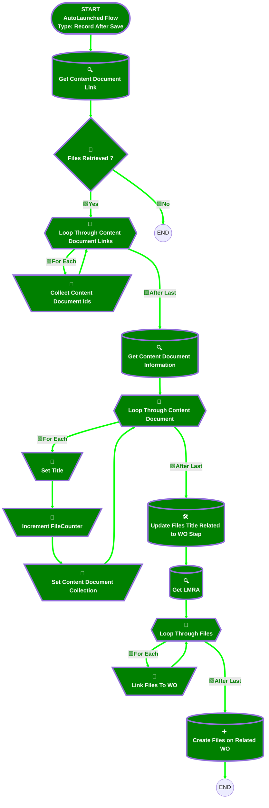

<b>🟩# [Work Step][After-Save][Record-Triggered] Relink Photo to LMRA record</b>

## 🟩Flow Diagram

```mermaid
%% If you read this, your Markdown visualizer does not handle MermaidJS syntax.
%% - If you are in VsCode, install extension `Markdown Preview Mermaid Support` at https://marketplace.visualstudio.com/items?itemName=bierner.markdown-mermaid
%% - If you are using sfdx-hardis, try to define env variable `MERMAID_MODES=cli,docker` ,then run again the command to regenerate markdown with SVG images.
%% - If you are within mkdocs-material, define mermaid plugin in `mkdocs.yml` as described in https://squidfunk.github.io/mkdocs-material/extensions/mermaid/
%% - At last resort, you can copy-paste this MermaidJS code in https://mermaid.live/ to see the Flow Diagram

flowchart TB
START(["<b>START<br/><b>AutoLaunched Flow</b></br>Type: <b> Record After Save</b></b>"]):::startClassAdded
click START "#general-information" "1048398234"

Collect_Content_Document_Ids[\"<b>🟰 <em></em><br/>Collect Content Document Ids</b>"/]:::assignmentsAdded
click Collect_Content_Document_Ids "#collect_content_document_ids" "1070634303"

Increment_FileCounter[\"<b>🟰 <em></em><br/>Increment FileCounter</b>"/]:::assignmentsAdded
click Increment_FileCounter "#increment_filecounter" "2234302930"

Link_Files_To_WO[\"<b>🟰 <em></em><br/>Link Files To WO</b>"/]:::assignmentsAdded
click Link_Files_To_WO "#link_files_to_wo" "3416229011"

Set_Content_Document_Collection[\"<b>🟰 <em></em><br/>Set Content Document Collection</b>"/]:::assignmentsAdded
click Set_Content_Document_Collection "#set_content_document_collection" "910719466"

Set_Title[\"<b>🟰 <em></em><br/>Set Title</b>"/]:::assignmentsAdded
click Set_Title "#set_title" "2743319961"

Files_Retrieved{"<b>🔀 <em></em><br/>Files Retrieved ?</b>"}:::decisionsAdded
click Files_Retrieved "#files_retrieved" "3734517596"

Loop_Through_Content_Document{{"<b>🔁 <em></em><br/>Loop Through Content Document</b>"}}:::loopsAdded
click Loop_Through_Content_Document "#loop_through_content_document" "4207084913"

Loop_Through_Content_Document_Links{{"<b>🔁 <em></em><br/>Loop Through Content Document Links</b>"}}:::loopsAdded
click Loop_Through_Content_Document_Links "#loop_through_content_document_links" "2183036775"

Loop_Through_Files{{"<b>🔁 <em></em><br/>Loop Through Files</b>"}}:::loopsAdded
click Loop_Through_Files "#loop_through_files" "646313633"

Create_Files_on_Related_WO[("<b>➕ <em></em><br/>Create Files on Related WO</b>")]:::recordCreatesAdded
click Create_Files_on_Related_WO "#create_files_on_related_wo" "510525524"

Get_Content_Document_Information[("<b>🔍 <em></em><br/>Get Content Document Information</b>")]:::recordLookupsAdded
click Get_Content_Document_Information "#get_content_document_information" "708484929"

Get_Content_Document_Link[("<b>🔍 <em></em><br/>Get Content Document Link</b>")]:::recordLookupsAdded
click Get_Content_Document_Link "#get_content_document_link" "2592306955"

Get_LMRA[("<b>🔍 <em></em><br/>Get LMRA</b>")]:::recordLookupsAdded
click Get_LMRA "#get_lmra" "4120573446"

Update_Files_Title_Related_to_WO_Step[("<b>🛠️ <em></em><br/>Update Files Title Related to WO Step</b>")]:::recordUpdatesAdded
click Update_Files_Title_Related_to_WO_Step "#update_files_title_related_to_wo_step" "611386255"

Collect_Content_Document_Ids ==> Loop_Through_Content_Document_Links
Increment_FileCounter ==> Set_Content_Document_Collection
Link_Files_To_WO ==> Loop_Through_Files
Set_Content_Document_Collection ==> Loop_Through_Content_Document
Set_Title ==> Increment_FileCounter
Files_Retrieved ==> |"🟩<b>Yes</b>"| Loop_Through_Content_Document_Links
Files_Retrieved ==> |"🟩<b>No</b>"| END_Files_Retrieved
Loop_Through_Content_Document ==> |"🟩<b>For Each</b>"|Set_Title
Loop_Through_Content_Document ===> |"🟩<b>After Last</b>"|Update_Files_Title_Related_to_WO_Step
Loop_Through_Content_Document_Links ==> |"🟩<b>For Each</b>"|Collect_Content_Document_Ids
Loop_Through_Content_Document_Links ===> |"🟩<b>After Last</b>"|Get_Content_Document_Information
Loop_Through_Files ==> |"🟩<b>For Each</b>"|Link_Files_To_WO
Loop_Through_Files ===> |"🟩<b>After Last</b>"|Create_Files_on_Related_WO
Create_Files_on_Related_WO ==> END_Create_Files_on_Related_WO
Get_Content_Document_Information ==> Loop_Through_Content_Document
Get_Content_Document_Link ==> Files_Retrieved
Get_LMRA ==> Loop_Through_Files
Update_Files_Title_Related_to_WO_Step ==> Get_LMRA
START ==>  Get_Content_Document_Link
END_Files_Retrieved(( END )):::endClassAdded
END_Create_Files_on_Related_WO(( END )):::endClassAdded


classDef actionCalls fill:#D4E4FC,color:black,text-decoration:none,max-height:100px
classDef assignments fill:#FBEED7,color:black,text-decoration:none,max-height:100px
classDef collectionProcessors fill:#F0E3FA,color:black,text-decoration:none,max-height:100px
classDef customErrors fill:#FFE9E9,color:black,text-decoration:none,max-height:100px
classDef decisions fill:#FDEAF6,color:black,text-decoration:none,max-height:100px
classDef loops fill:#FDEAF6,color:black,text-decoration:none,max-height:100px
classDef recordCreates fill:#FFF8C9,color:black,text-decoration:none,max-height:100px
classDef recordDeletes fill:#FFF8C9,color:black,text-decoration:none,max-height:100px
classDef recordLookups fill:#EDEAFF,color:black,text-decoration:none,max-height:100px
classDef recordUpdates fill:#FFF8C9,color:black,text-decoration:none,max-height:100px
classDef screens fill:#DFF6FF,color:black,text-decoration:none,max-height:100px
classDef subflows fill:#D4E4FC,color:black,text-decoration:none,max-height:100px
classDef startClass fill:#D9F2E6,color:black,text-decoration:none,max-height:100px
classDef endClass fill:#F9BABA,color:black,text-decoration:none,max-height:100px


classDef actionCallsAdded fill:green,color:white,stroke-width:4px,text-decoration:none,max-height:100px
classDef assignmentsAdded fill:green,color:white,stroke-width:4px,text-decoration:none,max-height:100px
classDef collectionProcessorsAdded fill:green,color:white,stroke-width:4px,text-decoration:none,max-height:100px
classDef customErrorsAdded fill:green,color:white,stroke-width:4px,text-decoration:none,max-height:100px
classDef decisionsAdded fill:green,color:white,stroke-width:4px,text-decoration:none,max-height:100px
classDef loopsAdded fill:green,color:white,stroke-width:4px,text-decoration:none,max-height:100px
classDef recordCreatesAdded fill:green,color:white,stroke-width:4px,text-decoration:none,max-height:100px
classDef recordDeletesAdded fill:green,color:white,stroke-width:4px,text-decoration:none,max-height:100px
classDef recordLookupsAdded fill:green,color:white,stroke-width:4px,text-decoration:none,max-height:100px
classDef recordUpdatesAdded fill:green,color:white,stroke-width:4px,text-decoration:none,max-height:100px
classDef screensAdded fill:green,color:white,stroke-width:4px,text-decoration:none,max-height:100px
classDef subflowsAdded fill:green,color:white,stroke-width:4px,text-decoration:none,max-height:100px
classDef startClassAdded fill:green,color:white,stroke-width:4px,text-decoration:none,max-height:100px

classDef actionCallsRemoved fill:red,color:white,stroke-width:4px,text-decoration:none,max-height:100px
classDef assignmentsRemoved fill:red,color:white,stroke-width:4px,text-decoration:none,max-height:100px
classDef collectionProcessorsRemoved fill:red,color:white,stroke-width:4px,text-decoration:none,max-height:100px
classDef customErrorsRemoved fill:red,color:white,stroke-width:4px,text-decoration:none,max-height:100px
classDef decisionsRemoved fill:red,color:white,stroke-width:4px,text-decoration:none,max-height:100px
classDef loopsRemoved fill:red,color:white,stroke-width:4px,text-decoration:none,max-height:100px
classDef recordCreatesRemoved fill:red,color:white,stroke-width:4px,text-decoration:none,max-height:100px
classDef recordDeletesRemoved fill:red,color:white,stroke-width:4px,text-decoration:none,max-height:100px
classDef recordLookupsRemoved fill:red,color:white,stroke-width:4px,text-decoration:none,max-height:100px
classDef recordUpdatesRemoved fill:red,color:white,stroke-width:4px,text-decoration:none,max-height:100px
classDef screensRemoved fill:red,color:white,stroke-width:4px,text-decoration:none,max-height:100px
classDef subflowsRemoved fill:red,color:white,stroke-width:4px,text-decoration:none,max-height:100px
classDef startClassRemoved fill:red,color:white,stroke-width:4px,text-decoration:none,max-height:100px

classDef actionCallsChanged fill:orange,color:white,stroke-width:4px,text-decoration:none,max-height:100px
classDef assignmentsChanged fill:orange,color:white,stroke-width:4px,text-decoration:none,max-height:100px
classDef collectionProcessorsChanged fill:orange,color:white,stroke-width:4px,text-decoration:none,max-height:100px
classDef customErrorsChanged fill:orange,color:white,stroke-width:4px,text-decoration:none,max-height:100px
classDef decisionsChanged fill:orange,color:white,stroke-width:4px,text-decoration:none,max-height:100px
classDef loopsChanged fill:orange,color:white,stroke-width:4px,text-decoration:none,max-height:100px
classDef recordCreatesChanged fill:orange,color:white,stroke-width:4px,text-decoration:none,max-height:100px
classDef recordDeletesChanged fill:orange,color:white,stroke-width:4px,text-decoration:none,max-height:100px
classDef recordLookupsChanged fill:orange,color:white,stroke-width:4px,text-decoration:none,max-height:100px
classDef recordUpdatesChanged fill:orange,color:white,stroke-width:4px,text-decoration:none,max-height:100px
classDef screensChanged fill:orange,color:white,stroke-width:4px,text-decoration:none,max-height:100px
classDef subflowsChanged fill:orange,color:white,stroke-width:4px,text-decoration:none,max-height:100px
classDef startClassChanged fill:orange,color:white,stroke-width:4px,text-decoration:none,max-height:100px
  
linkStyle 0,1,2,3,4,5,6,7,8,9,10,11,12,13,14,15,16,17,18 stroke:#00ff00,stroke-width:4px,color:green;
```

<b>🟩<!-- Flow description --></b>

## 🟩General Information

|🟩<b><!-- --></b>|<b><!-- --></b>|
|:---|:---|
|🟩<b>Object</b>|<b>WorkStep</b>|
|🟩<b>Process Type</b>|<b> Auto Launched Flow</b>|
|🟩<b>Trigger Type</b>|<b> Record After Save</b>|
|🟩<b>Record Trigger Type</b>|<b> Create And Update</b>|
|🟩<b>Label</b>|<b>[Work Step][After-Save][Record-Triggered] Relink Photo to LMRA record</b>|
|🟩<b>Status</b>|<b>Active</b>|
|🟩<b>Environments</b>|<b>Default</b>|
|🟩<b>Interview Label</b>|<b>[Work Step][After-Save][Record-Triggered] Relink Photo to LMRA record {!$Flow.CurrentDateTime}</b>|
|🟩<b> Builder Type (PM)</b>|<b>LightningFlowBuilder</b>|
|🟩<b> Canvas Mode (PM)</b>|<b>AUTO_LAYOUT_CANVAS</b>|
|🟩<b> Origin Builder Type (PM)</b>|<b>LightningFlowBuilder</b>|
|🟩<b>Connector</b>|<b>[Get_Content_Document_Link](#get_content_document_link)</b>|
|🟩<b>Next Node</b>|<b>[Get_Content_Document_Link](#get_content_document_link)</b>|

#### 🟩Filters (logic: **and**)

|🟩<b>Filter Id</b>|<b>Field</b>|<b>Operator</b>|<b>Value</b>|
|:-- |:-- |:--:|:--: |
|🟩<b>1</b>|<b>Status</b>|<b> Is Changed</b>|<b>✅</b>|
|🟩<b>2</b>|<b>Status</b>|<b> Equal To</b>|<b>Completed</b>|
|🟩<b>3</b>|<b>Name</b>|<b> Equal To</b>|<b>LMRA</b>|

## 🟩Variables

|🟩<b>Name</b>|<b>Data Type</b>|<b>Is Collection</b>|<b>Is Input</b>|<b>Is Output</b>|<b>Object Type</b>|<b>Description</b>|
|:-- |:--:|:--:|:--:|:--:|:--:|:--  |
|🟩<b>ContentDocumentCollection</b>|<b>SObject</b>|<b>✅</b>|<b>✅</b>|<b>⬜</b>|<b>ContentDocument</b>|<b><!-- --></b>|
|🟩<b>ContentDocumentIdCollection</b>|<b>String</b>|<b>✅</b>|<b>✅</b>|<b>⬜</b>|<b><!-- --></b>|<b><!-- --></b>|
|🟩<b>ContentDocumentRecord</b>|<b>SObject</b>|<b>⬜</b>|<b>✅</b>|<b>⬜</b>|<b>ContentDocument</b>|<b><!-- --></b>|
|🟩<b>FileCounter</b>|<b>Number</b>|<b>⬜</b>|<b>⬜</b>|<b>⬜</b>|<b><!-- --></b>|<b><!-- --></b>|
|🟩<b>RelinkCollection</b>|<b>SObject</b>|<b>✅</b>|<b>✅</b>|<b>⬜</b>|<b>ContentDocumentLink</b>|<b><!-- --></b>|
|🟩<b>RelinkRecord</b>|<b>SObject</b>|<b>⬜</b>|<b>✅</b>|<b>⬜</b>|<b>ContentDocumentLink</b>|<b><!-- --></b>|

## 🟩Formulas

|🟩<b>Name</b>|<b>Data Type</b>|<b>Expression</b>|<b>Description</b>|
|:-- |:--:|:-- |:--  |
|🟩<b>TitleFormat</b>|<b>String</b>|<b>"LMRA - " + {!Loop_Through_Content_Document.Title} +"_"+TEXT({!FileCounter})</b>|<b><!-- --></b>|

## 🟩Flow Nodes Details

### 🟩Collect_Content_Document_Ids

|🟩<b><!-- --></b>|<b><!-- --></b>|
|:---|:---|
|🟩<b>Type</b>|<b>Assignment</b>|
|🟩<b>Label</b>|<b>Collect Content Document Ids</b>|
|🟩<b>Connector</b>|<b>[Loop_Through_Content_Document_Links](#loop_through_content_document_links)</b>|

#### 🟩Assignments

|🟩<b>Assign To Reference</b>|<b>Operator</b>|<b>Value</b>|
|:-- |:--:|:--: |
|🟩<b>ContentDocumentIdCollection</b>|<b> Add</b>|<b>Loop_Through_Content_Document_Links.ContentDocumentId</b>|

### 🟩Increment_FileCounter

|🟩<b><!-- --></b>|<b><!-- --></b>|
|:---|:---|
|🟩<b>Type</b>|<b>Assignment</b>|
|🟩<b>Label</b>|<b>Increment FileCounter</b>|
|🟩<b>Connector</b>|<b>[Set_Content_Document_Collection](#set_content_document_collection)</b>|

#### 🟩Assignments

|🟩<b>Assign To Reference</b>|<b>Operator</b>|<b>Value</b>|
|:-- |:--:|:--: |
|🟩<b>FileCounter</b>|<b> Add</b>|<b>1</b>|

### 🟩Link_Files_To_WO

|🟩<b><!-- --></b>|<b><!-- --></b>|
|:---|:---|
|🟩<b>Type</b>|<b>Assignment</b>|
|🟩<b>Label</b>|<b>Link Files To WO</b>|
|🟩<b>Connector</b>|<b>[Loop_Through_Files](#loop_through_files)</b>|

#### 🟩Assignments

|🟩<b>Assign To Reference</b>|<b>Operator</b>|<b>Value</b>|
|:-- |:--:|:--: |
|🟩<b>RelinkRecord.ContentDocumentId</b>|<b> Assign</b>|<b>Loop_Through_Files.ContentDocumentId</b>|
|🟩<b>RelinkRecord.LinkedEntityId</b>|<b> Assign</b>|<b>Get_LMRA.Id</b>|
|🟩<b>RelinkCollection</b>|<b> Add</b>|<b>RelinkRecord</b>|

### 🟩Set_Content_Document_Collection

|🟩<b><!-- --></b>|<b><!-- --></b>|
|:---|:---|
|🟩<b>Type</b>|<b>Assignment</b>|
|🟩<b>Label</b>|<b>Set Content Document Collection</b>|
|🟩<b>Connector</b>|<b>[Loop_Through_Content_Document](#loop_through_content_document)</b>|

#### 🟩Assignments

|🟩<b>Assign To Reference</b>|<b>Operator</b>|<b>Value</b>|
|:-- |:--:|:--: |
|🟩<b>ContentDocumentCollection</b>|<b> Add</b>|<b>ContentDocumentRecord</b>|

### 🟩Set_Title

|🟩<b><!-- --></b>|<b><!-- --></b>|
|:---|:---|
|🟩<b>Type</b>|<b>Assignment</b>|
|🟩<b>Label</b>|<b>Set Title</b>|
|🟩<b>Connector</b>|<b>[Increment_FileCounter](#increment_filecounter)</b>|

#### 🟩Assignments

|🟩<b>Assign To Reference</b>|<b>Operator</b>|<b>Value</b>|
|:-- |:--:|:--: |
|🟩<b>ContentDocumentRecord.Id</b>|<b> Assign</b>|<b>Loop_Through_Content_Document.Id</b>|
|🟩<b>ContentDocumentRecord.Title</b>|<b> Assign</b>|<b>TitleFormat</b>|

### 🟩Files_Retrieved

|🟩<b><!-- --></b>|<b><!-- --></b>|
|:---|:---|
|🟩<b>Type</b>|<b>Decision</b>|
|🟩<b>Label</b>|<b>Files Retrieved ?</b>|
|🟩<b>Default Connector Label</b>|<b>No</b>|

#### 🟩Rule Yes (Yes)

|🟩<b><!-- --></b>|<b><!-- --></b>|
|:---|:---|
|🟩<b>Connector</b>|<b>[Loop_Through_Content_Document_Links](#loop_through_content_document_links)</b>|
|🟩<b>Condition Logic</b>|<b>and</b>|

|🟩<b>Condition Id</b>|<b>Left Value Reference</b>|<b>Operator</b>|<b>Right Value</b>|
|:-- |:-- |:--:|:--: |
|🟩<b>1</b>|<b>[Get_Content_Document_Link](#get_content_document_link)</b>|<b> Is Empty</b>|<b>⬜</b>|

### 🟩Loop_Through_Content_Document

|🟩<b><!-- --></b>|<b><!-- --></b>|
|:---|:---|
|🟩<b>Type</b>|<b>Loop</b>|
|🟩<b>Label</b>|<b>Loop Through Content Document</b>|
|🟩<b>Collection Reference</b>|<b>[Get_Content_Document_Information](#get_content_document_information)</b>|
|🟩<b>Iteration Order</b>|<b>Asc</b>|
|🟩<b>Next Value Connector</b>|<b>[Set_Title](#set_title)</b>|
|🟩<b>No More Values Connector</b>|<b>[Update_Files_Title_Related_to_WO_Step](#update_files_title_related_to_wo_step)</b>|

### 🟩Loop_Through_Content_Document_Links

|🟩<b><!-- --></b>|<b><!-- --></b>|
|:---|:---|
|🟩<b>Type</b>|<b>Loop</b>|
|🟩<b>Label</b>|<b>Loop Through Content Document Links</b>|
|🟩<b>Collection Reference</b>|<b>[Get_Content_Document_Link](#get_content_document_link)</b>|
|🟩<b>Iteration Order</b>|<b>Asc</b>|
|🟩<b>Next Value Connector</b>|<b>[Collect_Content_Document_Ids](#collect_content_document_ids)</b>|
|🟩<b>No More Values Connector</b>|<b>[Get_Content_Document_Information](#get_content_document_information)</b>|

### 🟩Loop_Through_Files

|🟩<b><!-- --></b>|<b><!-- --></b>|
|:---|:---|
|🟩<b>Type</b>|<b>Loop</b>|
|🟩<b>Label</b>|<b>Loop Through Files</b>|
|🟩<b>Collection Reference</b>|<b>[Get_Content_Document_Link](#get_content_document_link)</b>|
|🟩<b>Iteration Order</b>|<b>Asc</b>|
|🟩<b>Next Value Connector</b>|<b>[Link_Files_To_WO](#link_files_to_wo)</b>|
|🟩<b>No More Values Connector</b>|<b>[Create_Files_on_Related_WO](#create_files_on_related_wo)</b>|

### 🟩Create_Files_on_Related_WO

|🟩<b><!-- --></b>|<b><!-- --></b>|
|:---|:---|
|🟩<b>Type</b>|<b>Record Create</b>|
|🟩<b>Label</b>|<b>Create Files on Related WO</b>|
|🟩<b>Input Reference</b>|<b>RelinkCollection</b>|

### 🟩Get_Content_Document_Information

|🟩<b><!-- --></b>|<b><!-- --></b>|
|:---|:---|
|🟩<b>Type</b>|<b>Record Lookup</b>|
|🟩<b>Object</b>|<b>ContentDocument</b>|
|🟩<b>Label</b>|<b>Get Content Document Information</b>|
|🟩<b>Assign Null Values If No Records Found</b>|<b>⬜</b>|
|🟩<b>Get First Record Only</b>|<b>⬜</b>|
|🟩<b>Store Output Automatically</b>|<b>✅</b>|
|🟩<b>Connector</b>|<b>[Loop_Through_Content_Document](#loop_through_content_document)</b>|

#### 🟩Filters (logic: **and**)

|🟩<b>Filter Id</b>|<b>Field</b>|<b>Operator</b>|<b>Value</b>|
|:-- |:-- |:--:|:--: |
|🟩<b>1</b>|<b>Id</b>|<b> In</b>|<b>ContentDocumentIdCollection</b>|

### 🟩Get_Content_Document_Link

|🟩<b><!-- --></b>|<b><!-- --></b>|
|:---|:---|
|🟩<b>Type</b>|<b>Record Lookup</b>|
|🟩<b>Object</b>|<b>ContentDocumentLink</b>|
|🟩<b>Label</b>|<b>Get Content Document Link</b>|
|🟩<b>Assign Null Values If No Records Found</b>|<b>⬜</b>|
|🟩<b>Get First Record Only</b>|<b>⬜</b>|
|🟩<b>Store Output Automatically</b>|<b>✅</b>|
|🟩<b>Connector</b>|<b>[Files_Retrieved](#files_retrieved)</b>|

#### 🟩Filters (logic: **and**)

|🟩<b>Filter Id</b>|<b>Field</b>|<b>Operator</b>|<b>Value</b>|
|:-- |:-- |:--:|:--: |
|🟩<b>1</b>|<b>LinkedEntityId</b>|<b> Equal To</b>|<b>$Record.Id</b>|

### 🟩Get_LMRA

|🟩<b><!-- --></b>|<b><!-- --></b>|
|:---|:---|
|🟩<b>Type</b>|<b>Record Lookup</b>|
|🟩<b>Object</b>|<b>LMRA__c</b>|
|🟩<b>Label</b>|<b>Get LMRA</b>|
|🟩<b>Assign Null Values If No Records Found</b>|<b>⬜</b>|
|🟩<b>Get First Record Only</b>|<b>✅</b>|
|🟩<b>Store Output Automatically</b>|<b>✅</b>|
|🟩<b>Connector</b>|<b>[Loop_Through_Files](#loop_through_files)</b>|

#### 🟩Filters (logic: **and**)

|🟩<b>Filter Id</b>|<b>Field</b>|<b>Operator</b>|<b>Value</b>|
|:-- |:-- |:--:|:--: |
|🟩<b>1</b>|<b>Work_Order__c</b>|<b> Equal To</b>|<b>$Record.WorkOrderId</b>|

### 🟩Update_Files_Title_Related_to_WO_Step

|🟩<b><!-- --></b>|<b><!-- --></b>|
|:---|:---|
|🟩<b>Type</b>|<b>Record Update</b>|
|🟩<b>Label</b>|<b>Update Files Title Related to WO Step</b>|
|🟩<b>Input Reference</b>|<b>ContentDocumentCollection</b>|
|🟩<b>Connector</b>|<b>[Get_LMRA](#get_lmra)</b>|

___

<b>🟩_Documentation generated from branch monitoring_krinkelsgreencare__upeodev_sandbox by [sfdx-hardis](https://sfdx-hardis.cloudity.com), featuring [salesforce-flow-visualiser](https://github.com/toddhalfpenny/salesforce-flow-visualiser)_</b>